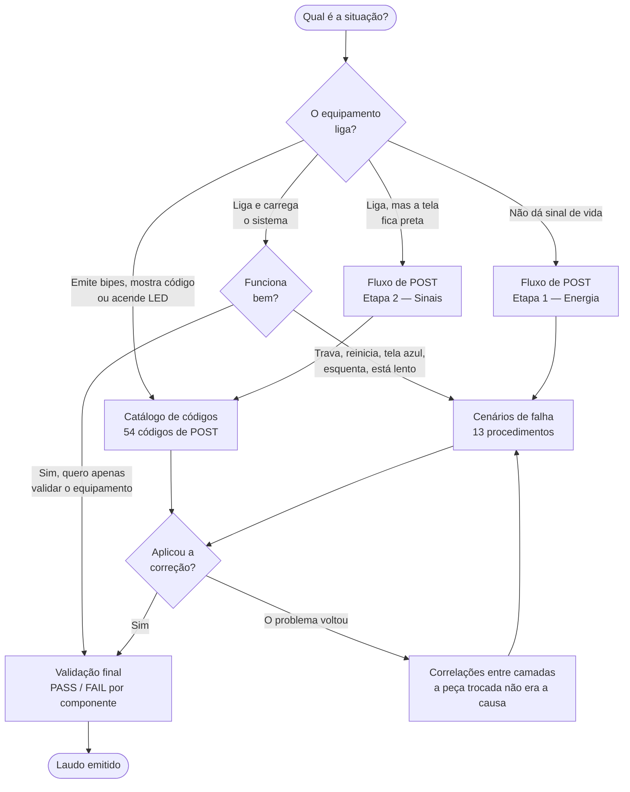

# Base de Diagnóstico de Hardware

> Base estruturada de conhecimento para diagnóstico de hardware, com fluxos, sintomas, códigos de erro, causas e procedimentos de análise e solução.

**Autor:** Edsilas · **Repositório:** [`edsilas/base-diagnostico-hardware`](https://github.com/edsilas/base-diagnostico-hardware) · **Licença:** MIT · **Documentação:** `doc-2.0.0`

Referência técnica para diagnóstico de falhas de hardware em computadores, do sinal de erro emitido
no POST até a validação final que fecha o atendimento. Esta página é o **ponto de entrada**: a
partir daqui você chega a qualquer procedimento sem precisar abrir arquivo por arquivo.

---

## Por onde começar

Escolha o caminho pelo que o equipamento está fazendo agora.



| O que você observa | Como isso costuma aparecer | Vá para |
| --- | --- | --- |
| Não dá sinal de vida | Nenhuma luz, nenhum ventilador, nenhum som | [Fluxo de diagnóstico POST](docs/06-fluxo-post.md) |
| Liga, mas não aparece imagem | Ventiladores giram, tela permanece preta | [Fluxo de diagnóstico POST](docs/06-fluxo-post.md) → [Liga sem vídeo](docs/10-cenarios/liga-sem-video.md) |
| Está emitindo bipes | Padrões como *1 longo + 2 curtos* ou *1-1-1-3* | [Catálogo de códigos](docs/09-codigos-post/00-indice-codigos.md) |
| Mostra dois caracteres num visor | Um par como `00`, `B4`, `FF`, geralmente na placa-mãe | [AMI Q-Code](docs/09-codigos-post/ami-q-code.md) |
| Há um LED de diagnóstico aceso | LED rotulado CPU, DRAM, VGA ou BOOT | [Debug LED genérico](docs/09-codigos-post/generico-debug-led.md) |
| Pisca em cores alternadas | Sequências como *2 âmbar + 1 branco* (Dell) | [Códigos Dell](docs/09-codigos-post/dell.md) |
| Toca uma melodia em vez de bipes | ThinkPad e ThinkStation com SmartBeep | [Códigos Lenovo](docs/09-codigos-post/lenovo.md) |
| O mesmo bipe tem dois significados | O padrão consta de mais de um fabricante | [Ambiguidade de códigos](docs/11-ambiguidades.md) |
| Trava, reinicia ou dá tela azul | Já carrega o sistema, mas não se sustenta | [Cenários de falha](docs/10-cenarios/00-indice-cenarios.md) |
| Esquenta demais ou desliga sozinho | Desligamento sem aviso, ventoinha acelerada | [Superaquecimento](docs/10-cenarios/superaquecimento.md) |
| Um disco sumiu do sistema | A unidade não aparece no sistema ou na BIOS | [Disco não reconhecido](docs/10-cenarios/disco-nao-reconhecido.md) |
| Falha só às vezes, sem padrão | Não reproduz sob demanda | [Falhas intermitentes](docs/10-cenarios/falhas-intermitentes.md) |
| Troquei a peça e o problema voltou | A causa estava em outro subsistema | [Correlações entre camadas](docs/12-correlacoes.md) |
| Terminei o reparo, preciso validar | — | [Validação final](docs/13-validacao-final.md) |
| Preciso do comando exato | — | [Referência de comandos](docs/19-comandos.md) |
| Quero buscar por componente, risco ou ferramenta | — | [Índices cruzados](docs/18-indices-cruzados.md) |
| Não reconheço um termo | — | [Glossário](docs/17-glossario.md) |

> [!IMPORTANT]
> Antes de usar qualquer número de camada, leia
> [Taxonomia de camadas](docs/03-taxonomia-camadas.md). A base usa **dois modelos de camadas**, um
> por escopo: *camada 3* é **Memória** no modelo POST e **CPU** no modelo sistêmico. O formato em
> que o número está escrito identifica qual é qual.

---

## Antes de executar qualquer procedimento

Toda ficha desta base — de código de POST ou de cenário — traz um campo de **risco declarado** e
uma seção de **pré-requisitos**, antes da seção de correção. Leia os dois antes de encostar no
equipamento.

| Confira | Onde está | Por quê |
| --- | --- | --- |
| O risco declarado da ficha | Campo *Risco associado* ou *Risco / criticidade*, na própria ficha | 18 dos 54 códigos e 5 dos 13 cenários são declarados **Crítico** |
| Os pré-requisitos | Seção *Pré-requisitos*, antes de *Execução da correção* | Vários procedimentos exigem o equipamento desligado e sem energia residual |
| As precauções de bancada | [Segurança e boas práticas](docs/15-seguranca-e-boas-praticas.md) | Descarga de energia residual, proteção contra ESD e medição energizada |
| O instrumental necessário | [Requisitos e ferramentas](docs/04-requisitos-e-ferramentas.md) | Medir tensão exige multímetro; não há substituto documentado |

> [!CAUTION]
> Parte dos procedimentos envolve **medição de tensão com o equipamento energizado**, manipulação
> de fonte e regravação de firmware. Se você não tem o instrumento pedido nos pré-requisitos ou não
> está seguro do passo, **pare e encaminhe a um técnico**. Esta base descreve o que fazer; ela não
> substitui prática de bancada.

> [!NOTE]
> A escala de risco — Crítico, Alto, Médio, Baixo, Variável — é a declarada pelas planilhas de
> origem, que não definem o significado de cada nível. Trate-a como ordem relativa, não como medida
> absoluta. Para ver tudo agrupado por risco, use
> [Índice por risco declarado](docs/18-indices-cruzados.md#índice-por-risco-declarado).

---

## O que há aqui

- **54 códigos de POST** catalogados (bipes, Q-Codes hexadecimais, LEDs de diagnóstico), cobrindo
  11 famílias de BIOS e fabricantes, cada um com causa raiz, método de diagnóstico, procedimento
  de correção e critério de validação.
- **13 cenários de falha pós-boot** (não liga, tela azul, reinício aleatório, superaquecimento,
  disco não reconhecido, entre outros), com comandos técnicos e evidência de sucesso.
- **Dois fluxos de decisão**: um para a fase de POST (7 etapas) e um sistêmico de ponta a ponta
  (17 nós, F01 a F14).
- **5 casos de ambiguidade** — o mesmo sinal com significados diferentes conforme o fabricante.
- **6 correlações em cascata** — falhas que aparecem como sintoma de outro subsistema.
- **10 critérios de validação final** por componente, com PASS, FAIL e tempo de observação.
- **64 etapas operacionais** dos guias de Victoria, AIDA64 e MemTest86.
- **Procedimentos transversais canônicos**: descarga de energia residual, boot mínimo e leitura dos
  limiares térmicos, unificados em [Segurança e boas práticas](docs/15-seguranca-e-boas-praticas.md).

---

## Comece aqui

Leitura de primeira vez, na ordem.

| Documento | O que resolve |
| --- | --- |
| [Visão geral](docs/01-visao-geral.md) | O que esta base é, o que cobre e onde ficam suas fronteiras. |
| [Taxonomia de camadas](docs/03-taxonomia-camadas.md) | **Leitura obrigatória.** Como saber qual dos dois modelos de camada você está lendo. |
| [Requisitos e ferramentas](docs/04-requisitos-e-ferramentas.md) | O que separar para a bancada antes de começar. |
| [Segurança e boas práticas](docs/15-seguranca-e-boas-praticas.md) | Energia residual, ESD, medição energizada e procedimentos destrutivos. |
| [Como utilizar](docs/05-utilizacao.md) | Por onde entrar conforme o sintoma e em que ordem ler. |
| [Índice completo](docs/00-indice.md) | Mapa de todos os documentos, com uma linha por arquivo. |

---

## Diagnostique

Do sintoma até a identificação da causa.

| Documento | O que resolve |
| --- | --- |
| [Fluxo de diagnóstico POST](docs/06-fluxo-post.md) | 7 etapas para equipamentos que não carregam o sistema. Termina na identificação do código. |
| [Fluxo de diagnóstico sistêmico](docs/07-fluxo-sistemico.md) | 17 nós, do botão Power ao laudo. Cobre também o comportamento depois do boot. |
| [Diagnóstico por camada](docs/08-diagnostico-por-camada.md) | O que testar em cada subsistema: componentes, testes primários, indicadores de falha. |

---

## Resolva

Da causa identificada até a correção aplicada.

| Documento | O que resolve |
| --- | --- |
| [Catálogo de códigos de POST](docs/09-codigos-post/00-indice-codigos.md) | Ficha completa dos 54 códigos, agrupados por família de BIOS. |
| [Cenários de falha](docs/10-cenarios/00-indice-cenarios.md) | Os 13 procedimentos pós-boot, com pré-requisitos, comandos e evidência de sucesso. |
| [Ambiguidade de códigos](docs/11-ambiguidades.md) | Os 5 sinais que significam coisas diferentes, e o teste que desempata. |
| [Correlações entre camadas](docs/12-correlacoes.md) | As 6 falhas que aparecem em outro subsistema e fazem trocar a peça errada. |

---

## Feche o atendimento

| Documento | O que resolve |
| --- | --- |
| [Validação final por componente](docs/13-validacao-final.md) | Critério PASS, critério FAIL, tempo de observação e ação em caso de reprovação, para 10 componentes. |

---

## Opere as ferramentas

| Documento | O que resolve |
| --- | --- |
| [Índice de ferramentas](docs/14-ferramentas/00-indice-ferramentas.md) | Qual ferramenta usar para cada verificação. |
| [Victoria](docs/14-ferramentas/victoria.md) | 9 etapas: S.M.A.R.T., varredura de superfície, remapeamento, relatório. |
| [MemTest86](docs/14-ferramentas/memtest86.md) | 10 etapas + critérios de decisão sobre o destino dos módulos. |
| [AIDA64](docs/14-ferramentas/aida64-etapas-01-15.md) | 45 etapas em três partes: [01–15](docs/14-ferramentas/aida64-etapas-01-15.md) · [16–30](docs/14-ferramentas/aida64-etapas-16-30.md) · [31–45](docs/14-ferramentas/aida64-etapas-31-45.md). |

---

## Consulte a referência

| Documento | O que resolve |
| --- | --- |
| [Índices cruzados](docs/18-indices-cruzados.md) | Os mesmos registros por componente, camada, risco, fase do POST, tipo de sinal e ferramenta. |
| [Referência de comandos](docs/19-comandos.md) | Todos os comandos técnicos dos cenários, com contexto e risco. |
| [Glossário](docs/17-glossario.md) | 47 termos, com a definição usada nesta base e a expansão de cada sigla. |
| [Perguntas frequentes](docs/16-faq.md) | Dúvidas derivadas do conteúdo documentado. |
| [Segurança e boas práticas](docs/15-seguranca-e-boas-praticas.md) | Precauções e procedimentos transversais canônicos. |

---

## Manutenção e rastreabilidade

| Documento | O que resolve |
| --- | --- |
| [Arquitetura da documentação](docs/02-arquitetura.md) | Como o conhecimento está organizado e de qual aba cada documento saiu. |
| [Fontes](docs/references/fontes.md) | Inventário das fontes, com hash de verificação e o registro das verificações externas. |
| [Matriz de rastreabilidade](docs/references/matriz-rastreabilidade.md) | Informação → coluna de origem → documento → nível de confiança. |
| [Histórico](docs/references/changelog.md) | O que mudou em cada versão da documentação. |
| [Como contribuir](CONTRIBUTING.md) | Regras de conteúdo, padrão dos documentos e fluxo de alteração. |

---

## Como obter

```bash
git clone https://github.com/edsilas/base-diagnostico-hardware.git
cd base-diagnostico-hardware
```

A documentação é lida diretamente no GitHub ou em qualquer leitor de Markdown. Não há software a
instalar para consultá-la.

## Requisitos

O material é documental: o "requisito" é o instrumental de bancada exigido pelos procedimentos —
multímetro, osciloscópio, programadora CH341A, mídia bootável, componentes *known-good*, entre
outros. Inventário completo em
[Requisitos e ferramentas](docs/04-requisitos-e-ferramentas.md).

## Estrutura do repositório

```text
docs/
├── 00-indice.md                    Mapa da documentação
├── 01-visao-geral.md               O que é o projeto e onde ficam suas fronteiras
├── 02-arquitetura.md               Como a documentação está organizada
├── 03-taxonomia-camadas.md         Os dois modelos de camadas (leitura obrigatória)
├── 04-requisitos-e-ferramentas.md  Instrumental necessário
├── 05-utilizacao.md                Por onde entrar conforme a situação
├── 06-fluxo-post.md                Decisão antes do boot (Etapas 1–7)
├── 07-fluxo-sistemico.md           Decisão de ponta a ponta (F01–F14)
├── 08-diagnostico-por-camada.md    O que testar em cada subsistema
├── 09-codigos-post/                Fichas dos 54 códigos, por família de BIOS
├── 10-cenarios/                    Fichas dos 13 cenários de falha
├── 11-ambiguidades.md              Códigos com mais de um significado
├── 12-correlacoes.md               Falhas em cascata entre camadas
├── 13-validacao-final.md           Critérios PASS / FAIL por componente
├── 14-ferramentas/                 Victoria, AIDA64, MemTest86
├── 15-seguranca-e-boas-praticas.md Segurança de bancada e procedimentos canônicos
├── 16-faq.md                       Perguntas derivadas do conteúdo
├── 17-glossario.md                 Termos técnicos
├── 18-indices-cruzados.md          Busca por componente, camada, risco, fase, sinal, ferramenta
├── 19-comandos.md                  Todos os comandos técnicos reunidos
└── references/
    ├── fontes.md                   Origem de cada informação e verificações externas
    ├── matriz-rastreabilidade.md   Informação → fonte → documento → confiança
    └── changelog.md                Histórico desta documentação

CONTRIBUTING.md                     Regras de conteúdo e fluxo de alteração
LICENSE                             Licença MIT
```

## Padrão dos documentos

Todo documento segue a mesma estrutura, para que você saiba onde procurar sem reaprender o formato:

1. **Trilha de navegação** de volta a esta página;
2. **Resumo** de uma linha e **Aplica-se a**;
3. **Neste documento** — sumário com links para cada seção;
4. **Contexto, Escopo, Fora do escopo, Relação com outros documentos**;
5. **Fluxograma** da decisão que o documento resolve, quando aplicável;
6. **Conteúdo**, com procedimentos organizados em identificação → pré-requisitos → diagnóstico →
   execução → resultado esperado → risco → próximos passos;
7. **Próximos passos** — para onde ir a partir dali;
8. **Rodapé** com fonte primária, nível de confiança, autoria e versão.

Os avisos seguem convenção fixa: **NOTE** para procedência e nível de confiança, **TIP** para
atalhos de navegação, **IMPORTANT** para pré-requisito que muda o resultado, **WARNING** para risco
de erro de diagnóstico e **CAUTION** para risco elétrico, perda de dados ou dano a componente.

## Como esta base é mantida

Todo campo técnico é transcrição literal da célula correspondente nas planilhas de origem. Isso
elimina paráfrase acidental: o que está aqui é o que a fonte diz, com a mesma grafia e os mesmos
valores.

Três regras sustentam a confiabilidade do material:

- **Lacuna se declara.** Campo sem informação na origem vira
  *"Informação não identificada na fonte analisada"*, nunca uma dedução plausível.
- **Divergência se resolve com fonte primária.** Quando as planilhas apresentavam valores
  diferentes para o mesmo procedimento, a decisão foi tomada contra a documentação oficial do
  fabricante ou a norma aplicável, e o critério ficou registrado no ponto de uso. O registro de
  cada verificação está em [Fontes](docs/references/fontes.md#nível-3--fontes-externas-verificadas).
- **Inferência se marca.** Conclusão derivada leva o rótulo **Inferido** no ponto de uso.

Regras completas e fluxo de alteração em [CONTRIBUTING.md](CONTRIBUTING.md).

## Licença

Distribuído sob a licença MIT. O texto completo está no arquivo [`LICENSE`](LICENSE), na raiz do
repositório.

## Autoria e créditos

**Edsilas** — autor e responsável pelo projeto
([`edsilas`](https://github.com/edsilas)).

O conteúdo técnico deriva de duas planilhas de referência de autoria de Edsilas. As referências a
documentação de fabricantes citadas dentro do material são declarações da fonte original; as que
foram conferidas de forma independente estão identificadas em
[fontes](docs/references/fontes.md).
