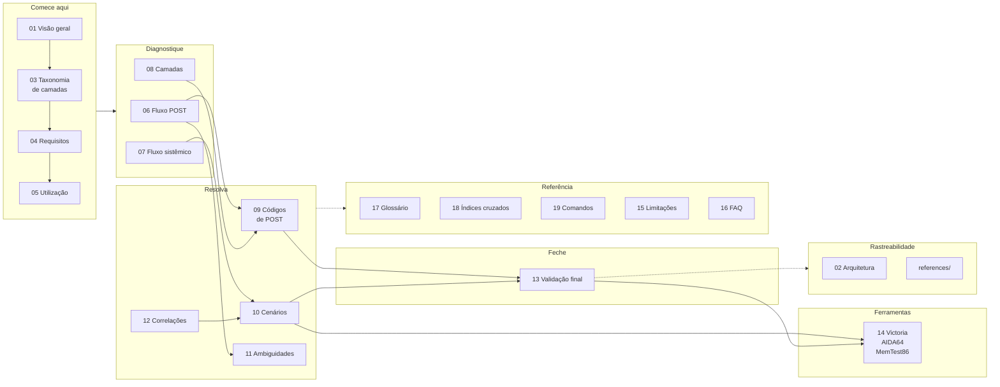

<!-- Gerado a partir de Ambos os arquivos-fonte. Não editar manualmente sem atualizar a fonte. -->

[Início](../README.md) › [Comece aqui](../README.md#comece-aqui) › **Índice da base de conhecimento**

# Índice da base de conhecimento

> Mapa completo da documentação, na ordem lógica de uso, com uma linha por documento.


**Aplica-se a:** Navegação — complementa o README com a lista exaustiva

## Neste documento

- [Mapa da documentação](#mapa-da-documentação)
- [Ordem lógica](#ordem-lógica)
- [Documentos](#documentos)
- [Convenção de níveis de confiança](#convenção-de-níveis-de-confiança)
- [Próximos passos](#próximos-passos)

## Contexto

Mapa completo da documentação, na ordem lógica de uso. Cada documento tem uma descrição de uma linha.

## Escopo

Listagem ordenada de todos os documentos, com finalidade e origem.

## Fora do escopo

Conteúdo técnico; detalhes de estrutura interna (ver documento 02).

## Relação com outros documentos

- [README](../README.md)
- [Visão geral](01-visao-geral.md)
- [Como utilizar](05-utilizacao.md)

---

> [!TIP]
> Para navegar **pelo sintoma**, use o [README](../README.md) — ele tem o fluxograma de entrada.
> Esta página lista **todos** os documentos, para quando você já sabe o que procura.

## Mapa da documentação



## Ordem lógica

```text
Comece aqui        → README, 00-indice
Entenda o projeto  → 01-visao-geral, 02-arquitetura, 03-taxonomia-camadas
Prepare-se         → 04-requisitos-e-ferramentas
Saiba navegar      → 05-utilizacao
Diagnostique       → 06-fluxo-post, 07-fluxo-sistemico, 08-diagnostico-por-camada
Resolva            → 09-codigos-post/, 10-cenarios/, 11-ambiguidades, 12-correlacoes
Feche o caso       → 13-validacao-final
Opere a ferramenta → 14-ferramentas/
Conheça os limites → 15-limitacoes, 16-faq, 17-glossario
Busque de outro jeito → 18-indices-cruzados, 19-comandos
Rastreie a origem  → references/
```

## Documentos

### Comece aqui

| Documento | Finalidade |
| --- | --- |
| [README](../README.md) | Porta de entrada do repositório: o que é, o que há, início rápido. |
| [00-indice.md](00-indice.md) | Este documento: mapa completo da base. |

### Entenda o projeto

| Documento | Finalidade |
| --- | --- |
| [01-visao-geral.md](01-visao-geral.md) | O que a base é, o que cobre, para quem e o que não faz. |
| [02-arquitetura.md](02-arquitetura.md) | Como o conhecimento foi organizado e de onde cada documento veio. |
| [03-taxonomia-camadas.md](03-taxonomia-camadas.md) | Os dois modelos de camadas coexistentes e o conflito entre eles. **Leitura obrigatória.** |

### Prepare-se e navegue

| Documento | Finalidade |
| --- | --- |
| [04-requisitos-e-ferramentas.md](04-requisitos-e-ferramentas.md) | Inventário do instrumental exigido, por camada, por cenário e por componente. |
| [05-utilizacao.md](05-utilizacao.md) | Por onde entrar conforme o sintoma e em que ordem ler. |

### Diagnostique

| Documento | Finalidade |
| --- | --- |
| [06-fluxo-post.md](06-fluxo-post.md) | Fluxo condicional de 7 etapas para falhas antes do boot. |
| [07-fluxo-sistemico.md](07-fluxo-sistemico.md) | Árvore de decisão de 17 nós, do botão Power à validação final. |
| [08-diagnostico-por-camada.md](08-diagnostico-por-camada.md) | Ficha de cada um dos 7 subsistemas: componentes, testes, indicadores de falha. |

### Resolva

| Documento | Finalidade |
| --- | --- |
| [09-codigos-post/](09-codigos-post/00-indice-codigos.md) | Catálogo dos 54 códigos de POST, com ficha completa de cada um. |
| [10-cenarios/](10-cenarios/00-indice-cenarios.md) | Fichas dos 13 cenários de falha pós-boot. |
| [11-ambiguidades.md](11-ambiguidades.md) | Os 5 sinais com mais de um significado e como diferenciá-los. |
| [12-correlacoes.md](12-correlacoes.md) | As 6 falhas que se manifestam em outra camada e as armadilhas associadas. |

### Feche o atendimento

| Documento | Finalidade |
| --- | --- |
| [13-validacao-final.md](13-validacao-final.md) | Critérios PASS e FAIL por componente, com tempo de observação e ação em caso de reprovação. |

### Opere as ferramentas

| Documento | Finalidade |
| --- | --- |
| [14-ferramentas/](14-ferramentas/00-indice-ferramentas.md) | Índice dos guias operacionais. |
| [victoria.md](14-ferramentas/victoria.md) | 9 etapas: da preparação do ambiente ao relatório final. |
| [memtest86.md](14-ferramentas/memtest86.md) | 10 etapas + critérios de decisão sobre o destino dos módulos. |
| [aida64-etapas-01-15.md](14-ferramentas/aida64-etapas-01-15.md) | AIDA64, etapas 1 a 15. |
| [aida64-etapas-16-30.md](14-ferramentas/aida64-etapas-16-30.md) | AIDA64, etapas 16 a 30. |
| [aida64-etapas-31-45.md](14-ferramentas/aida64-etapas-31-45.md) | AIDA64, etapas 31 a 45. |

### Conheça os limites

| Documento | Finalidade |
| --- | --- |
| [15-limitacoes.md](15-limitacoes.md) | O que a base não cobre, lacunas e divergências verificadas. |
| [16-faq.md](16-faq.md) | Perguntas derivadas exclusivamente do conteúdo documentado. |
| [17-glossario.md](17-glossario.md) | Termos técnicos usados no material, com a definição que a fonte dá. |

### Busque de outro jeito

| Documento | Finalidade |
| --- | --- |
| [18-indices-cruzados.md](18-indices-cruzados.md) | Os mesmos registros reagrupados por componente, camada, risco, fase do POST, tipo de sinal e ferramenta. |
| [19-comandos.md](19-comandos.md) | Todos os comandos técnicos dos cenários reunidos, com contexto e risco. |

### Rastreie a origem

| Documento | Finalidade |
| --- | --- |
| [references/fontes.md](references/fontes.md) | Inventário das fontes e do que foi extraído de cada aba. |
| [references/matriz-rastreabilidade.md](references/matriz-rastreabilidade.md) | Informação → fonte → documento → nível de confiança. |
| [references/pendencias.md](references/pendencias.md) | Tudo que precisa de validação humana. |
| [references/changelog.md](references/changelog.md) | Histórico desta documentação. |

## Convenção de níveis de confiança

| Nível | Significado |
| --- | --- |
| **Confirmado** | Identificado diretamente na fonte primária (célula da planilha). |
| **Oficial** | Confirmado por documentação oficial de fabricante citada pela própria fonte. |
| **Inferido** | Conclusão técnica ou organizacional derivada das informações, sempre sinalizada. |
| **Não confirmado** | Informação encontrada, mas sem evidência suficiente. |
| **Necessita validação** | Informação insuficiente, ausente ou conflitante entre fontes. |

## Próximos passos

| Se você… | Vá para |
| --- | --- |
| quer entrar pelo sintoma | [README](../README.md) |
| vai alterar a documentação | [Como contribuir](../CONTRIBUTING.md) |
| quer rastrear uma informação até a célula de origem | [Matriz de rastreabilidade](references/matriz-rastreabilidade.md) |


---

| | |
| --- | --- |
| **Fonte primária deste documento** | Ambos os arquivos-fonte |
| **Status de confiança** | Confirmado (estrutura) — documento organizacional |
| **Última verificação contra a fonte** | 2026-08-07 |
| **Autoria** | Edsilas |
| **Versão da documentação** | `doc-1.3.0` |
