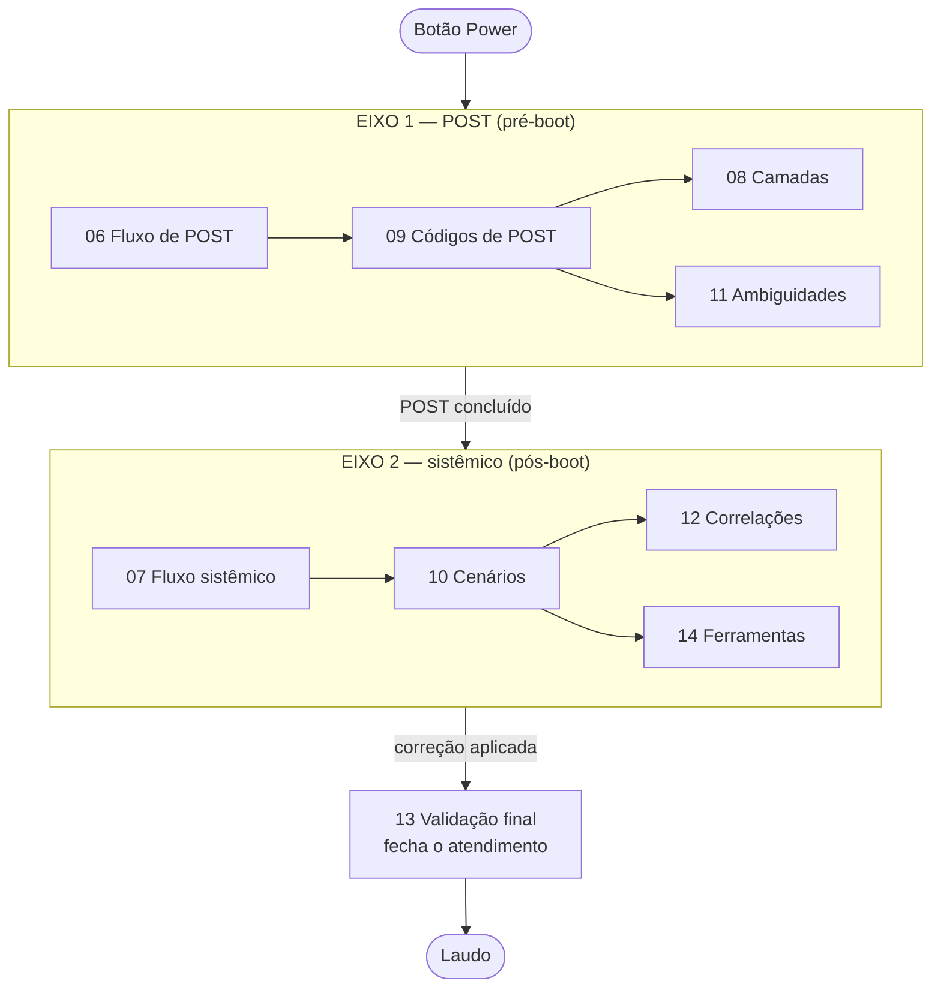

<!-- Gerado a partir de Ambos os arquivos-fonte. Não editar manualmente sem atualizar a fonte. -->

[Início](../README.md) › [Manutenção e rastreabilidade](../README.md#manutenção-e-rastreabilidade) › **Arquitetura da documentação**

# Arquitetura da documentação

> Como o conhecimento foi organizado, de qual aba cada documento saiu e quais convenções todos seguem.

**Aplica-se a:** Manutenção da base e auditoria de origem

## Neste documento

- [Os dois eixos do material](#os-dois-eixos-do-material)
- [Princípio de responsabilidade única](#princípio-de-responsabilidade-única)
- [Mapa aba de origem → documento](#mapa-aba-de-origem--documento)
- [Convenções adotadas](#convenções-adotadas)
- [Versionamento do conteúdo](#versionamento-do-conteúdo)
- [Como manter](#como-manter)
- [Próximos passos](#próximos-passos)

## Contexto

Explica como o conhecimento foi organizado: quais eixos existem, o que cada documento carrega e de qual aba de planilha cada documento saiu. É o mapa para quem vai manter a base.

## Escopo

Eixos de organização, princípio de responsabilidade única por documento, mapa aba-de-origem → documento e convenções adotadas.

## Fora do escopo

Conteúdo técnico em si; procedimentos; navegação por tarefa (ver documento 05).

## Relação com outros documentos

- [Índice da documentação](00-indice.md)
- [Visão geral](01-visao-geral.md)
- [Fontes](references/fontes.md)
- [Matriz de rastreabilidade](references/matriz-rastreabilidade.md)

---

## Os dois eixos do material

As fontes se organizam em dois eixos que **se encontram no momento do boot**:

**Eixo 1 — pré-boot (POST).** O equipamento ainda não entregou controle ao sistema operacional. O
único canal de informação é o sinal que o firmware emite: beep, código hexadecimal em display,
LED de diagnóstico. Origem: `HW_HARDWARE_CODIGOS_DE_ERROS.xlsx`.

**Eixo 2 — pós-boot (sistêmico).** O equipamento liga e carrega o sistema, mas falha em uso: trava,
reinicia, exibe tela azul, superaquece. O canal de informação passa a ser software: logs, S.M.A.R.T.,
sensores, stress test. Origem: `HW_HARDWARE_FLUXO_DIAGNOSTICO.xlsx`.

> [!NOTE]
> O diagrama acima é uma **representação organizacional** desta documentação. A fonte não contém
> diagrama equivalente. Nível de confiança: **Inferido**, derivado da leitura dos fluxos
> (Etapa 1→7 no eixo 1; F01→F14 no eixo 2).

## Princípio de responsabilidade única

Cada documento tem um dono de assunto. Informação não é duplicada entre documentos: quando um
documento precisa de conteúdo de outro, ele **referencia** em vez de copiar.

| Documento | Responsabilidade exclusiva |
| --- | --- |
| `01-visao-geral.md` | O que o projeto é e o que não é |
| `02-arquitetura.md` | Como a documentação está organizada |
| `03-taxonomia-camadas.md` | Significado dos números de camada e o conflito entre os dois modelos |
| `04-requisitos-e-ferramentas.md` | Instrumental necessário |
| `05-utilizacao.md` | Por onde entrar conforme a situação |
| `06-fluxo-post.md` | Sequência de decisão antes do boot |
| `07-fluxo-sistemico.md` | Sequência de decisão de ponta a ponta |
| `08-diagnostico-por-camada.md` | O que testar em cada subsistema (modelo POST) |
| `09-codigos-post/` | Ficha de cada código de erro |
| `10-cenarios/` | Ficha de cada cenário de falha |
| `11-ambiguidades.md` | Códigos com mais de um significado |
| `12-correlacoes.md` | Falha em uma camada que aparece como sintoma em outra |
| `13-validacao-final.md` | Critérios de aprovação e reprovação pós-reparo |
| `14-ferramentas/` | Operação passo a passo de Victoria, AIDA64 e MemTest86 |
| `15-seguranca-e-boas-praticas.md` | Precauções de bancada e procedimentos transversais canônicos |
| `16-faq.md` | Perguntas derivadas do conteúdo documentado |
| `17-glossario.md` | Termos técnicos usados no material |
| `references/` | Origem dos dados, rastreabilidade e histórico |

## Mapa aba de origem → documento

| Arquivo-fonte | Aba | Volume | Documento derivado |
| --- | --- | --- | --- |
| `HW_HARDWARE_CODIGOS_DE_ERROS.xlsx` | `Tabela Diagnóstico POST` | 54 códigos | [09-codigos-post/](09-codigos-post/00-indice-codigos.md) |
| `HW_HARDWARE_CODIGOS_DE_ERROS.xlsx` | `Fluxo de Diagnóstico` | 7 etapas | [06-fluxo-post.md](06-fluxo-post.md) |
| `HW_HARDWARE_CODIGOS_DE_ERROS.xlsx` | `Camadas de Diagnóstico` | 7 camadas | [08-diagnostico-por-camada.md](08-diagnostico-por-camada.md) |
| `HW_HARDWARE_CODIGOS_DE_ERROS.xlsx` | `Ambiguidade de Códigos` | 5 casos | [11-ambiguidades.md](11-ambiguidades.md) |
| `HW_HARDWARE_FLUXO_DIAGNOSTICO.xlsx` | `TABELA_PRINCIPAL` | 13 cenários (IDs) | [10-cenarios/](10-cenarios/00-indice-cenarios.md) |
| `HW_HARDWARE_FLUXO_DIAGNOSTICO.xlsx` | `FLUXO_LOGICO` | 17 nós | [07-fluxo-sistemico.md](07-fluxo-sistemico.md) |
| `HW_HARDWARE_FLUXO_DIAGNOSTICO.xlsx` | `CORRELACOES` | 6 correlações | [12-correlacoes.md](12-correlacoes.md) |
| `HW_HARDWARE_FLUXO_DIAGNOSTICO.xlsx` | `VALIDACAO_FINAL` | 10 componentes | [13-validacao-final.md](13-validacao-final.md) |
| `HW_HARDWARE_FLUXO_DIAGNOSTICO.xlsx` | `INDICE_CENARIOS` | 9 cenários | [10-cenarios/00-indice-cenarios.md](10-cenarios/00-indice-cenarios.md) |
| `HW_HARDWARE_FLUXO_DIAGNOSTICO.xlsx` | `REF_Victoria` | 9 etapas | [14-ferramentas/victoria.md](14-ferramentas/victoria.md) |
| `HW_HARDWARE_FLUXO_DIAGNOSTICO.xlsx` | `REF_AIDA64` | 45 etapas | [14-ferramentas/aida64-etapas-01-15.md](14-ferramentas/aida64-etapas-01-15.md) |
| `HW_HARDWARE_FLUXO_DIAGNOSTICO.xlsx` | `REF_MemTest86` | 10 etapas + critérios | [14-ferramentas/memtest86.md](14-ferramentas/memtest86.md) |

## Convenções adotadas

**Fidelidade ao texto de origem.** Todo campo técnico é transcrição literal da célula
correspondente. Os documentos das pastas `09-codigos-post/`, `10-cenarios/` e `14-ferramentas/`,
mais os documentos 06, 07, 08, 11, 12, 13, 18 e 19, reproduzem as células **sem reescrita**: nada
foi resumido, adaptado ou dito com outras palavras. Isso elimina a possibilidade de paráfrase
acidental.

**Referências cruzadas derivadas.** As ligações entre documentos — código → ficha da camada,
camada → códigos atribuídos, cenário → nós do fluxo que o alcançam, cenário → dependências — não
foram escritas à mão: são calculadas a partir das colunas de classificação e ligação das próprias
planilhas. Se a fonte mudar, elas mudam junto.

**Diagramas.** Os fluxogramas em Mermaid nos documentos 06 e 07 reproduzem a topologia declarada
nas colunas de encadeamento. Os rótulos foram condensados para caber no diagrama; o texto integral
está sempre logo abaixo, sem cortes.

**Identificadores.** Os IDs de cenário (`NL-01`, `SV-02`, …), de nó de fluxo (`F01`…`F14`) e de
correlação (`COR-01`…`COR-06`) **existem na fonte** e foram preservados. O identificador de código
de POST (`POST-01`…`POST-54`) **não existe na fonte**: foi criado nesta documentação, seguindo a
ordem das linhas, para permitir link estável. Está sempre acompanhado do código literal.

**Camadas.** O número de camada é sempre reproduzido no formato original, porque o formato
identifica qual dos dois modelos está em uso. Ver [03-taxonomia-camadas.md](03-taxonomia-camadas.md).

**Divergências entre as fontes.** Quando as duas planilhas apresentavam valores diferentes para o
mesmo procedimento, a decisão foi tomada contra a documentação oficial do fabricante ou a norma
aplicável, e o valor adotado passou a valer em toda a base, com o critério explicado no ponto de
uso. As consultas estão registradas em
[references/fontes.md](references/fontes.md#verificações-independentes-realizadas).

**Lacunas.** Campo vazio na origem gera, no documento, a marcação explícita
*"Informação não identificada na fonte analisada"*. Nenhuma lacuna foi preenchida por dedução.

**Links.** Todos os links entre documentos são relativos.

## Versionamento do conteúdo

As planilhas de origem não trazem campo de versão, e o Excel não gravou `docProps/core.xml` em
nenhuma das duas. A base resolve isso deslocando o versionamento para o artefato publicado:

| Elemento | Como é versionado |
| --- | --- |
| **Conjunto publicado** | Um único número, `doc-X.Y.Z`, no rodapé de todos os documentos. A partir de `doc-2.0.0` ele cobre estrutura **e** conteúdo técnico |
| **Estado das planilhas** | Fixado pelo **hash SHA-256** de cada arquivo, registrado em [references/fontes.md](references/fontes.md#nível-1--fontes-primárias). Hash diferente, fonte diferente |
| **Data de conferência** | Campo *Última verificação contra a fonte*, no rodapé de cada documento |
| **Histórico** | [references/changelog.md](references/changelog.md), com o que mudou e contra qual documento oficial cada decisão foi tomada |

Escala:

- **maior** (`2.0.0`) — mudança estrutural: arquivo renomeado, removido ou reorganizado;
- **menor** (`2.1.0`) — conteúdo novo ou documento acrescentado;
- **correção** (`2.0.1`) — link, formatação ou erro de transcrição.

> [!IMPORTANT]
> Ao trocar a versão, atualize o rodapé de **todos** os documentos, a tabela de identidade em
> [01-visao-geral.md](01-visao-geral.md#identidade-oficial) e o cabeçalho do
> [README](../README.md).

## Como manter

1. A fonte da verdade continua sendo o arquivo `.xlsx`. Alterações de conteúdo técnico devem ser
   feitas na planilha e só então trazidas para o Markdown.
2. Documentos derivados trazem, na primeira linha, um comentário HTML indicando a aba de origem —
   é assim que se reconhece um deles.
3. Os documentos redigidos (README, 00, 01, 02, 03, 04, 05, 15, 16, 17 e `references/`) não
   transcrevem células e podem ser editados diretamente, desde que nenhuma afirmação nova entre
   sem fonte. A separação completa está em
   [CONTRIBUTING.md](../CONTRIBUTING.md#quais-arquivos-derivam-de-dados-e-quais-não-derivam).
4. Toda mudança deve ser registrada em [references/changelog.md](references/changelog.md).
5. Divergência nova entre fontes se resolve contra documento oficial e se incorpora ao ponto de
   uso — a base não mantém lista paralela de itens em aberto.

## Próximos passos

| Se você… | Vá para |
| --- | --- |
| vai alterar conteúdo técnico | [Como contribuir](../CONTRIBUTING.md) |
| quer rastrear uma informação até a célula | [Matriz de rastreabilidade](references/matriz-rastreabilidade.md) |
| quer ver o histórico de mudanças | [Changelog](references/changelog.md) |
| quer conferir uma verificação externa | [Fontes](references/fontes.md#verificações-independentes-realizadas) |

---

| | |
| --- | --- |
| **Fonte primária deste documento** | Ambos os arquivos-fonte |
| **Status de confiança** | Confirmado (mapa e volumes) / Inferido (diagrama de eixos) |
| **Última verificação contra a fonte** | 2026-08-08 |
| **Autoria** | Edsilas |
| **Versão da documentação** | `doc-2.0.0` |
