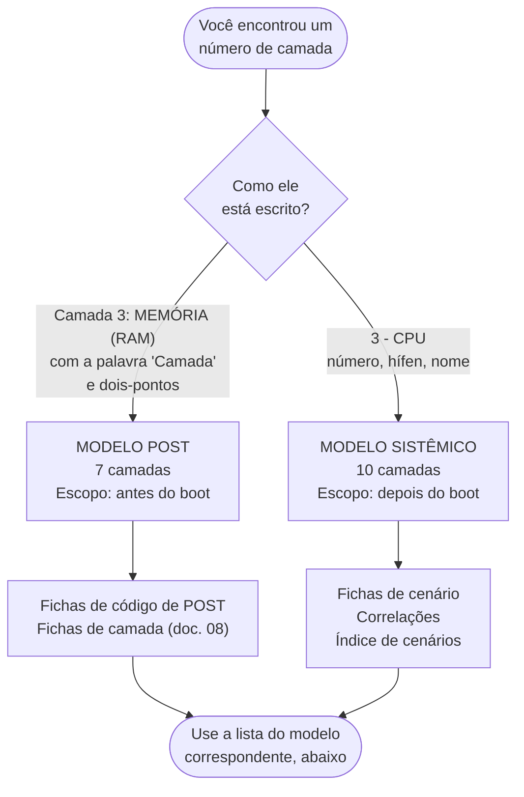

[Início](../README.md) › [Comece aqui](../README.md#comece-aqui) › **Taxonomia de camadas**

# Taxonomia de camadas

> A base usa dois modelos de camadas, um por escopo de diagnóstico. Leia antes de usar qualquer número de camada.

**Aplica-se a:** Toda a documentação — os números de camada aparecem em códigos, cenários e correlações

## Neste documento

- [O essencial em uma frase](#o-essencial-em-uma-frase)
- [Como saber qual modelo você está lendo](#como-saber-qual-modelo-você-está-lendo)
- [Modelo POST — 7 camadas](#modelo-post--7-camadas)
- [Modelo sistêmico — 10 camadas](#modelo-sistêmico--10-camadas)
- [Ficha de referência das camadas do modelo sistêmico](#ficha-de-referência-das-camadas-do-modelo-sistêmico)
- [Comparação direta dos números](#comparação-direta-dos-números)
- [Regra de notação obrigatória](#regra-de-notação-obrigatória)
- [Próximos passos](#próximos-passos)

## Contexto

A base cobre dois momentos distintos do diagnóstico — antes e depois do boot — e cada um tem seu
próprio agrupamento de subsistemas. Os dois usam a palavra **camada** e numerações diferentes. Este
documento define os dois modelos, indica o escopo de cada um e fixa a notação que os distingue em
qualquer ponto da documentação.

## Escopo

Definição, origem, alcance e ficha de referência de cada modelo de camadas; tabela de comparação
entre as numerações; regra de notação adotada.

## Fora do escopo

Detalhamento técnico das camadas do modelo POST (ver [documento 08](08-diagnostico-por-camada.md));
fichas de código; fichas de cenário.

## Relação com outros documentos

- [Diagnóstico por camada](08-diagnostico-por-camada.md) — ficha técnica completa do modelo POST
- [Índice de códigos POST](09-codigos-post/00-indice-codigos.md) — usa o modelo POST
- [Índice de cenários](10-cenarios/00-indice-cenarios.md) — usa o modelo sistêmico
- [Correlações entre camadas](12-correlacoes.md) — usa o modelo sistêmico

---

## O essencial em uma frase

**O número da camada só tem significado junto com o modelo.** *Camada 3* é **Memória** no modelo
POST e **CPU** no modelo sistêmico — e o formato em que o número está escrito já diz qual é qual.

> [!CAUTION]
> Usar o número de camada fora do modelo correspondente leva a testar o subsistema errado. Nunca
> converta um número de um modelo para o outro, e nunca cite um número de camada sem o formato que
> o identifica.

## Como saber qual modelo você está lendo

O formato do texto identifica o modelo. Não é preciso decorar as duas listas.

> [!TIP]
> Regra prática: se o texto começa com a palavra **Camada** seguida de dois-pontos, é o modelo
> POST. Se começa com o número seguido de hífen, é o modelo sistêmico.

### Por que existem dois

Os dois modelos não competem: cobrem fases diferentes do atendimento, e cada um agrupa os
subsistemas pela ordem em que eles são verificáveis naquela fase.

| | Modelo POST | Modelo sistêmico |
| --- | --- | --- |
| **Fase** | Antes de o sistema operacional carregar | Depois do boot |
| **Canal de informação** | Sinal do firmware: beep, Q-Code, LED de diagnóstico | Software: logs, S.M.A.R.T., sensores, stress test |
| **Ordena as camadas por** | Ordem de inicialização do hardware no POST | Ordem de investigação do sintoma em uso |
| **Camadas** | 7 | 10 |
| **Inclui software** | Não | Sim — sistema operacional e drivers |
| **Documento de referência** | [08-diagnostico-por-camada.md](08-diagnostico-por-camada.md) | [Ficha de referência](#ficha-de-referência-das-camadas-do-modelo-sistêmico), abaixo |

A diferença de conteúdo explica a diferença de numeração: o modelo sistêmico precisa de camadas
que não existem antes do boot — *SO* e *Drivers* — e não separa *Chipset* de *Placa-mãe* como o
POST separa.

## Modelo POST — 7 camadas

**Notação literal:** `Camada N: NOME`.

| Nº | Nome (literal na fonte) | Ficha técnica |
| --- | --- | --- |
| 1 | ENERGIA (PSU/VRM) | [Camada 1](08-diagnostico-por-camada.md#camada-1--energia-psuvrm) |
| 2 | CPU (Processador) | [Camada 2](08-diagnostico-por-camada.md#camada-2--cpu-processador) |
| 3 | MEMÓRIA (RAM) | [Camada 3](08-diagnostico-por-camada.md#camada-3--memória-ram) |
| 4 | VÍDEO (GPU/iGPU) | [Camada 4](08-diagnostico-por-camada.md#camada-4--vídeo-gpuigpu) |
| 5 | CHIPSET / MOTHERBOARD | [Camada 5](08-diagnostico-por-camada.md#camada-5--chipset--motherboard) |
| 6 | FIRMWARE (BIOS/UEFI) | [Camada 6](08-diagnostico-por-camada.md#camada-6--firmware-biosuefi) |
| 7 | PERIFÉRICOS CRÍTICOS | [Camada 7](08-diagnostico-por-camada.md#camada-7--periféricos-críticos) |

Cada ficha traz componentes, sintomas típicos, testes primários, ferramentas e indicadores de
falha — o detalhamento completo está em
[08-diagnostico-por-camada.md](08-diagnostico-por-camada.md).

## Modelo sistêmico — 10 camadas

`Camada Primária` (`INDICE_CENARIOS`) e `Falha Primária / Efeito Cascata` (`CORRELACOES`).
**Notação literal:** `N - Nome`.

| Nº | Nome (literal na fonte) | Natureza | Abas onde aparece |
| --- | --- | --- | --- |
| 1 | Energia | Hardware | CORRELACOES, INDICE_CENARIOS, TABELA_PRINCIPAL |
| 2 | Firmware | Hardware | CORRELACOES |
| 3 | CPU | Hardware | CORRELACOES, INDICE_CENARIOS, TABELA_PRINCIPAL |
| 4 | Memória | Hardware | CORRELACOES, INDICE_CENARIOS, TABELA_PRINCIPAL |
| 5 | Armazenamento | Hardware | CORRELACOES, INDICE_CENARIOS, TABELA_PRINCIPAL |
| 6 | GPU | Hardware | CORRELACOES, INDICE_CENARIOS, TABELA_PRINCIPAL |
| 7 | Placa-mãe | Hardware | TABELA_PRINCIPAL |
| 8 | Periféricos | Hardware | CORRELACOES |
| 9 | SO | Software | CORRELACOES, INDICE_CENARIOS, TABELA_PRINCIPAL |
| 10 | Drivers | Software | CORRELACOES, INDICE_CENARIOS, TABELA_PRINCIPAL |

A ordem segue a sequência de investigação adotada pelo
[fluxo sistêmico](07-fluxo-sistemico.md): energia primeiro, software por último. As camadas
**2 (Firmware)**, **8 (Periféricos)** e **10 (Drivers)** aparecem apenas como origem ou destino de
efeito em cascata — não são ponto de entrada de nenhum cenário, e por isso ocorrem só na aba
`CORRELACOES`.

## Ficha de referência das camadas do modelo sistêmico

A tabela abaixo reúne, para cada camada do modelo sistêmico, o que a fonte declara nas colunas
`Componente Suspeito`, `Primeiro Teste` e `Ferramentas Necessárias` dos cenários atribuídos a ela.
É o equivalente, para este modelo, do que o [documento 08](08-diagnostico-por-camada.md) oferece
para o modelo POST.

| Camada | Componentes suspeitos declarados | Cenários de entrada | Primeiro teste | Ferramentas |
| --- | --- | --- | --- | --- |
| **1 - Energia** | PSU; VRM; cabos de alimentação; contatos elétricos | [NL-01](10-cenarios/nao-liga.md#nl-01), [RA-01](10-cenarios/reinicializacao-aleatoria.md#ra-01), [FI-01](10-cenarios/falhas-intermitentes.md#fi-01) | Teste paperclip da PSU → multímetro nas tensões | Multímetro, Testador PSU, Chave de fenda |
| **2 - Firmware** | BIOS/UEFI desatualizado; microcode; MRC; tabelas ACPI | Entrada apenas por cascata — [COR-03](12-correlacoes.md#cor-03) | Verificar changelog da BIOS no site do fabricante da placa-mãe | Utilitário de atualização do fabricante |
| **3 - CPU** | CPU; thermal throttling; VRM; cooler; pasta térmica; ventilação do gabinete | [TR-01](10-cenarios/travamentos-freeze.md#tr-01), [SA-01](10-cenarios/superaquecimento.md#sa-01) | AIDA64 Sensores (idle) → Stability Test FPU | AIDA64, Pasta térmica, Termômetro IR, Álcool isopropílico |
| **4 - Memória** | Módulos DRAM; slots DIMM; perfil XMP; IMC da CPU | [SV-01](10-cenarios/liga-sem-video.md#sv-01), [RA-02](10-cenarios/reinicializacao-aleatoria.md#ra-02), [BS-01](10-cenarios/bsod.md#bs-01) | Reencaixar RAM (1 módulo, slot primário) → MemTest86 | MemTest86, AIDA64, Manual da placa-mãe |
| **5 - Armazenamento** | HDD/SSD; controladora SATA/NVMe; cabo de dados; cabo de energia; porta SATA/M.2 | [BS-02](10-cenarios/bsod.md#bs-02), [DN-01](10-cenarios/disco-nao-reconhecido.md#dn-01) | Verificar cabos → outra porta SATA → BIOS (AHCI) → outro sistema | Victoria, Cabos SATA *known-good*, CrystalDiskInfo |
| **6 - GPU** | GPU dedicada; iGPU; slot PCIe x16 | [SV-02](10-cenarios/liga-sem-video.md#sv-02) | Remover GPU dedicada → testar iGPU | GPU *known-good*, Manual da placa-mãe |
| **7 - Placa-mãe** | Placa-mãe; VRM; Front Panel Header | [NL-02](10-cenarios/nao-liga.md#nl-02) | Curto do PWR_SW com boot mínimo | Chave de fenda, Lupa |
| **8 - Periféricos** | Dispositivos conectados; gerenciamento de energia | Entrada apenas por cascata — [COR-03](12-correlacoes.md#cor-03) | Verificar Gerenciador de Dispositivos | Gerenciador de Dispositivos |
| **9 - SO** | Processos do SO; malware; Windows Update; registro do Windows | [AU-01](10-cenarios/alto-uso-cpu-gpu.md#au-01) | Gerenciador de Tarefas → Process Explorer → verificar malware | Process Explorer, Windows Defender Offline, `sfc`, DISM |
| **10 - Drivers** | Driver de vídeo; driver de chipset; driver de armazenamento | Entrada apenas por cascata — [COR-06](12-correlacoes.md#cor-06) | Event Viewer → erros de driver → rollback | Gerenciador de Dispositivos, DDU, AIDA64 |

> [!NOTE]
> A tabela acima **reorganiza** colunas já existentes nas abas `TABELA_PRINCIPAL`,
> `INDICE_CENARIOS` e `CORRELACOES` — agrupando por camada o que a fonte registra por cenário.
> Nenhum campo foi acrescentado.> **Inferido (organizacional)** (o agrupamento por camada).

## Comparação direta dos números

| Nº | Modelo POST | Modelo sistêmico | Coincide? |
| --- | --- | --- | --- |
| 1 | ENERGIA (PSU/VRM) | Energia | Sim |
| 2 | CPU (Processador) | Firmware | Não |
| 3 | MEMÓRIA (RAM) | CPU | Não |
| 4 | VÍDEO (GPU/iGPU) | Memória | Não |
| 5 | CHIPSET / MOTHERBOARD | Armazenamento | Não |
| 6 | FIRMWARE (BIOS/UEFI) | GPU | Não |
| 7 | PERIFÉRICOS CRÍTICOS | Placa-mãe | Não |
| 8 | — (não existe) | Periféricos | n/a |
| 9 | — (não existe) | SO | n/a |
| 10 | — (não existe) | Drivers | n/a |

Apenas a camada 1 (*Energia*) coincide. Use esta tabela para **conferir**, nunca para converter.

### Equivalência por assunto

Quando você precisa ir de um modelo ao outro, faça pelo **assunto**, não pelo número:

| Assunto | No modelo POST | No modelo sistêmico |
| --- | --- | --- |
| Alimentação | `Camada 1: ENERGIA (PSU/VRM)` | `1 - Energia` |
| Processador | `Camada 2: CPU (Processador)` | `3 - CPU` |
| Memória | `Camada 3: MEMÓRIA (RAM)` | `4 - Memória` |
| Vídeo | `Camada 4: VÍDEO (GPU/iGPU)` | `6 - GPU` |
| Placa e chipset | `Camada 5: CHIPSET / MOTHERBOARD` | `7 - Placa-mãe` |
| Firmware | `Camada 6: FIRMWARE (BIOS/UEFI)` | `2 - Firmware` |
| Periféricos e armazenamento | `Camada 7: PERIFÉRICOS CRÍTICOS` | `5 - Armazenamento` e `8 - Periféricos` |
| Sistema operacional | — não existe antes do boot | `9 - SO` |
| Drivers | — não existe antes do boot | `10 - Drivers` |

> [!NOTE]
> A equivalência por assunto é **organizacional**, derivada dos nomes das camadas nos dois modelos.
> Ela não altera nenhum número.
## Regra de notação obrigatória

1. Todo número de camada é reproduzido **exatamente no formato da fonte** — `Camada 3: MEMÓRIA
   (RAM)` ou `3 - CPU`. O formato é o identificador do modelo.
2. Nenhum número de camada é convertido de um modelo para o outro. Quando um documento precisa
   citar o assunto nos dois escopos, cita os dois valores.
3. Os nomes *modelo POST* e *modelo sistêmico* são desta documentação, criados para poder falar dos
   dois sem ambiguidade.
4. Códigos cuja camada é declarada como `Variável` na fonte — caso do
   [SmartBeep Lenovo](09-codigos-post/lenovo.md#post-44--melodia-variável), em que a camada só é
   conhecida depois de o aplicativo decodificar o bipe — permanecem assim, e o documento indica o
   motivo no ponto de uso.

## Próximos passos

| Se você… | Vá para |
| --- | --- |
| quer a ficha técnica de uma camada do modelo POST | [Diagnóstico por camada](08-diagnostico-por-camada.md) |
| está consultando um código de POST | [Índice de códigos POST](09-codigos-post/00-indice-codigos.md) |
| está consultando um cenário de falha | [Índice de cenários](10-cenarios/00-indice-cenarios.md) |
| trocou a peça e o problema voltou | [Correlações entre camadas](12-correlacoes.md) |

---

| Atributo | Valor |
| --- | --- |
| **Autoria** | Edsilas |
| **Versão da documentação** | `doc-3.0.0` |
