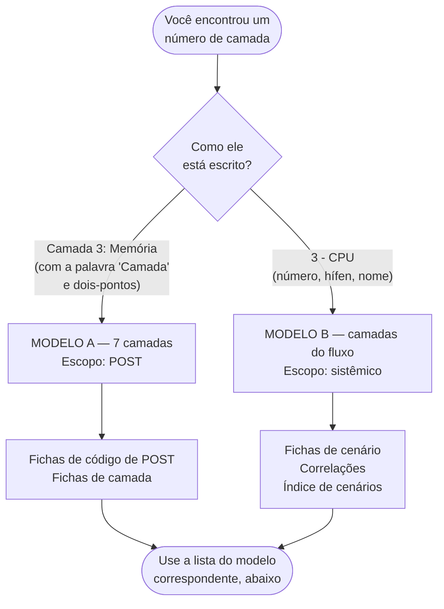

<!-- Gerado a partir de Ambos os arquivos-fonte (ver corpo do documento). Não editar manualmente sem atualizar a fonte. -->

[Início](../README.md) › [Comece aqui](../README.md#comece-aqui) › **Taxonomia de camadas — dois modelos coexistentes**

# Taxonomia de camadas — dois modelos coexistentes

> Os dois arquivos-fonte numeram as camadas de forma incompatível. Leia antes de usar qualquer número de camada.

**Aplica-se a:** Toda a documentação — os números de camada aparecem em códigos, cenários e correlações

## Neste documento

- [Como saber qual modelo estou lendo](#como-saber-qual-modelo-estou-lendo)
- [Modelo A — 7 camadas (escopo POST)](#modelo-a--7-camadas-escopo-post)
- [Modelo B — camadas do fluxo sistêmico](#modelo-b--camadas-do-fluxo-sistêmico)
- [Comparação direta dos números](#comparação-direta-dos-números)
- [Regra de uso adotada nesta documentação](#regra-de-uso-adotada-nesta-documentação)
- [Próximos passos](#próximos-passos)

## Contexto

As duas planilhas-fonte usam a palavra **camada** com numerações diferentes e incompatíveis. Este documento registra os dois modelos, indica onde cada um é usado e alerta para o risco de leitura cruzada equivocada. É leitura obrigatória antes de usar qualquer número de camada.

## Escopo

Definição, origem e alcance de cada modelo de camadas; tabela de equivalência possível; regra de uso adotada nesta documentação.

## Fora do escopo

Detalhamento técnico das camadas (ver documento 08); fichas de código; cenários.

## Relação com outros documentos

- [Diagnóstico por camada (modelo POST)](08-diagnostico-por-camada.md)
- [Índice de códigos POST](09-codigos-post/00-indice-codigos.md) — usa o modelo A
- [Índice de cenários](10-cenarios/00-indice-cenarios.md) — usa o modelo B
- [Correlações entre camadas](12-correlacoes.md) — usa o modelo B
- [Pendências](references/pendencias.md)

---

> [!CAUTION]
> O número de uma camada **não significa a mesma coisa** nos dois arquivos-fonte.
> Exemplo: **camada 3** é *Memória* no modelo A e *CPU* no modelo B. Usar o número errado leva a
> testar o subsistema errado.
>
> A documentação **não escolhe** um dos modelos como correto: preserva ambos, identifica a origem
> de cada um e exige que o número da camada venha sempre acompanhado do modelo.
>
> **Status: Necessita validação** pelo proprietário do projeto —
> [P-03 em pendências](references/pendencias.md).

## Como saber qual modelo estou lendo

O formato do texto identifica o modelo. Não é preciso decorar as duas listas.

> [!TIP]
> Regra prática: se o texto começa com a palavra **Camada**, é o modelo de 7 camadas do POST.
> Se começa com o número seguido de hífen, é o modelo do fluxo sistêmico.

## Modelo A — 7 camadas (escopo POST)

**Origem:** `HW_HARDWARE_CODIGOS_DE_ERROS.xlsx`, abas `Camadas de Diagnóstico` (tabela de definição)
e `Tabela Diagnóstico POST` (coluna `CAMADA DE DIAGNÓSTICO`).
**Formato literal na fonte:** `Camada N: Nome`.
**Status: Confirmado** — existe tabela de definição explícita.

| Nº | Nome (literal na fonte) |
| --- | --- |
| 1 | ENERGIA (PSU/VRM) |
| 2 | CPU (Processador) |
| 3 | MEMÓRIA (RAM) |
| 4 | VÍDEO (GPU/iGPU) |
| 5 | CHIPSET / MOTHERBOARD |
| 6 | FIRMWARE (BIOS/UEFI) |
| 7 | PERIFÉRICOS CRÍTICOS |

Ficha técnica completa de cada camada: [08-diagnostico-por-camada.md](08-diagnostico-por-camada.md).

## Modelo B — camadas do fluxo sistêmico

**Origem:** `HW_HARDWARE_FLUXO_DIAGNOSTICO.xlsx`, colunas `Camada Afetada` (`TABELA_PRINCIPAL`),
`Camada Primária` (`INDICE_CENARIOS`) e `Falha Primária / Efeito Cascata` (`CORRELACOES`).
**Formato literal na fonte:** `N - Nome` ou `N-Nome`.
**Status: Reconstruído a partir do uso.** Não existe, em nenhuma das abas, uma tabela que defina
este modelo. A lista abaixo foi montada varrendo todas as ocorrências literais nas células.

| Nº | Nome (literal na fonte) | Abas onde aparece |
| --- | --- | --- |
| 1 | Energia | CORRELACOES, INDICE_CENARIOS, TABELA_PRINCIPAL |
| 2 | Firmware | CORRELACOES |
| 3 | CPU | CORRELACOES, INDICE_CENARIOS, TABELA_PRINCIPAL |
| 4 | Memória | CORRELACOES, INDICE_CENARIOS, TABELA_PRINCIPAL |
| 5 | Armazenamento | CORRELACOES, INDICE_CENARIOS, TABELA_PRINCIPAL |
| 6 | GPU | CORRELACOES, INDICE_CENARIOS, TABELA_PRINCIPAL |
| 7 | Placa-mãe | TABELA_PRINCIPAL |
| 8 | Periféricos | CORRELACOES |
| 9 | SO | CORRELACOES, INDICE_CENARIOS, TABELA_PRINCIPAL |
| 10 | Drivers | CORRELACOES |

> As camadas do modelo B **não possuem ficha técnica** equivalente ao documento 08: a fonte não
> descreve componentes, testes primários nem indicadores de falha para elas.
> Registrado em [Pendências](references/pendencias.md).

## Comparação direta dos números

| Nº | Modelo A (POST) | Modelo B (sistêmico) | Coincide? |
| --- | --- | --- | --- |
| 1 | ENERGIA (PSU/VRM) | Energia | Sim |
| 2 | CPU (Processador) | Firmware | **Não** |
| 3 | MEMÓRIA (RAM) | CPU | **Não** |
| 4 | VÍDEO (GPU/iGPU) | Memória | **Não** |
| 5 | CHIPSET / MOTHERBOARD | Armazenamento | **Não** |
| 6 | FIRMWARE (BIOS/UEFI) | GPU | **Não** |
| 7 | PERIFÉRICOS CRÍTICOS | Placa-mãe | **Não** |
| 8 | — (não existe) | Periféricos | n/a |
| 9 | — (não existe) | SO | n/a |
| 10 | — (não existe) | Drivers | n/a |

Apenas a camada 1 (*Energia*) coincide entre os dois modelos. As demais divergem.

## Regra de uso adotada nesta documentação

1. Todo número de camada é sempre reproduzido **exatamente como está na fonte**, incluindo o
   formato (`Camada 3: Memória` vs `3 - CPU`). O formato já identifica o modelo.
2. Nenhum número de camada foi convertido de um modelo para o outro.
3. Os nomes *Modelo A* e *Modelo B* existem **apenas nesta documentação**, para poder falar dos
   dois sem ambiguidade. Não estão na fonte.

> [!NOTE]
> Os rótulos "Modelo A" e "Modelo B" existem apenas nesta documentação, para permitir falar dos
> dois sem ambiguidade. Nível de confiança: **Inferido (organizacional)**.

## Próximos passos

| Se você… | Vá para |
| --- | --- |
| quer a ficha técnica de uma camada do modelo A | [Diagnóstico por camada](08-diagnostico-por-camada.md) |
| está consultando um código de POST | [Índice de códigos POST](09-codigos-post/00-indice-codigos.md) |
| está consultando um cenário de falha | [Índice de cenários](10-cenarios/00-indice-cenarios.md) |
| quer acompanhar a resolução do conflito | [Pendências — P-03](references/pendencias.md) |

---

| | |
| --- | --- |
| **Fonte primária deste documento** | Ambos os arquivos-fonte (ver corpo do documento) |
| **Status de confiança** | Confirmado (modelo A) / Necessita validação (modelo B) |
| **Última verificação contra a fonte** | 2026-08-07 |
| **Autoria** | Edsilas |
| **Versão da documentação** | `doc-1.3.0` |
