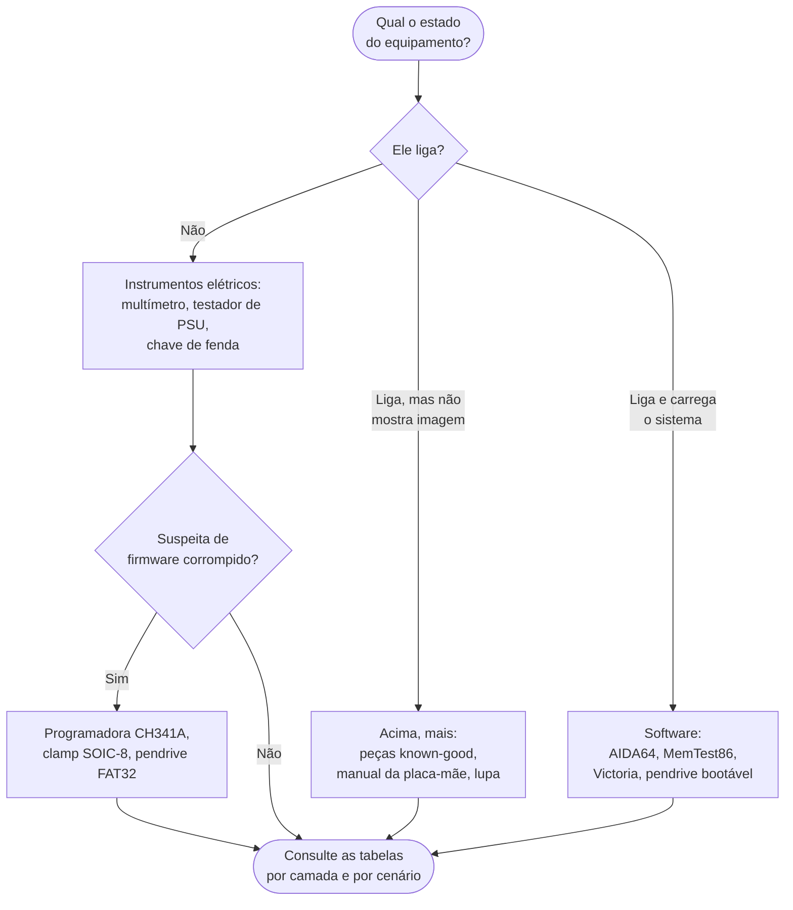

[Início](../README.md) › [Comece aqui](../README.md#comece-aqui) › **Requisitos e ferramentas**

# Requisitos e ferramentas

> Inventário do instrumental exigido pelos procedimentos, organizado por camada, por cenário e por componente na validação.

**Aplica-se a:** Preparação da bancada antes de iniciar um atendimento

## Neste documento

- [O que separar antes de começar](#o-que-separar-antes-de-começar)
- [Ferramentas por camada de diagnóstico (modelo POST)](#ferramentas-por-camada-de-diagnóstico-modelo-post)
- [Ferramentas por cenário de falha](#ferramentas-por-cenário-de-falha)
- [Ferramentas de validação por componente](#ferramentas-de-validação-por-componente)
- [Ferramentas com guia operacional próprio](#ferramentas-com-guia-operacional-próprio)
- [Instrumental de segurança](#instrumental-de-segurança)
- [Próximos passos](#próximos-passos)

## Contexto

Inventário das ferramentas, instrumentos e insumos citados nas fontes, organizado por onde a exigência aparece. Serve para montar a bancada antes de iniciar um atendimento.

## Escopo

Ferramentas por camada de diagnóstico, por cenário de falha e por componente na validação final, transcritas das colunas correspondentes.

## Fora do escopo

Passo a passo de operação das ferramentas (ver `14-ferramentas/`); onde comprar, preços, versões suportadas ou requisitos de sistema — não constam nas fontes.

## Relação com outros documentos

- [Guias de ferramentas](14-ferramentas/00-indice-ferramentas.md) — operação detalhada de Victoria, AIDA64 e MemTest86
- [Diagnóstico por camada](08-diagnostico-por-camada.md)
- [Índice de cenários](10-cenarios/00-indice-cenarios.md)
- [Validação final por componente](13-validacao-final.md)
- [Segurança e boas práticas](15-seguranca-e-boas-praticas.md) — como usar o instrumental com segurança

---

> [!NOTE]
> O projeto é uma base de conhecimento documental. Não há software a instalar, compilar ou
> configurar. "Requisito", aqui, significa o instrumental necessário para executar os
> procedimentos documentados.
>
> Requisitos de sistema, versões mínimas de sistema operacional e requisitos de licenciamento das
> ferramentas **não constam nas fontes analisadas**, exceto onde citados pontualmente nos guias
> (por exemplo, a exigência de UEFI pelo MemTest86 v10+ e a licença Engineer do AIDA64).

## O que separar antes de começar

O instrumental depende de até onde o equipamento chega. Use o fluxo abaixo para decidir o que levar
para a bancada.

> [!NOTE]
> O agrupamento acima deriva das colunas de ferramentas por camada e por cenário, reproduzidas
> integralmente abaixo.> **Inferido** (o agrupamento por estado do equipamento).

## Ferramentas por camada de diagnóstico (modelo POST)

| Camada | Nome | Ferramentas (literal na fonte) |
| --- | --- | --- |
| 1 | ENERGIA (PSU/VRM) | Multímetro digital, Osciloscópio (ripple), Testador de fonte ATX, Fonte de bancada |
| 2 | CPU (Processador) | Multímetro (VCore, EPS 12V), Lupa 10x, Lista compatibilidade CPU, BIOS Flashback utility |
| 3 | MEMÓRIA (RAM) | MemTest86 (bootável), Multímetro (VDRAM), Borracha branca, Isopropanol 99%, Lupa, QVL do fabricante |
| 4 | VÍDEO (GPU/iGPU) | Cabo HDMI/DP known-good, Monitor known-good, GPU known-good, Borracha branca |
| 5 | CHIPSET / MOTHERBOARD | Multímetro, Osciloscópio, Lupa 10x, Bateria CR2032, Ar comprimido |
| 6 | FIRMWARE (BIOS/UEFI) | Programadora CH341A/CH341B, Pendrive FAT32, Clamp SOIC-8, Software de gravação (flashrom, AsProgrammer) |
| 7 | PERIFÉRICOS CRÍTICOS | CrystalDiskInfo (SMART), Cabos SATA novos, Pendrive bootável, POST Card PCI/USB |

## Ferramentas por cenário de falha

| Cenário | Ferramentas necessárias (literal na fonte) |
| --- | --- |
| Não liga | Multímetro, Testador PSU, Chave de fenda |
| Liga sem vídeo | Manual placa-mãe, GPU known-good |
| Reinicialização aleatória | AIDA64, MemTest86, Multímetro |
| BSOD (Tela Azul) | WinDbg, BlueScreenView, MemTest86, Victoria |
| Travamentos (Freeze) | AIDA64, Pasta térmica, Álcool isopropílico |
| Disco não reconhecido | Cabos SATA known-good, Victoria |
| Alto uso CPU/GPU | Process Explorer, Windows Defender Offline |
| Superaquecimento | AIDA64, Pasta térmica, Termômetro IR |
| Falhas intermitentes | AIDA64 (Log), UPS, Multímetro |

## Ferramentas de validação por componente

| Componente | Ferramenta de validação (literal na fonte) |
| --- | --- |
| PSU | AIDA64 Engineer; Multímetro |
| Placa-mãe | AIDA64; Inspeção visual (capacitores, VRM) |
| CPU | AIDA64 Engineer; Intel Processor Diagnostic Tool |
| RAM | MemTest86 v10+; AIDA64 (Cache & Memory Benchmark) |
| Disco HDD | Victoria HDD/SSD; CrystalDiskInfo |
| Disco SSD/NVMe | AIDA64; CrystalDiskInfo; Utilitário do fabricante |
| GPU | AIDA64; FurMark (opcional); Utilitário NVIDIA/AMD |
| SO Windows | sfc; DISM; Event Viewer; Reliability Monitor |
| Drivers | Gerenciador de Dispositivos; AIDA64 (Drivers de Sistema) |
| Térmico | AIDA64; Termômetro IR (opcional) |

## Ferramentas com guia operacional próprio

Apenas três ferramentas possuem procedimento passo a passo nas fontes:

| Ferramenta | Etapas documentadas | Guia |
| --- | --- | --- |
| Victoria (HDD/SSD) | 9 | [victoria.md](14-ferramentas/victoria.md) |
| MemTest86 | 10 + critérios de decisão | [memtest86.md](14-ferramentas/memtest86.md) |
| AIDA64 | 45 | [01–15](14-ferramentas/aida64-etapas-01-15.md) · [16–30](14-ferramentas/aida64-etapas-16-30.md) · [31–45](14-ferramentas/aida64-etapas-31-45.md) |

As demais ferramentas citadas (multímetro, osciloscópio, programadora CH341A, CrystalDiskInfo,
WinDbg, Process Explorer, FurMark, entre outras) aparecem apenas como menção dentro de
procedimentos, sem guia próprio.

> [!NOTE]
> colunas de origem.

## Instrumental de segurança

Além das ferramentas de diagnóstico, a bancada precisa do instrumental que protege o operador e os
componentes. Ele não aparece nas tabelas de ferramentas porque não é usado para
diagnosticar — é usado para não danificar.

| Item | Para quê | Referência |
| --- | --- | --- |
| Pulseira antiestática, ligada ao aterramento da bancada | Evitar descarga eletrostática no manuseio de placas e módulos | ANSI/ESD S20.20-2021; pulseiras conforme ANSI/ESD S1.1 |
| Manta dissipativa aterrada | Superfície segura para apoiar placas | ANSI/ESD S20.20-2021 |
| Embalagem dissipativa ou com blindagem | Guardar e transportar componentes removidos | ANSI/ESD S541 |
| Iluminação dirigida e lupa 10x | Inspeção de socket, trilhas e capacitores | Citada nas camadas 2, 5 e 6 |
| Ar comprimido | Limpeza sem contato mecânico | Citado na camada 5 |

> [!CAUTION]
> Componentes podem ser danificados por descargas a partir de **100 V** (modelo de corpo humano),
> muito abaixo do limiar que uma pessoa percebe. Não sentir choque não significa que não houve
> descarga — e o dano por ESD costuma ser latente, aparecendo semanas depois. Ver
> [Proteção contra ESD](15-seguranca-e-boas-praticas.md#proteção-contra-descarga-eletrostática-esd).

## Próximos passos

| Se você… | Vá para |
| --- | --- |
| precisa do passo a passo de uma ferramenta | [Guias de ferramentas](14-ferramentas/00-indice-ferramentas.md) |
| quer saber qual ferramenta cada código exige | [Índices cruzados](18-indices-cruzados.md) |
| vai abrir o equipamento | [Segurança e boas práticas](15-seguranca-e-boas-praticas.md) |
| está pronto para começar o diagnóstico | [Fluxo de diagnóstico sistêmico](07-fluxo-sistemico.md) |

---

| Atributo | Valor |
| --- | --- |
| **Autoria** | Edsilas |
| **Versão da documentação** | `doc-3.0.0` |
