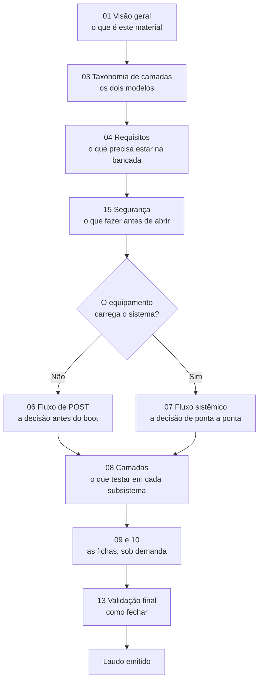

[Início](../README.md) › [Comece aqui](../README.md#comece-aqui) › **Como utilizar esta base**

# Como utilizar esta base

> Roteiro de entrada: por onde começar conforme o sintoma, em que ordem ler e quais regras seguir ao aplicar os procedimentos.

**Aplica-se a:** Uso da base durante um atendimento

## Neste documento

- [Antes de qualquer coisa](#antes-de-qualquer-coisa)
- [Onde entrar conforme o sintoma](#onde-entrar-conforme-o-sintoma)
- [Ordem de leitura para quem está chegando agora](#ordem-de-leitura-para-quem-está-chegando-agora)
- [Regras de uso do material](#regras-de-uso-do-material)
- [Consulta automatizada](#consulta-automatizada)
- [Próximos passos](#próximos-passos)

## Contexto

Roteiro de entrada. Diz por onde começar conforme o que está acontecendo com o equipamento e em que ordem percorrer os documentos.

## Escopo

Pontos de entrada por situação, ordem de leitura recomendada e regras de uso do material.

## Fora do escopo

Conteúdo técnico dos procedimentos; organização interna da documentação (ver documento 02).

## Relação com outros documentos

- [Índice da documentação](00-indice.md)
- [Fluxo de diagnóstico POST](06-fluxo-post.md)
- [Fluxo de diagnóstico sistêmico](07-fluxo-sistemico.md)
- [Índice de cenários](10-cenarios/00-indice-cenarios.md)
- [Segurança e boas práticas](15-seguranca-e-boas-praticas.md)

---

## Antes de qualquer coisa

Leia [Taxonomia de camadas](03-taxonomia-camadas.md). A base usa dois modelos de camadas, um por
escopo, e usar o número no modelo errado leva a testar o subsistema errado.

Se você vai abrir o equipamento, leia também
[Segurança e boas práticas](15-seguranca-e-boas-praticas.md): descarga de energia residual e
proteção contra ESD são pré-requisito de qualquer manipulação.

## Onde entrar conforme o sintoma

A triagem por sintoma vive no [README](../README.md#por-onde-começar) — fluxograma de decisão e
tabela completa de *o que você observa* → documento. Ela não é repetida aqui.

Esta página cobre o que vem **depois** de escolher o caminho: em que ordem ler e que regras seguir
ao aplicar um procedimento.

## Ordem de leitura para quem está chegando agora

> [!IMPORTANT]
> A etapa **03 Taxonomia de camadas** não é opcional. Ela é o único ponto da base em que o
> conflito entre os dois modelos de numeração é explicado, e todo número de camada que você
> encontrar depois depende dela.

## Regras de uso do material

1. **Prepare a bancada antes de abrir.** Descarga de energia residual e proteção contra ESD estão
   em [Segurança e boas práticas](15-seguranca-e-boas-praticas.md); os procedimentos assumem que
   você as executou.
2. **Não pule a camada de energia.** Os dois fluxos começam por ela, e a correlação
   [COR-01](12-correlacoes.md#cor-01) registra que instabilidade de fonte se manifesta como falha de
   memória, de disco e de sistema operacional.
3. **Anote o sinal exatamente como observado.** A Etapa 3 do fluxo de POST exige registrar número
   de beeps, duração (curto/longo) e pausas. Sem isso, a consulta ao catálogo não converge.
4. **Identifique o fabricante do BIOS antes de interpretar um beep.** O mesmo padrão sonoro tem
   significados diferentes entre AMI, Award e Acer/Insyde.
5. **Não conclua o atendimento sem validar.** O documento 13 traz critério PASS e FAIL por
   componente, com tempo de observação.
6. **Onde a documentação disser "Informação não identificada na fonte analisada", trate como
   lacuna real** — não como algo que possa ser preenchido por analogia com outro registro.

## Consulta automatizada

Cada documento é autocontido: traz contexto, escopo, fora de escopo e relação com outros
documentos. É possível carregar apenas o documento relevante sem perder a noção de onde ele se
encaixa.

## Próximos passos

| Se você… | Vá para |
| --- | --- |
| o equipamento não carrega o sistema | [Fluxo de diagnóstico POST](06-fluxo-post.md) |
| o equipamento carrega e falha em uso | [Fluxo de diagnóstico sistêmico](07-fluxo-sistemico.md) |
| vai abrir o equipamento | [Segurança e boas práticas](15-seguranca-e-boas-praticas.md) |
| quer a lista completa de documentos | [Índice da documentação](00-indice.md) |

---

| Atributo | Valor |
| --- | --- |
| **Autoria** | Edsilas |
| **Versão da documentação** | `doc-3.0.0` |
