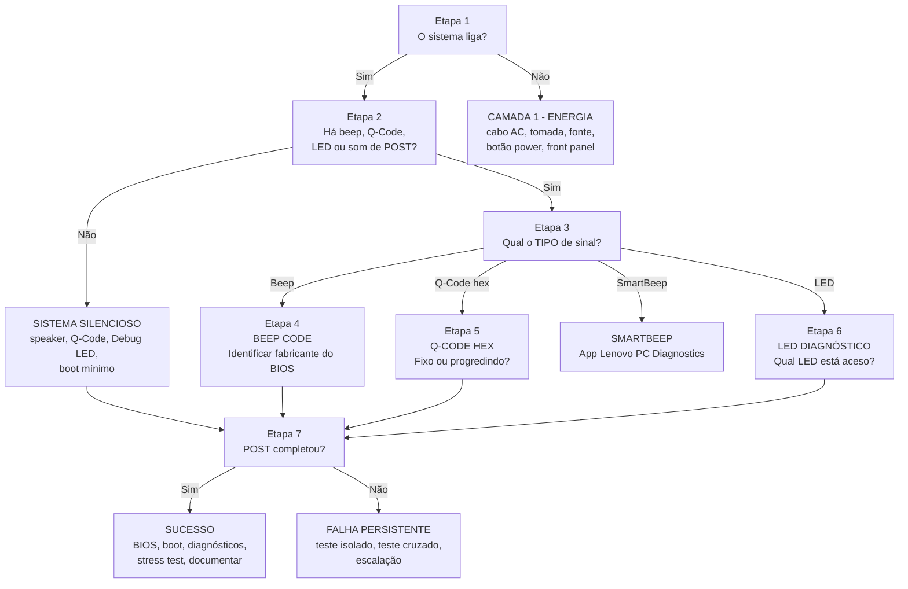

[Início](../README.md) › [Diagnostique](../README.md#diagnostique) › **Fluxo de diagnóstico POST**

# Fluxo de diagnóstico POST

> Sequência de decisão para equipamentos que não concluem o POST, da verificação de energia até a identificação do código de erro.

**Aplica-se a:** Desktops, notebooks e servidores que não chegam a carregar o sistema operacional

## Neste documento

- [Objetivo](#objetivo)
- [Quando utilizar](#quando-utilizar)
- [Pré-requisitos](#pré-requisitos)
- [Visão geral das etapas](#visão-geral-das-etapas)
- [Diagrama do fluxo](#diagrama-do-fluxo)
- [Fluxo detalhado](#fluxo-detalhado)
- [Quando interromper](#quando-interromper)
- [Observações](#observações)
- [Próximos passos](#próximos-passos)

## Contexto

Fluxo condicional aplicado **antes** de o sistema operacional carregar. Vai da verificação de energia até a identificação do tipo de sinal de diagnóstico (beep, Q-Code, LED, SmartBeep) e o encaminhamento para a ficha do código correspondente.

## Escopo

As 7 etapas do fluxograma de POST registradas na fonte, com condição, ação em caso afirmativo, ação em caso negativo, próxima etapa e observações.

## Fora do escopo

Diagnóstico após o boot do sistema operacional (ver fluxo sistêmico); conteúdo das fichas de código; guias de ferramentas.

## Relação com outros documentos

- [Fluxo de diagnóstico sistêmico](07-fluxo-sistemico.md) — continua depois que o POST conclui
- [Índice de códigos POST](09-codigos-post/00-indice-codigos.md) — destino das Etapas 4, 5 e 6
- [Camadas de diagnóstico](08-diagnostico-por-camada.md) — subsistemas citados nas ações
- [Ambiguidade de códigos](11-ambiguidades.md) — tratamento citado na Etapa 4
- [Segurança e boas práticas](15-seguranca-e-boas-praticas.md) — define o boot mínimo citado nas Etapas 2 e 7

---

## Objetivo

Título declarado na fonte: **FLUXOGRAMA DE DIAGNÓSTICO POST — ESTRUTURA CONDICIONAL**

## Quando utilizar

Quando o equipamento não conclui o POST: não liga, liga sem vídeo, emite beeps, exibe Q-Code fixo
ou acende LED de diagnóstico. A Etapa 1 é o ponto de entrada obrigatório.

## Pré-requisitos

As ferramentas citadas nas ações de cada etapa estão reproduzidas abaixo, no texto original. Antes
de executar qualquer etapa que exija abrir o equipamento:

| Pré-requisito | Onde está definido |
| --- | --- |
| Descarga da energia residual — 30 s com o botão Power, sem cabo AC | [Procedimento canônico](15-seguranca-e-boas-praticas.md#procedimento-canônico-de-power-drain) |
| Proteção contra descarga eletrostática | [Proteção contra ESD](15-seguranca-e-boas-praticas.md#proteção-contra-descarga-eletrostática-esd) |
| Composição do boot mínimo citada nas Etapas 2 e 7 | [Boot mínimo](15-seguranca-e-boas-praticas.md#boot-mínimo-as-duas-composições-canônicas) |
| Multímetro, para a medição de 5VSB da Etapa 1 | [Requisitos e ferramentas](04-requisitos-e-ferramentas.md) |

> **Inferida** a partir da condição da Etapa 1.

## Visão geral das etapas

| Etapa | Condição / pergunta | Próxima etapa |
| --- | --- | --- |
| 1 | O sistema liga (fans giram, LEDs acendem)? | Etapa 2 |
| 2 | Há beep code, Q-Code, LED de diagnóstico, ou som de POST? | Etapa 3 ou Etapa 7 |
| 3 | Identificar o TIPO de sinal: Beep, Q-Code Hex, LED, ou SmartBeep? | Etapa 4/5/6 |
| 4 | BEEP CODE — Identificar fabricante do BIOS:  AMI = sequência numérica.  Award = longo+curto ou contínuo.  Phoenix = padrões X-X-X-X com pausas. | Procedimento |
| 5 | Q-CODE HEX — Ler display de 2 dígitos na placa-mãe.  O código é fixo ou está progredindo? | Procedimento |
| 6 | LED DIAGNÓSTICO — Qual LED está aceso?  CPU (Vermelho) / DRAM (Amarelo) / VGA (Branco) / BOOT (Verde) | Procedimento |
| 7 | Após procedimento: POST completou com sucesso? | FIM ou Escalação |

## Diagrama do fluxo

Reprodução visual das colunas `ETAPA`, `CONDIÇÃO / PERGUNTA` e `PRÓXIMA ETAPA`. O texto integral
de cada etapa está na seção seguinte.

> O diagrama é uma representação das colunas de encadeamento da fonte. Os rótulos das setas e os
> textos dos nós são resumos das células; o conteúdo integral está abaixo, sem cortes.

---

## Fluxo detalhado

### Etapa 1

#### Condição / pergunta

O sistema liga (fans giram, LEDs acendem)?

#### Ação se SIM

→ Ir para Etapa 2 (verificar sinais de diagnóstico).

#### Ação se NÃO

CAMADA 1 — ENERGIA:  
1. Verificar cabo AC.  
2. Testar tomada.  
3. Testar fonte (BIST se Dell, multímetro 5VSB).  
4. Verificar botão power e cabos front panel.  
5. Se 5VSB OK mas não liga: curto na placa.

#### Próxima etapa

Etapa 2

#### Observações

Se 5VSB (standby 5V) ausente no conector 24-pin: fonte morta ou cabo AC.

---

### Etapa 2

#### Condição / pergunta

Há beep code, Q-Code, LED de diagnóstico, ou som de POST?

#### Ação se SIM

→ Ir para Etapa 3 (identificar padrão).

#### Ação se NÃO

SISTEMA SILENCIOSO (NO POST):  
1. Verificar se speaker está conectado.  
2. Verificar Q-Code display (se disponível).  
3. Verificar LEDs de diagnóstico (CPU/DRAM/VGA/BOOT).  
4. Se nenhum indicador: boot mínimo (CPU + 1 RAM + fonte).  
5. Se boot mínimo falha: placa ou CPU condenada.

#### Próxima etapa

Etapa 3 ou Etapa 7

#### Observações

Sistemas sem speaker, Q-Code ou Debug LED são os mais difíceis de diagnosticar. POST Card USB/PCI é recomendada.

> [!IMPORTANT]
> O *boot mínimo* citado no item 4 desta etapa é o **boot mínimo absoluto** — CPU + cooler +
> 1 módulo de RAM no slot primário + PSU, sem GPU dedicada. Quando a placa não tem speaker,
> Q-Code nem Debug LED, use a variante **com vídeo**, porque a tela passa a ser o único canal de
> resposta. As duas composições estão definidas em
> [Boot mínimo](15-seguranca-e-boas-praticas.md#boot-mínimo-as-duas-composições-canônicas).
> O cooler é obrigatório nas duas: sem ele o teste mede a proteção térmica, não a falha.

---

### Etapa 3

#### Condição / pergunta

Identificar o TIPO de sinal: Beep, Q-Code Hex, LED, ou SmartBeep?

#### Ação se SIM

BEEP → Etapa 4.  
Q-CODE HEX → Etapa 5.  
LED → Etapa 6.  
SMARTBEEP → Usar App Lenovo PC Diagnostics.

#### Ação se NÃO

N/A — pelo menos um tipo deve ser identificado.

#### Próxima etapa

Etapa 4/5/6

#### Observações

Anotar o padrão exatamente: número de beeps, duração (curto/longo), pausas entre sequências.

---

### Etapa 4

#### Condição / pergunta

BEEP CODE — Identificar fabricante do BIOS:  
AMI = sequência numérica.  
Award = longo+curto ou contínuo.  
Phoenix = padrões X-X-X-X com pausas.

#### Ação se SIM

Localizar código na Tabela Diagnóstico POST (Aba 1).  
Seguir procedimento específico do fabricante.

#### Ação se NÃO

Se código não está na tabela: anotar padrão exato, consultar documentação do fabricante da placa-mãe.

#### Próxima etapa

Procedimento

#### Observações

AMBIGUIDADE: Se mesmo beep code tem múltiplos significados (ex: 1L+2C em AMI vs Award vs Acer), diferenciar pelo fabricante do BIOS.

---

### Etapa 5

#### Condição / pergunta

Q-CODE HEX — Ler display de 2 dígitos na placa-mãe.  
O código é fixo ou está progredindo?

#### Ação se SIM

FIXO (travou) → Localizar código na Tabela e seguir procedimento.  
PROGREDINDO → Aguardar. Se chegar a AA ou 00 e parar: POST OK.

#### Ação se NÃO

Se código não está documentado: anotar e consultar manual da placa-mãe (seção Q-Code/Debug).

#### Próxima etapa

Procedimento

#### Observações

Q-Code FF: verificar se aparece IMEDIATAMENTE (falha grave) ou APÓS sequência (normal = boot OK).

---

### Etapa 6

#### Condição / pergunta

LED DIAGNÓSTICO — Qual LED está aceso?  
CPU (Vermelho) / DRAM (Amarelo) / VGA (Branco) / BOOT (Verde)

#### Ação se SIM

CPU → Verificar EPS 8-pin, socket, compatibilidade BIOS.  
DRAM → Aguardar 3 min (DDR5), reseat, CMOS.  
VGA → Reseat GPU, verificar monitor.  
BOOT → Verificar disco, BIOS boot order.

#### Ação se NÃO

Se LEDs não acendem: placa pode não ter Debug LEDs. Usar POST Card ou beep codes.

#### Próxima etapa

Procedimento

#### Observações

LEDs seguem sequência CPU→DRAM→VGA→BOOT. Se LED trava em uma etapa, o problema é naquela camada.

---

### Etapa 7

#### Condição / pergunta

Após procedimento: POST completou com sucesso?

#### Ação se SIM

SUCESSO:  
1. Entrar no BIOS e verificar hardware reconhecido.  
2. Boot no OS.  
3. Executar diagnósticos: MemTest86, CrystalDiskInfo, FurMark.  
4. Stress test 30 min.  
5. Documentar solução.

#### Ação se NÃO

FALHA PERSISTENTE:  
1. Escalar para teste de hardware isolado.  
2. Teste cruzado: CPU, RAM, GPU em outro sistema.  
3. Se componente falha em 2 sistemas: componente condenado.  
4. Se componente OK em outro sistema: placa-mãe condenada.  
5. Considerar reparo em nível de componente (BGA, capacitor, etc.).

#### Próxima etapa

FIM ou Escalação

#### Observações

Documentar TUDO: código original, testes realizados, resultado de cada teste, componente identificado como causa raiz.

---

## Quando interromper

A fonte registra, na Etapa 7, dois desfechos: **SUCESSO** (POST completo, seguido de validação e
documentação) e **FALHA PERSISTENTE** (escalação para teste de hardware isolado e teste cruzado).
Ambos estão transcritos integralmente na Etapa 7 acima.

## Observações

A Etapa 4 remete à tabela de diagnóstico de POST. Nesta documentação,
esse conteúdo está em [09-codigos-post/](09-codigos-post/00-indice-codigos.md).

## Próximos passos

| Se você… | Vá para |
| --- | --- |
| identificou o código e quer a ficha | [Índice de códigos POST](09-codigos-post/00-indice-codigos.md) |
| o código tem mais de um significado | [Ambiguidade de códigos](11-ambiguidades.md) |
| quer saber o que testar em cada subsistema | [Diagnóstico por camada](08-diagnostico-por-camada.md) |
| o POST concluiu e a falha aparece em uso | [Fluxo de diagnóstico sistêmico](07-fluxo-sistemico.md) |
| precisa montar o boot mínimo | [Segurança e boas práticas](15-seguranca-e-boas-praticas.md#boot-mínimo-as-duas-composições-canônicas) |

---

| Atributo | Valor |
| --- | --- |
| **Autoria** | Edsilas |
| **Versão da documentação** | `doc-3.0.0` |
