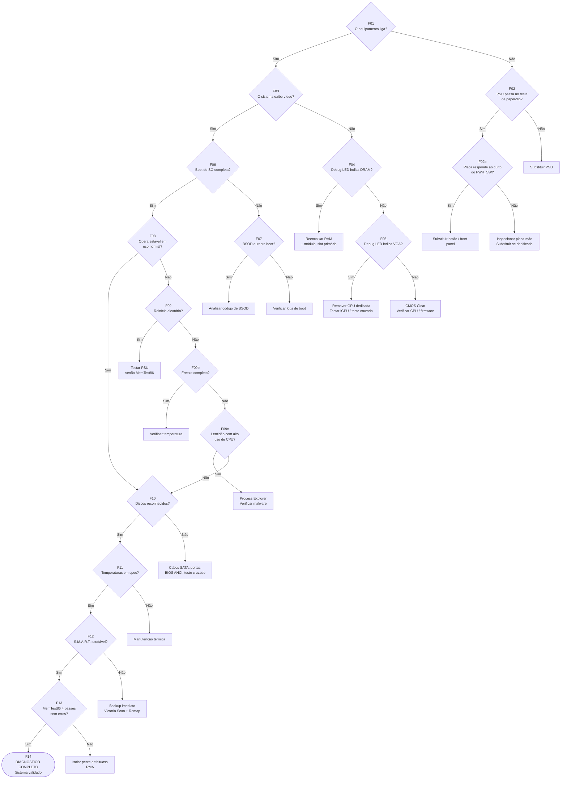
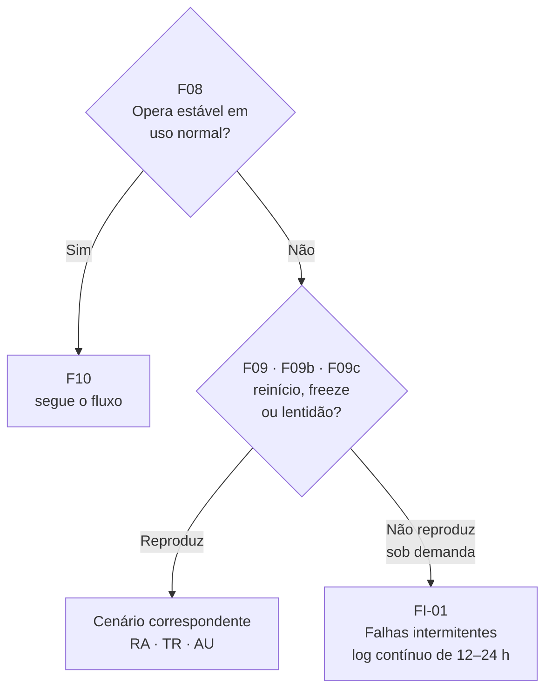

[Início](../README.md) › [Diagnostique](../README.md#diagnostique) › **Fluxo de diagnóstico sistêmico (F01 → F14)**

# Fluxo de diagnóstico sistêmico (F01 → F14)

> Árvore de decisão de ponta a ponta: do botão Power até o laudo final, passando por energia, vídeo, boot, estabilidade, disco e memória.

**Aplica-se a:** Qualquer atendimento, do primeiro contato ao encerramento

## Neste documento

- [Objetivo](#objetivo)
- [Quando utilizar](#quando-utilizar)
- [Pré-requisitos](#pré-requisitos)
- [Mapa de nós](#mapa-de-nós)
- [Diagrama do fluxo](#diagrama-do-fluxo)
- [Nós detalhados](#nós-detalhados)
- [Como o fluxo alcança cada cenário](#como-o-fluxo-alcança-cada-cenário)
- [Quando interromper](#quando-interromper)
- [Observações](#observações)
- [Próximos passos](#próximos-passos)

## Contexto

Árvore de decisão de ponta a ponta: parte do acionamento do botão Power e termina na validação completa do sistema. Cada nó aponta o próximo nó ou uma ação terminal, e referencia o ID do cenário correspondente.

## Escopo

Os 17 nós de decisão registrados na fonte (rótulos F01 a F14, incluindo os sub-nós F02b, F09b e F09c), com condição, ramo verdadeiro, ramo falso, ação, ferramentas e ID de cenário referenciado.

## Fora do escopo

Detalhamento dos cenários (ver fichas em `10-cenarios/`); códigos de POST; passo a passo das ferramentas.

## Relação com outros documentos

- [Índice de cenários](10-cenarios/00-indice-cenarios.md) — destino dos IDs referenciados
- [Fluxo de diagnóstico POST](06-fluxo-post.md) — detalhamento da faixa pré-boot
- [Validação final por componente](13-validacao-final.md) — critérios usados no nó F14
- [Correlações entre camadas](12-correlacoes.md) — armadilhas que este fluxo não cobre
- [Segurança e boas práticas](15-seguranca-e-boas-praticas.md) — pré-requisitos de bancada e limiares térmicos

---

## Objetivo

Conduzir o diagnóstico do estado elétrico até a validação final, sem saltar etapas, registrando em
cada nó a decisão tomada.

## Quando utilizar

A partir do nó **F01**, em qualquer atendimento. O fluxo cobre tanto a faixa pré-boot (F01–F05)
quanto o comportamento pós-boot (F06–F14).

## Pré-requisitos

As ferramentas exigidas por nó estão na coluna *Ferramentas*, reproduzida abaixo. Antes dos nós que
exigem abrir o equipamento — **F02**, **F02b**, **F04**, **F05** e **F10** —, valem os
pré-requisitos gerais de bancada: descarga da energia residual e proteção contra ESD, definidos em
[Segurança e boas práticas](15-seguranca-e-boas-praticas.md).

O *minimal boot* citado em **F02b** é o **boot mínimo absoluto** — CPU + cooler + 1 módulo de RAM +
PSU —, conforme
[Boot mínimo](15-seguranca-e-boas-praticas.md#boot-mínimo-as-duas-composições-canônicas).

## Mapa de nós

| Nó | Condição / pergunta | SE verdadeiro → | SE falso → | ID de cenário |
| --- | --- | --- | --- | --- |
| F01 | O equipamento liga? (LEDs, ventoinhas, qualquer sinal elétrico) | → Ir para F03 | → Ir para F02 | NL-01 |
| F02 | PSU passa no teste de paperclip? (+5VSB presente, tensões dentro de spec) | → Ir para F02b | → AÇÃO: Substituir PSU | NL-01 |
| F02b | Placa-mãe responde ao curto do PWR_SW com minimal boot? | → AÇÃO: Substituir botão/front panel | → AÇÃO: Inspecionar placa-mãe (VRM, capacitores). Substituir se danificada. | NL-02 |
| F03 | O sistema exibe vídeo? (POST visível no monitor) | → Ir para F06 | → Ir para F04 | SV-01 |
| F04 | Debug LED da placa-mãe indica DRAM? | → AÇÃO: Reencaixar RAM. Testar 1 módulo no slot primário. | → Ir para F05 | SV-01 |
| F05 | Debug LED indica VGA? Ou sem vídeo com RAM validada? | → AÇÃO: Remover GPU dedicada. Testar iGPU. Testar GPU em outro sistema. | → AÇÃO: CMOS Clear. Verificar CPU (pinos, compatibilidade). Suspeitar firmware. | SV-02 |
| F06 | O sistema completa o boot do SO normalmente? | → Ir para F08 | → Ir para F07 | — |
| F07 | BSOD ocorre durante boot? Qual código? | → Analisar código: SE 0x7A/0x24 → Disco (BS-02). SE 0x1A/0x0A → RAM (BS-01). | → Verificar logs de boot: bcdedit, bootrec /rebuildbcd | BS-01, BS-02 |
| F08 | Sistema opera estável em uso normal? (sem freezes, sem reinícios) | → Ir para F10 | → Ir para F09 | — |
| F09 | Reinicialização aleatória? (sem BSOD prévio) | → AÇÃO: Testar PSU (AIDA64 Voltages). SE instável → PSU. SE estável → MemTest86. | → Ir para F09b (Freeze) | RA-01, RA-02 |
| F09b | Freeze completo? (mouse/teclado não respondem) | → AÇÃO: Verificar temperatura (AIDA64 OSD). SE > 95°C → Térmico (TR-01). SE OK → firmware/driver. | → Ir para F09c (Lentidão) | TR-01 |
| F09c | Lentidão com alto uso de CPU? | → AÇÃO: Process Explorer para identificar processo. Verificar malware. | → Ir para F10 | AU-01 |
| F10 | Todos os discos reconhecidos pelo sistema? | → Ir para F11 | → AÇÃO: Verificar cabos SATA, portas, BIOS (AHCI). Teste cruzado. | DN-01 |
| F11 | Temperaturas dentro de spec sob carga? (CPU < 85°C, GPU < 85°C) | → Ir para F12 | → AÇÃO: Manutenção térmica (pasta, cooler, airflow). Ver SA-01. | SA-01 |
| F12 | S.M.A.R.T. dos discos saudável? (ID 05, C5, C6 = 0) | → Ir para F13 | → AÇÃO: Backup imediato. Victoria Scan + Remap se viável. Substituir disco. | BS-02 |
| F13 | MemTest86 4 passes sem erros? | → Ir para F14 (Sistema validado como saudável) | → AÇÃO: Isolar pente defeituoso (teste individual). RMA. Ver RA-02. | RA-02 |
| F14 | DIAGNÓSTICO COMPLETO. Sistema validado. | Gerar relatório final (AIDA64 + Victoria + MemTest86) | — | — |

## Diagrama do fluxo

Reprodução visual das colunas `Nó`, `Condição / Pergunta`, `SE Verdadeiro →` e `SE Falso →`.
O texto integral de cada nó está na seção seguinte.

> Losangos são nós de decisão; retângulos são ações terminais declaradas na fonte. Os textos foram
> condensados para caber no diagrama — o conteúdo integral está abaixo, sem cortes.

---

## Nós detalhados

### F01

#### Condição / pergunta

O equipamento liga? (LEDs, ventoinhas, qualquer sinal elétrico)

#### SE verdadeiro →

→ Ir para F03

#### SE falso →

→ Ir para F02

#### Ação

Observar resposta ao pressionar botão Power

#### Ferramentas

Observação visual/auditiva

#### Referência (ID)

[NL-01](10-cenarios/00-indice-cenarios.md)

---

### F02

#### Condição / pergunta

PSU passa no teste de paperclip? (+5VSB presente, tensões dentro de spec)

#### SE verdadeiro →

→ Ir para F02b

#### SE falso →

→ AÇÃO: Substituir PSU

#### Ação

Medir tensões com multímetro. Teste paperclip PS_ON→COM

#### Ferramentas

Multímetro, Testador PSU

#### Referência (ID)

[NL-01](10-cenarios/00-indice-cenarios.md)

---

### F02b

#### Condição / pergunta

Placa-mãe responde ao curto do PWR_SW com minimal boot?

#### SE verdadeiro →

→ AÇÃO: Substituir botão/front panel

#### SE falso →

→ AÇÃO: Inspecionar placa-mãe (VRM, capacitores). Substituir se danificada.

#### Ação

Minimal boot: CPU+Cooler+1RAM+PSU apenas. Curto PWR_SW.

#### Ferramentas

Chave de fenda, Lupa

#### Referência (ID)

[NL-02](10-cenarios/00-indice-cenarios.md)

---

### F03

#### Condição / pergunta

O sistema exibe vídeo? (POST visível no monitor)

#### SE verdadeiro →

→ Ir para F06

#### SE falso →

→ Ir para F04

#### Ação

Conectar monitor via HDMI/DP. Verificar fonte de vídeo.

#### Ferramentas

Monitor known-good, Cabo known-good

#### Referência (ID)

[SV-01](10-cenarios/00-indice-cenarios.md)

---

### F04

#### Condição / pergunta

Debug LED da placa-mãe indica DRAM?

#### SE verdadeiro →

→ AÇÃO: Reencaixar RAM. Testar 1 módulo no slot primário.

#### SE falso →

→ Ir para F05

#### Ação

Verificar LEDs de diagnóstico ou beep codes.

#### Ferramentas

Manual da placa-mãe (beep codes)

#### Referência (ID)

[SV-01](10-cenarios/00-indice-cenarios.md)

---

### F05

#### Condição / pergunta

Debug LED indica VGA? Ou sem vídeo com RAM validada?

#### SE verdadeiro →

→ AÇÃO: Remover GPU dedicada. Testar iGPU. Testar GPU em outro sistema.

#### SE falso →

→ AÇÃO: CMOS Clear. Verificar CPU (pinos, compatibilidade). Suspeitar firmware.

#### Ação

Teste cruzado de GPU. Limpar slot PCIe.

#### Ferramentas

Ar comprimido, GPU known-good

#### Referência (ID)

[SV-02](10-cenarios/00-indice-cenarios.md)

---

### F06

#### Condição / pergunta

O sistema completa o boot do SO normalmente?

#### SE verdadeiro →

→ Ir para F08

#### SE falso →

→ Ir para F07

#### Ação

Observar se Windows carrega até o desktop.

#### Ferramentas

Observação

#### Referência (ID)

— (nó de bifurcação pura: não executa ação própria, apenas encaminha)

---

### F07

#### Condição / pergunta

BSOD ocorre durante boot? Qual código?

#### SE verdadeiro →

→ Analisar código: SE 0x7A/0x24 → Disco (BS-02). SE 0x1A/0x0A → RAM (BS-01).

#### SE falso →

→ Verificar logs de boot: bcdedit, bootrec /rebuildbcd

#### Ação

Anotar código de BSOD. Analisar minidump com WinDbg.

#### Ferramentas

WinDbg, BlueScreenView

#### Referência (ID)

[BS-01](10-cenarios/00-indice-cenarios.md), [BS-02](10-cenarios/00-indice-cenarios.md)

---

### F08

#### Condição / pergunta

Sistema opera estável em uso normal? (sem freezes, sem reinícios)

#### SE verdadeiro →

→ Ir para F10

#### SE falso →

→ Ir para F09

#### Ação

Usar o sistema por 15-30 min com tarefas normais.

#### Ferramentas

Observação

#### Referência (ID)

— (nó de bifurcação pura: não executa ação própria, apenas encaminha)

---

### F09

#### Condição / pergunta

Reinicialização aleatória? (sem BSOD prévio)

#### SE verdadeiro →

→ AÇÃO: Testar PSU (AIDA64 Voltages). SE instável → PSU. SE estável → MemTest86.

#### SE falso →

→ Ir para F09b (Freeze)

#### Ação

AIDA64 Stability Test + monitorar +12V. Event Viewer: Kernel-Power 41.

#### Ferramentas

AIDA64, Event Viewer

#### Referência (ID)

[RA-01](10-cenarios/00-indice-cenarios.md), [RA-02](10-cenarios/00-indice-cenarios.md)

---

### F09b

#### Condição / pergunta

Freeze completo? (mouse/teclado não respondem)

#### SE verdadeiro →

→ AÇÃO: Verificar temperatura (AIDA64 OSD). SE > 95°C → Térmico (TR-01). SE OK → firmware/driver.

#### SE falso →

→ Ir para F09c (Lentidão)

#### Ação

AIDA64 Stability Test + FPU Stress. Monitorar throttling.

#### Ferramentas

AIDA64 OSD

#### Referência (ID)

[TR-01](10-cenarios/00-indice-cenarios.md)

---

### F09c

#### Condição / pergunta

Lentidão com alto uso de CPU?

#### SE verdadeiro →

→ AÇÃO: Process Explorer para identificar processo. Verificar malware.

#### SE falso →

→ Ir para F10

#### Ação

Gerenciador de Tarefas → Detalhes → Ordenar por CPU.

#### Ferramentas

Process Explorer, Defender Offline

#### Referência (ID)

[AU-01](10-cenarios/00-indice-cenarios.md)

---

### F10

#### Condição / pergunta

Todos os discos reconhecidos pelo sistema?

#### SE verdadeiro →

→ Ir para F11

#### SE falso →

→ AÇÃO: Verificar cabos SATA, portas, BIOS (AHCI). Teste cruzado.

#### Ação

diskmgmt.msc + BIOS Storage Configuration

#### Ferramentas

diskmgmt.msc, Victoria

#### Referência (ID)

[DN-01](10-cenarios/00-indice-cenarios.md)

---

### F11

#### Condição / pergunta

Temperaturas dentro de spec sob carga? (CPU < 85°C, GPU < 85°C)

#### SE verdadeiro →

→ Ir para F12

#### SE falso →

→ AÇÃO: Manutenção térmica (pasta, cooler, airflow). Ver SA-01.

#### Ação

AIDA64 Stability Test 30min + OSD

#### Ferramentas

AIDA64, Termômetro IR

#### Referência (ID)

[SA-01](10-cenarios/00-indice-cenarios.md)

---

### F12

#### Condição / pergunta

S.M.A.R.T. dos discos saudável? (ID 05, C5, C6 = 0)

#### SE verdadeiro →

→ Ir para F13

#### SE falso →

→ AÇÃO: Backup imediato. Victoria Scan + Remap se viável. Substituir disco.

#### Ação

Victoria → Get SMART → Verificar RAW values

#### Ferramentas

Victoria, CrystalDiskInfo

#### Referência (ID)

[BS-02](10-cenarios/00-indice-cenarios.md)

---

### F13

#### Condição / pergunta

MemTest86 4 passes sem erros?

#### SE verdadeiro →

→ Ir para F14 (Sistema validado como saudável)

#### SE falso →

→ AÇÃO: Isolar pente defeituoso (teste individual). RMA. Ver RA-02.

#### Ação

MemTest86 boot USB. XMP ativo.

#### Ferramentas

MemTest86

#### Referência (ID)

[RA-02](10-cenarios/00-indice-cenarios.md)

---

### F14

#### Condição / pergunta

DIAGNÓSTICO COMPLETO. Sistema validado.

#### SE verdadeiro →

Gerar relatório final (AIDA64 + Victoria + MemTest86)

#### SE falso →

—

#### Ação

Compilar evidências. Classificar: Saudável / Manutenção Preventiva / Condenado.

#### Ferramentas

AIDA64 Report, Victoria Log, MemTest86 HTML

#### Referência (ID)

— (nó terminal: o fluxo encerra aqui e passa à emissão do laudo)

---

## Como o fluxo alcança cada cenário

Os treze IDs de cenário são alcançáveis a partir deste fluxo. A tabela mostra por qual nó se chega
a cada um:

| Cenário | Alcançado por | Condição |
| --- | --- | --- |
| [NL-01](10-cenarios/nao-liga.md#nl-01) | F01, F02 | O equipamento não liga |
| [NL-02](10-cenarios/nao-liga.md#nl-02) | F02b | PSU aprovada, mas a placa não responde |
| [SV-01](10-cenarios/liga-sem-video.md#sv-01) | F03, F04 | Liga sem vídeo; Debug LED em DRAM |
| [SV-02](10-cenarios/liga-sem-video.md#sv-02) | F05 | Debug LED estaciona em VGA |
| [BS-01](10-cenarios/bsod.md#bs-01) | F07 | BSOD de código 0x1A ou 0x0A |
| [BS-02](10-cenarios/bsod.md#bs-02) | F07, F12 | BSOD de código 0x7A ou 0x24; S.M.A.R.T. degradado |
| [RA-01](10-cenarios/reinicializacao-aleatoria.md#ra-01) | F09 | Reinício aleatório com PSU instável |
| [RA-02](10-cenarios/reinicializacao-aleatoria.md#ra-02) | F09, F13 | Reinício aleatório com PSU estável; erro em MemTest86 |
| [TR-01](10-cenarios/travamentos-freeze.md#tr-01) | F09b | Freeze completo |
| [AU-01](10-cenarios/alto-uso-cpu-gpu.md#au-01) | F09c | Lentidão com alto uso de CPU |
| [DN-01](10-cenarios/disco-nao-reconhecido.md#dn-01) | F10 | Disco não reconhecido |
| [SA-01](10-cenarios/superaquecimento.md#sa-01) | F11 | Temperatura fora de spec sob carga |
| [FI-01](10-cenarios/falhas-intermitentes.md#fi-01) | F08 → F09 → F09b → F09c, sem reprodução | Ver a regra abaixo |

### Regra de entrada do cenário FI-01

O cenário [FI-01](10-cenarios/falhas-intermitentes.md#fi-01) trata de falhas **não reproduzíveis
sob demanda** — a própria ficha declara, no campo *Condição de Ocorrência*, que o problema é
intermitente e de difícil reprodução. Por isso ele não é alcançado por um nó que faça uma pergunta
respondível na hora: nenhum teste pontual reproduz o sintoma.

A regra é esta:

> Se **F08** foi respondido **"não"** — o sistema não opera estável —, mas **F09**, **F09b** e
> **F09c** não conseguem reproduzir a falha durante a observação, o caso é de falha intermitente:
> vá para **FI-01** e passe ao registro contínuo de sensores.

> [!NOTE]
> A regra acima é **derivada** do campo *Condição de Ocorrência* de FI-01 e da estrutura dos nós
> F08 a F09c: a coluna `Referência (ID)` de `FLUXO_LOGICO` não cita FI-01 em nenhum nó. Nível de
> confiança: **Inferido**, sobre campos Confirmados.

## Quando interromper

O nó **F14** é terminal: a fonte o descreve como "DIAGNÓSTICO COMPLETO. Sistema validado." e
determina a geração de relatório final com classificação em *Saudável*, *Manutenção Preventiva* ou
*Condenado*.

## Observações

Os nós **F06** e **F08** não têm ID de cenário associado, e isso é coerente com a função deles: são
**nós de bifurcação pura**. A ação declarada em cada um é apenas observar — *"Observar se Windows
carrega até o desktop"* e *"Usar o sistema por 15-30 min com tarefas normais"* — e o resultado
encaminha para outro nó. Como não executam procedimento próprio, não há ficha de cenário a
referenciar. Todos os nós que executam ação apontam para pelo menos um ID.

## Próximos passos

| Se você… | Vá para |
| --- | --- |
| chegou a uma ação e quer o procedimento detalhado | [Índice de cenários](10-cenarios/00-indice-cenarios.md) |
| está antes do boot e precisa interpretar um sinal | [Fluxo de diagnóstico POST](06-fluxo-post.md) |
| chegou ao nó F14 | [Validação final por componente](13-validacao-final.md) |
| o sintoma parece apontar para a peça errada | [Correlações entre camadas](12-correlacoes.md) |

---

| Atributo | Valor |
| --- | --- |
| **Autoria** | Edsilas |
| **Versão da documentação** | `doc-3.0.0` |
