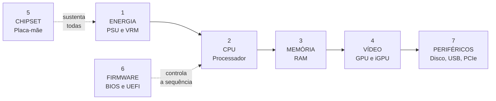

[Início](../README.md) › [Diagnostique](../README.md#diagnostique) › **Diagnóstico por camada (modelo POST, 7 camadas)**

# Diagnóstico por camada (modelo POST, 7 camadas)

> O que testar em cada subsistema: componentes, sintomas típicos, testes primários, ferramentas e indicadores de falha.

**Aplica-se a:** Consulta após um código de POST apontar uma camada

## Neste documento

- [Ordem de verificação das camadas](#ordem-de-verificação-das-camadas)
- [Título declarado na fonte](#título-declarado-na-fonte)
- [Resumo das camadas](#resumo-das-camadas)
- [Fichas de camada](#fichas-de-camada)
- [Próximos passos](#próximos-passos)

## Contexto

Ficha técnica de cada subsistema do modelo de camadas usado pelo catálogo de códigos de POST. É a referência para saber *o que testar* depois que um código apontou uma camada.

## Escopo

As 7 camadas registradas na fonte, com componentes, sintomas típicos, testes primários, ferramentas e indicadores de falha.

## Fora do escopo

O modelo de camadas de 10 níveis usado pelo arquivo de fluxo sistêmico (ver taxonomia); fichas de código; cenários pós-boot.

## Relação com outros documentos

- [Taxonomia de camadas](03-taxonomia-camadas.md) — **leia antes**: existem dois modelos distintos
- [Índice de códigos POST](09-codigos-post/00-indice-codigos.md) — cada código aponta uma camada
- [Fluxo de diagnóstico POST](06-fluxo-post.md)

---

> [!IMPORTANT]
> As camadas descritas aqui pertencem ao modelo de **7 camadas** do arquivo
> O modelo sistêmico usa uma
> numeração **diferente e incompatível**: camada 3 é *Memória* aqui e *CPU* lá.
> Confira sempre o formato do número antes de usá-lo — ver
> [Taxonomia de camadas](03-taxonomia-camadas.md).

## Ordem de verificação das camadas

O firmware inicializa os subsistemas em sequência. Uma camada só é alcançada se a anterior
respondeu, e é por isso que a ordem abaixo também é a ordem de teste: não adianta investigar
memória enquanto a alimentação da CPU não estiver confirmada.

> [!NOTE]
> As camadas 1 a 4 e a 7 seguem a sequência de inicialização declarada nas fichas
> (`Fase POST`: energia → CPU → memória → vídeo → periféricos). As camadas 5 e 6 aparecem
> tracejadas porque a fonte as descreve como transversais: falham em qualquer ponto da sequência.
> **Inferido** (a representação da ordem).

## Título declarado na fonte

**CAMADAS DE DIAGNÓSTICO POST — HIERARQUIA DE SUBSISTEMAS**

## Resumo das camadas

| Camada | Nome | Sintomas típicos |
| --- | --- | --- |
| 1 | ENERGIA (PSU/VRM) | Sistema não liga. Fans não giram. LEDs apagados. Cheiro de queimado. Capacitores inchados visíveis. |
| 2 | CPU (Processador) | LED CPU aceso. Beep codes de CPU. Q-Code 00/D0. Fans giram mas sem POST. Sistema reinicia instantaneamente. |
| 3 | MEMÓRIA (RAM) | LED DRAM aceso. Beep codes de memória. Q-Code 50-55. Beep contínuo (Award). Sistema liga mas tela preta. |
| 4 | VÍDEO (GPU/iGPU) | LED VGA aceso. Tela preta com POST OK (beep de sucesso). Beep de vídeo. Q-Code D6/D7. Artefatos visuais. |
| 5 | CHIPSET / MOTHERBOARD | Beep de timer/CMOS. Clock RTC incorreto. Periféricos não funcionam. Sistema instável. Erros múltiplos sem padrão claro. |
| 6 | FIRMWARE (BIOS/UEFI) | Beep de checksum. Q-Code FE (pre-POST hang). BIOS não acessível. Tela com mensagem de recovery. LED Dell 3Â+3B. |
| 7 | PERIFÉRICOS CRÍTICOS | LED BOOT aceso. Q-Code 99/9A/9C/A0-A2/B4. Sistema trava durante detecção de periféricos. Boot device missing. |

---

## Fichas de camada

### Camada 1 — ENERGIA (PSU/VRM)

#### Componentes

Fonte ATX/SFX, Cabos AC, Conector 24-pin, Conector EPS 8-pin, VRMs (MOSFET, Indutor, Capacitor), Reguladores DC-DC, Standby 5VSB

#### Sintomas típicos

Sistema não liga. Fans não giram. LEDs apagados. Cheiro de queimado. Capacitores inchados visíveis.

#### Testes primários

1. Verificar AC na tomada.  
2. Medir 5VSB (pino 9 do 24-pin, fio roxo) — deve ser 5V com AC conectado.  
3. Teste BIST (Dell).  
4. Jumper teste de fonte (pino PS_ON para GND).  
5. Medir 12V, 5V, 3.3V sob carga.  
6. Verificar ripple com osciloscópio (< 120mV em 12V).

#### Ferramentas

Multímetro digital, Osciloscópio (ripple), Testador de fonte ATX, Fonte de bancada

#### Indicadores de falha

5VSB ausente, 12V abaixo de 11.4V, Ripple > 120mV em 12V, Capacitores visualmente danificados, Cheiro de queimado

#### Códigos de POST atribuídos a esta camada

5 código(s), conforme a coluna `CAMADA DE DIAGNÓSTICO` do catálogo:

- [POST-24](09-codigos-post/award.md#post-24--repetitivo-sirene-contínua) — `Repetitivo (Sirene contínua)`
- [POST-32](09-codigos-post/dell.md#post-32--2-âmbar--2-branco) — `2 Âmbar + 2 Branco`
- [POST-37](09-codigos-post/dell.md#post-37--3-âmbar--5-branco) — `3 Âmbar + 5 Branco`
- [POST-41](09-codigos-post/hp.md#post-41--3-longos--4-curtos-34) — `3 Longos + 4 Curtos (3.4)`
- [POST-42](09-codigos-post/hp.md#post-42--4-longos--2-curtos-42) — `4 Longos + 2 Curtos (4.2)`

---

### Camada 2 — CPU (Processador)

#### Componentes

Processador, Socket LGA/PGA, Pinos do socket, Microcode, Cache L1/L2/L3, VCore (alimentação CPU)

#### Sintomas típicos

LED CPU aceso. Beep codes de CPU. Q-Code 00/D0. Fans giram mas sem POST. Sistema reinicia instantaneamente.

#### Testes primários

1. Inspecionar socket (pinos tortos, debris).  
2. Medir EPS 12V.  
3. Medir VCore nos pontos de teste.  
4. Verificar compatibilidade CPU-BIOS.  
5. Teste cruzado CPU.  
6. BIOS Flashback se CPU não suportada.

#### Ferramentas

Multímetro (VCore, EPS 12V), Lupa 10x, Lista compatibilidade CPU, BIOS Flashback utility

#### Indicadores de falha

LED CPU (vermelho), Q-Code 00/D0/63-67, VCore = 0V, Pinos do socket visivelmente tortos

#### Códigos de POST atribuídos a esta camada

11 código(s), conforme a coluna `CAMADA DE DIAGNÓSTICO` do catálogo:

- [POST-04](09-codigos-post/ami-legacy.md#post-04--5-beeps-curtos) — `5 Beeps Curtos`
- [POST-06](09-codigos-post/ami-legacy.md#post-06--7-beeps-curtos) — `7 Beeps Curtos`
- [POST-10](09-codigos-post/ami-legacy.md#post-10--11-beeps-curtos) — `11 Beeps Curtos`
- [POST-13](09-codigos-post/ami-q-code.md#post-13--00--d0) — `00 / D0`
- [POST-15](09-codigos-post/ami-q-code.md#post-15--63--67) — `63 — 67`
- [POST-21](09-codigos-post/ami-q-code.md#post-21--ff) — `FF`
- [POST-24](09-codigos-post/award.md#post-24--repetitivo-sirene-contínua) — `Repetitivo (Sirene contínua)`
- [POST-26](09-codigos-post/phoenix.md#post-26--1-1-1-3) — `1-1-1-3`
- [POST-31](09-codigos-post/dell.md#post-31--2-âmbar--1-branco) — `2 Âmbar + 1 Branco`
- [POST-42](09-codigos-post/hp.md#post-42--4-longos--2-curtos-42) — `4 Longos + 2 Curtos (4.2)`
- [POST-51](09-codigos-post/generico-debug-led.md#post-51--led-cpu-vermelho) — `LED CPU (Vermelho)`

---

### Camada 3 — MEMÓRIA (RAM)

#### Componentes

Módulos DIMM/SO-DIMM, Slots DIMM, Controladora de Memória (integrada na CPU), SPD/XMP/EXPO, VDRAM (regulador de tensão de memória)

#### Sintomas típicos

LED DRAM aceso. Beep codes de memória. Q-Code 50-55. Beep contínuo (Award). Sistema liga mas tela preta.

#### Testes primários

1. Power drain completo.  
2. Reseat RAM com pressão uniforme.  
3. Testar slot individual (A2 primeiro).  
4. Limpar contatos (borracha branca + isopropanol).  
5. Reset CMOS.  
6. Verificar QVL.  
7. DDR5: aguardar 3 min.  
8. Medir VDRAM.  
9. MemTest86 (se POST parcial).

#### Ferramentas

MemTest86 (bootável), Multímetro (VDRAM), Borracha branca, Isopropanol 99%, Lupa, QVL do fabricante

#### Indicadores de falha

LED DRAM (amarelo), Q-Code 50-55, Beep contínuo, VDRAM = 0V ou fora de spec, Módulo não reconhecido no BIOS

#### Códigos de POST atribuídos a esta camada

12 código(s), conforme a coluna `CAMADA DE DIAGNÓSTICO` do catálogo:

- [POST-01](09-codigos-post/ami-legacy.md#post-01--1-beep-curto) — `1 Beep Curto`
- [POST-02](09-codigos-post/ami-legacy.md#post-02--2-ou-3-beeps-curtos) — `2 ou 3 Beeps Curtos`
- [POST-12](09-codigos-post/ami-uefi-aptio.md#post-12--1-longo--3-curtos) — `1 Longo + 3 Curtos`
- [POST-14](09-codigos-post/ami-q-code.md#post-14--50--55) — `50 — 55`
- [POST-25](09-codigos-post/award.md#post-25--contínuo-longo-ininterrupto) — `Contínuo Longo (ininterrupto)`
- [POST-28](09-codigos-post/phoenix.md#post-28--1-3-1-1) — `1-3-1-1`
- [POST-29](09-codigos-post/phoenix.md#post-29--1-3-4-1) — `1-3-4-1`
- [POST-33](09-codigos-post/dell.md#post-33--2-âmbar--3-branco) — `2 Âmbar + 3 Branco`
- [POST-39](09-codigos-post/hp.md#post-39--3-longos--2-curtos-32) — `3 Longos + 2 Curtos (3.2)`
- [POST-46](09-codigos-post/apple.md#post-46--1-tom-repetido-a-cada-5-segundos) — `1 Tom repetido a cada 5 segundos`
- [POST-47](09-codigos-post/apple.md#post-47--3-tons-repetidos-a-cada-5-segundos) — `3 Tons repetidos a cada 5 segundos`
- [POST-52](09-codigos-post/generico-debug-led.md#post-52--led-dram-amarelo) — `LED DRAM (Amarelo)`

---

### Camada 4 — VÍDEO (GPU/iGPU)

#### Componentes

GPU Dedicada (PCIe), iGPU (integrada na CPU), VRAM, Slot PCIe x16, Cabo de alimentação PCIe (6+2 pin), Cabo de vídeo (HDMI/DP/DVI/VGA), Monitor

#### Sintomas típicos

LED VGA aceso. Tela preta com POST OK (beep de sucesso). Beep de vídeo. Q-Code D6/D7. Artefatos visuais.

#### Testes primários

1. Verificar se monitor está ligado e no input correto.  
2. Trocar cabo de vídeo.  
3. Reseat GPU.  
4. Verificar cabo PCIe power.  
5. Testar iGPU (remover GPU dedicada).  
6. Teste cruzado GPU.  
7. FurMark se POST parcial.

#### Ferramentas

Cabo HDMI/DP known-good, Monitor known-good, GPU known-good, Borracha branca

#### Indicadores de falha

LED VGA (branco), Q-Code D6/D7, Tela preta com fans girando, Artefatos gráficos

#### Códigos de POST atribuídos a esta camada

9 código(s), conforme a coluna `CAMADA DE DIAGNÓSTICO` do catálogo:

- [POST-07](09-codigos-post/ami-legacy.md#post-07--8-beeps-curtos) — `8 Beeps Curtos`
- [POST-11](09-codigos-post/ami-uefi-aptio.md#post-11--1-longo--2-curtos) — `1 Longo + 2 Curtos`
- [POST-19](09-codigos-post/ami-q-code.md#post-19--d6--d7) — `D6 / D7`
- [POST-22](09-codigos-post/award.md#post-22--1-longo--2-curtos) — `1 Longo + 2 Curtos`
- [POST-23](09-codigos-post/award.md#post-23--1-longo--3-curtos) — `1 Longo + 3 Curtos`
- [POST-34](09-codigos-post/dell.md#post-34--2-âmbar--7-branco) — `2 Âmbar + 7 Branco`
- [POST-40](09-codigos-post/hp.md#post-40--3-longos--3-curtos-33) — `3 Longos + 3 Curtos (3.3)`
- [POST-49](09-codigos-post/acer-insyde.md#post-49--1-longo--2-curtos) — `1 Longo + 2 Curtos`
- [POST-53](09-codigos-post/generico-debug-led.md#post-53--led-vga-branco) — `LED VGA (Branco)`

---

### Camada 5 — CHIPSET / MOTHERBOARD

#### Componentes

PCH (Platform Controller Hub), Super I/O, CMOS/RTC, Cristal 32.768 kHz, Bateria CR2032, Trilhas PCB, Barramentos internos, Conectores internos

#### Sintomas típicos

Beep de timer/CMOS. Clock RTC incorreto. Periféricos não funcionam. Sistema instável. Erros múltiplos sem padrão claro.

#### Testes primários

1. Trocar bateria CR2032.  
2. Reset CMOS (jumper 10s).  
3. Verificar cristal 32kHz com osciloscópio.  
4. Inspeção visual (capacitores, SOT, resistores queimados).  
5. Teste de continuidade em trilhas suspeitas.  
6. Boot mínimo para isolar.

#### Ferramentas

Multímetro, Osciloscópio, Lupa 10x, Bateria CR2032, Ar comprimido

#### Indicadores de falha

Beep de timer (4 curtos AMI), Data/hora resetam, Múltiplos erros simultâneos, Capacitores visivelmente danificados

#### Códigos de POST atribuídos a esta camada

9 código(s), conforme a coluna `CAMADA DE DIAGNÓSTICO` do catálogo:

- [POST-03](09-codigos-post/ami-legacy.md#post-03--4-beeps-curtos) — `4 Beeps Curtos`
- [POST-05](09-codigos-post/ami-legacy.md#post-05--6-beeps-curtos) — `6 Beeps Curtos`
- [POST-09](09-codigos-post/ami-legacy.md#post-09--10-beeps-curtos) — `10 Beeps Curtos`
- [POST-20](09-codigos-post/ami-q-code.md#post-20--fe) — `FE`
- [POST-30](09-codigos-post/phoenix.md#post-30--1-4-2-1) — `1-4-2-1`
- [POST-32](09-codigos-post/dell.md#post-32--2-âmbar--2-branco) — `2 Âmbar + 2 Branco`
- [POST-35](09-codigos-post/dell.md#post-35--3-âmbar--1-branco) — `3 Âmbar + 1 Branco`
- [POST-43](09-codigos-post/hp.md#post-43--5-longos-50) — `5 Longos (5.0)`
- [POST-45](09-codigos-post/lenovo.md#post-45--0110-binário) — `0110 (Binário)`

---

### Camada 6 — FIRMWARE (BIOS/UEFI)

#### Componentes

SPI Flash (chip BIOS), EEPROM, CMOS NVRAM, Option ROMs, Microcode patches, ME (Management Engine) firmware

#### Sintomas típicos

Beep de checksum. Q-Code FE (pre-POST hang). BIOS não acessível. Tela com mensagem de recovery. LED Dell 3Â+3B.

#### Testes primários

1. Trocar bateria CR2032.  
2. BIOS Recovery nativo (varia por fabricante).  
3. BIOS Flashback / Q-Flash Plus.  
4. Regravação via programadora CH341A.  
5. HP: Win+B ao ligar.  
6. Dell: Ctrl+Esc com pendrive.

#### Ferramentas

Programadora CH341A/CH341B, Pendrive FAT32, Clamp SOIC-8, Software de gravação (flashrom, AsProgrammer)

#### Indicadores de falha

Beep de checksum ROM, POST não inicia, BIOS Setup inacessível, Mensagem de recovery na tela

#### Códigos de POST atribuídos a esta camada

6 código(s), conforme a coluna `CAMADA DE DIAGNÓSTICO` do catálogo:

- [POST-08](09-codigos-post/ami-legacy.md#post-08--9-beeps-curtos) — `9 Beeps Curtos`
- [POST-21](09-codigos-post/ami-q-code.md#post-21--ff) — `FF`
- [POST-27](09-codigos-post/phoenix.md#post-27--1-2-2-3) — `1-2-2-3`
- [POST-36](09-codigos-post/dell.md#post-36--3-âmbar--3-branco) — `3 Âmbar + 3 Branco`
- [POST-38](09-codigos-post/hp.md#post-38--2-longos--2-curtos-22) — `2 Longos + 2 Curtos (2.2)`
- [POST-48](09-codigos-post/apple.md#post-48--3-longos--3-curtos--3-longos-sos) — `3 Longos + 3 Curtos + 3 Longos (SOS)`

---

### Camada 7 — PERIFÉRICOS CRÍTICOS

#### Componentes

USB (portas e dispositivos), SATA/NVMe (discos), PCIe (placas de expansão), Teclado (PS/2/USB), Front Panel headers, Audio header

#### Sintomas típicos

LED BOOT aceso. Q-Code 99/9A/9C/A0-A2/B4. Sistema trava durante detecção de periféricos. Boot device missing.

#### Testes primários

1. Boot mínimo (desconectar todos periféricos).  
2. Reconectar um a um para isolar.  
3. Verificar SMART dos discos.  
4. Trocar cabos SATA.  
5. Verificar encaixe M.2.  
6. Testar portas USB (curto?).

#### Ferramentas

CrystalDiskInfo (SMART), Cabos SATA novos, Pendrive bootável, POST Card PCI/USB

#### Indicadores de falha

LED BOOT (verde), Q-Code A0-A2/B4, Disco não detectado no BIOS, USB causando travamento

#### Códigos de POST atribuídos a esta camada

5 código(s), conforme a coluna `CAMADA DE DIAGNÓSTICO` do catálogo:

- [POST-16](09-codigos-post/ami-q-code.md#post-16--99--9a--9c) — `99 / 9A / 9C`
- [POST-17](09-codigos-post/ami-q-code.md#post-17--a0--a2) — `A0 — A2`
- [POST-18](09-codigos-post/ami-q-code.md#post-18--b4) — `B4`
- [POST-50](09-codigos-post/ami-q-code.md#post-50--7f) — `7F`
- [POST-54](09-codigos-post/generico-debug-led.md#post-54--led-boot-verde) — `LED BOOT (Verde)`

---

## Próximos passos

| Se você… | Vá para |
| --- | --- |
| quer a ficha do código que apontou esta camada | [Índice de códigos POST](09-codigos-post/00-indice-codigos.md) |
| não sabe qual modelo de camada está lendo | [Taxonomia de camadas](03-taxonomia-camadas.md) |
| precisa montar a bancada | [Requisitos e ferramentas](04-requisitos-e-ferramentas.md) |
| terminou o teste e quer validar | [Validação final por componente](13-validacao-final.md) |

---

| Atributo | Valor |
| --- | --- |
| **Autoria** | Edsilas |
| **Versão da documentação** | `doc-3.0.0` |
