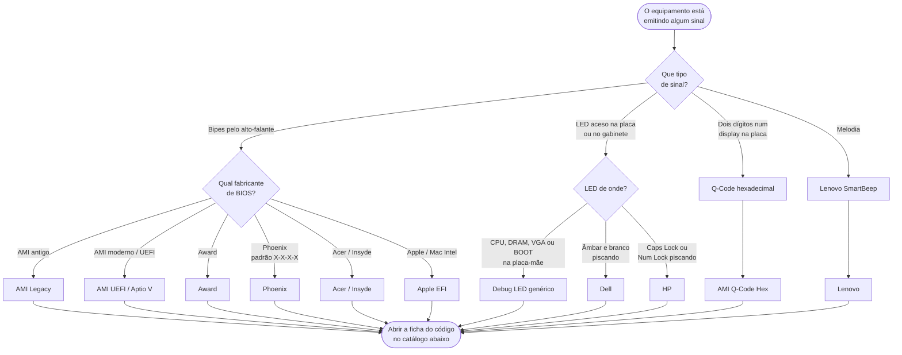

<!-- Gerado a partir de `HW_HARDWARE_CODIGOS_DE_ERROS.xlsx` → aba `Tabela Diagnóstico POST`. Não editar manualmente sem atualizar a fonte. -->

[Início](../../README.md) › [Resolva](../../README.md#resolva) › **Índice de códigos POST**

# Índice de códigos POST

> Ponto de entrada do catálogo: localize o código que o equipamento está emitindo e vá direto para a ficha.

**Aplica-se a:** Falhas anteriores ao carregamento do sistema operacional

## Neste documento

- [Como localizar o código](#como-localizar-o-código)
- [Identificadores](#identificadores)
- [Arquivos por família de BIOS](#arquivos-por-família-de-bios)
- [Catálogo completo](#catálogo-completo)
- [Próximos passos](#próximos-passos)

## Contexto

Ponto de entrada do catálogo de códigos de POST. Lista todos os códigos registrados na fonte e aponta para a ficha completa de cada um.

## Escopo

Índice único dos 54 códigos presentes na fonte, agrupados por família de BIOS.

## Fora do escopo

Conteúdo detalhado das fichas (ver arquivos por família); fluxos; cenários pós-boot.

## Relação com outros documentos

- [Fluxo de diagnóstico POST](../06-fluxo-post.md) — como chegar até um código
- [Ambiguidade de códigos](../11-ambiguidades.md) — códigos com mais de um significado
- [Camadas de diagnóstico](../08-diagnostico-por-camada.md) — subsistema de cada código

---

## Como localizar o código

> [!TIP]
> Não sabe identificar o fabricante do BIOS? A tela de abertura antes do erro, o adesivo na
> placa-mãe e o manual do fabricante trazem essa informação. O
> [fluxo de diagnóstico POST](../06-fluxo-post.md) percorre essa identificação passo a passo.

> [!IMPORTANT]
> O mesmo padrão sonoro pode significar coisas diferentes conforme o fabricante. Antes de aplicar
> o procedimento, confira se o código está em [Ambiguidade de códigos](../11-ambiguidades.md).

## Identificadores

O campo **ID doc.** (`POST-NN`) é um identificador criado **nesta documentação** para permitir
referência cruzada estável entre documentos. Ele **não existe na planilha de origem** e segue a
ordem das linhas da aba `Tabela Diagnóstico POST`. O campo **Código** é o valor literal da fonte.

> Nível de confiança do campo `ID doc.`: **Inferido (organizacional)**.
> Nível de confiança de todos os demais campos: **Confirmado**.

## Arquivos por família de BIOS

- [AMI BIOS Legacy](ami-legacy.md) — 10 código(s)
- [AMI UEFI / Aptio V](ami-uefi-aptio.md) — 2 código(s)
- [AMI Q-Code Hex](ami-q-code.md) — 10 código(s)
- [Award BIOS](award.md) — 4 código(s)
- [Phoenix BIOS](phoenix.md) — 5 código(s)
- [Dell (LED de diagnóstico)](dell.md) — 7 código(s)
- [HP (LED piscante)](hp.md) — 6 código(s)
- [Lenovo (SmartBeep / beep binário)](lenovo.md) — 2 código(s)
- [Apple EFI (Mac Intel)](apple.md) — 3 código(s)
- [Acer / Insyde](acer-insyde.md) — 1 código(s)
- [Genérico — Debug LED](generico-debug-led.md) — 4 código(s)

## Catálogo completo

| ID doc. | Código | Tipo de sinal | Fabricante BIOS | Plataforma | Componente afetado | Camada | Risco | Ficha |
| --- | --- | --- | --- | --- | --- | --- | --- | --- |
| POST-01 | 1 Beep Curto | Beep Sonoro | AMI (Legacy BIOS) | AMI Legacy — Desktop / Servidor | RAM (Módulos DIMM) | Camada 3: Memória | Alto | [POST-01](ami-legacy.md#post-01--1-beep-curto) |
| POST-02 | 2 ou 3 Beeps Curtos | Beep Sonoro | AMI (Legacy BIOS) | AMI Legacy — Desktop / Servidor | RAM (Base Memory) | Camada 3: Memória | Alto | [POST-02](ami-legacy.md#post-02--2-ou-3-beeps-curtos) |
| POST-03 | 4 Beeps Curtos | Beep Sonoro | AMI (Legacy BIOS) | AMI Legacy — Desktop / Servidor | Timer / Chipset (PCH/SIO) | Camada 5: Chipset / Motherboard | Crítico | [POST-03](ami-legacy.md#post-03--4-beeps-curtos) |
| POST-04 | 5 Beeps Curtos | Beep Sonoro | AMI (Legacy BIOS) | AMI Legacy — Desktop / Servidor | CPU (Processador) | Camada 2: CPU | Crítico | [POST-04](ami-legacy.md#post-04--5-beeps-curtos) |
| POST-05 | 6 Beeps Curtos | Beep Sonoro | AMI (Legacy BIOS) | AMI Legacy — Desktop / Servidor | KBC / Super I/O | Camada 5: Chipset / Motherboard | Médio | [POST-05](ami-legacy.md#post-05--6-beeps-curtos) |
| POST-06 | 7 Beeps Curtos | Beep Sonoro | AMI (Legacy BIOS) | AMI Legacy — Desktop / Servidor | CPU (Processador) | Camada 2: CPU | Crítico | [POST-06](ami-legacy.md#post-06--7-beeps-curtos) |
| POST-07 | 8 Beeps Curtos | Beep Sonoro | AMI (Legacy BIOS) | AMI Legacy — Desktop / Servidor | GPU / VRAM | Camada 4: Vídeo | Alto | [POST-07](ami-legacy.md#post-07--8-beeps-curtos) |
| POST-08 | 9 Beeps Curtos | Beep Sonoro | AMI (Legacy BIOS) | AMI Legacy — Desktop / Servidor | BIOS / EEPROM | Camada 6: Firmware | Crítico | [POST-08](ami-legacy.md#post-08--9-beeps-curtos) |
| POST-09 | 10 Beeps Curtos | Beep Sonoro | AMI (Legacy BIOS) | AMI Legacy — Desktop / Servidor | CMOS / Super I/O | Camada 5: Chipset / Motherboard | Médio | [POST-09](ami-legacy.md#post-09--10-beeps-curtos) |
| POST-10 | 11 Beeps Curtos | Beep Sonoro | AMI (Legacy BIOS) | AMI Legacy — Desktop / Servidor | CPU (Cache) | Camada 2: CPU | Crítico | [POST-10](ami-legacy.md#post-10--11-beeps-curtos) |
| POST-11 | 1 Longo + 2 Curtos | Beep Sonoro | AMI (UEFI/Aptio V) | AMI UEFI/Aptio — Desktop Moderno | GPU / PCIe | Camada 4: Vídeo | Alto | [POST-11](ami-uefi-aptio.md#post-11--1-longo--2-curtos) |
| POST-12 | 1 Longo + 3 Curtos | Beep Sonoro | AMI (UEFI/Aptio V) | AMI UEFI/Aptio — Desktop Moderno | RAM (Módulos DIMM) | Camada 3: Memória | Alto | [POST-12](ami-uefi-aptio.md#post-12--1-longo--3-curtos) |
| POST-13 | 00 / D0 | Hex Q-Code (Display) | AMI (Q-Code Hex) | AMI Q-Code — ASUS / GIGABYTE Desktop | CPU | Camada 2: CPU | Crítico | [POST-13](ami-q-code.md#post-13--00--d0) |
| POST-14 | 50 — 55 | Hex Q-Code (Display) | AMI (Q-Code Hex) | AMI Q-Code — ASUS / GIGABYTE Desktop | RAM / Controladora de Memória | Camada 3: Memória | Alto | [POST-14](ami-q-code.md#post-14--50--55) |
| POST-15 | 63 — 67 | Hex Q-Code (Display) | AMI (Q-Code Hex) | AMI Q-Code — ASUS / GIGABYTE Desktop | CPU / VRM | Camada 2: CPU | Alto | [POST-15](ami-q-code.md#post-15--63--67) |
| POST-16 | 99 / 9A / 9C | Hex Q-Code (Display) | AMI (Q-Code Hex) | AMI Q-Code — ASUS / GIGABYTE Desktop | Super I/O / USB / PCIe | Camada 7: Periféricos Críticos | Médio | [POST-16](ami-q-code.md#post-16--99--9a--9c) |
| POST-17 | A0 — A2 | Hex Q-Code (Display) | AMI (Q-Code Hex) | AMI Q-Code — ASUS / GIGABYTE Desktop | SATA / M.2 / NVMe | Camada 7: Periféricos Críticos | Médio | [POST-17](ami-q-code.md#post-17--a0--a2) |
| POST-18 | B4 | Hex Q-Code (Display) | AMI (Q-Code Hex) | AMI Q-Code — ASUS / GIGABYTE Desktop | USB | Camada 7: Periféricos Críticos | Médio | [POST-18](ami-q-code.md#post-18--b4) |
| POST-19 | D6 / D7 | Hex Q-Code (Display) | AMI (Q-Code Hex) | AMI Q-Code — ASUS / GIGABYTE Desktop | GPU / Saída de Vídeo | Camada 4: Vídeo | Alto | [POST-19](ami-q-code.md#post-19--d6--d7) |
| POST-20 | FE | Hex Q-Code (Display) | AMI (Q-Code Hex) | AMI Q-Code — ASUS / GIGABYTE Desktop | Placa-mãe (Estrutural) | Camada 5: Chipset / Motherboard | Crítico | [POST-20](ami-q-code.md#post-20--fe) |
| POST-21 | FF | Hex Q-Code (Display) | AMI (Q-Code Hex) | AMI Q-Code — ASUS / GIGABYTE Desktop | Variável | Camada 6: Firmware / Camada 2: CPU | Variável | [POST-21](ami-q-code.md#post-21--ff) |
| POST-50 | 7F | Hex Q-Code (Display) | AMI (Q-Code Hex) | ASUS / GIGABYTE — Desktop | Teclado / BIOS Setup | Camada 7: Periféricos Críticos | Baixo | [POST-50](ami-q-code.md#post-50--7f) |
| POST-22 | 1 Longo + 2 Curtos | Beep Sonoro | Award BIOS | Award — Desktop Legado | GPU / Adaptador Gráfico | Camada 4: Vídeo | Alto | [POST-22](award.md#post-22--1-longo--2-curtos) |
| POST-23 | 1 Longo + 3 Curtos | Beep Sonoro | Award BIOS | Award — Desktop Legado | GPU / VRAM | Camada 4: Vídeo | Alto | [POST-23](award.md#post-23--1-longo--3-curtos) |
| POST-24 | Repetitivo (Sirene contínua) | Beep Sonoro | Award BIOS | Award — Desktop Legado | CPU / PSU / Cooler | Camada 1: Energia / Camada 2: CPU | Crítico | [POST-24](award.md#post-24--repetitivo-sirene-contínua) |
| POST-25 | Contínuo Longo (ininterrupto) | Beep Sonoro | Award BIOS | Award — Desktop Legado | RAM | Camada 3: Memória | Alto | [POST-25](award.md#post-25--contínuo-longo-ininterrupto) |
| POST-26 | 1-1-1-3 | Beep Sonoro (Sequência) | Phoenix BIOS | Phoenix — Desktop / Servidor | CPU / Placa-mãe | Camada 2: CPU | Crítico | [POST-26](phoenix.md#post-26--1-1-1-3) |
| POST-27 | 1-2-2-3 | Beep Sonoro (Sequência) | Phoenix BIOS | Phoenix — Desktop / Servidor | BIOS / EEPROM | Camada 6: Firmware | Crítico | [POST-27](phoenix.md#post-27--1-2-2-3) |
| POST-28 | 1-3-1-1 | Beep Sonoro (Sequência) | Phoenix BIOS | Phoenix — Desktop / Servidor | RAM / Slots DIMM | Camada 3: Memória | Alto | [POST-28](phoenix.md#post-28--1-3-1-1) |
| POST-29 | 1-3-4-1 | Beep Sonoro (Sequência) | Phoenix BIOS | Phoenix — Desktop / Servidor | RAM / Trilhas da Placa-mãe | Camada 3: Memória | Alto | [POST-29](phoenix.md#post-29--1-3-4-1) |
| POST-30 | 1-4-2-1 | Beep Sonoro (Sequência) | Phoenix BIOS | Phoenix — Desktop / Servidor | CMOS / RTC / Cristal 32kHz | Camada 5: Chipset / Motherboard | Médio | [POST-30](phoenix.md#post-30--1-4-2-1) |
| POST-31 | 2 Âmbar + 1 Branco | LED Diagnóstico (Âmbar/Branco) | Proprietário Dell | Dell — OptiPlex / XPS / Latitude | CPU | Camada 2: CPU | Crítico | [POST-31](dell.md#post-31--2-âmbar--1-branco) |
| POST-32 | 2 Âmbar + 2 Branco | LED Diagnóstico (Âmbar/Branco) | Proprietário Dell | Dell — OptiPlex / XPS / Latitude | Placa-mãe / PSU | Camada 1: Energia / Camada 5: Chipset | Crítico | [POST-32](dell.md#post-32--2-âmbar--2-branco) |
| POST-33 | 2 Âmbar + 3 Branco | LED Diagnóstico (Âmbar/Branco) | Proprietário Dell | Dell — OptiPlex / XPS / Latitude | RAM | Camada 3: Memória | Alto | [POST-33](dell.md#post-33--2-âmbar--3-branco) |
| POST-34 | 2 Âmbar + 7 Branco | LED Diagnóstico (Âmbar/Branco) | Proprietário Dell | Dell — OptiPlex / XPS / Latitude / AIO | LCD / GPU / Cabo eDP | Camada 4: Vídeo | Médio | [POST-34](dell.md#post-34--2-âmbar--7-branco) |
| POST-35 | 3 Âmbar + 1 Branco | LED Diagnóstico (Âmbar/Branco) | Proprietário Dell | Dell — OptiPlex / XPS | Bateria CR2032 | Camada 5: Chipset / Motherboard | Baixo | [POST-35](dell.md#post-35--3-âmbar--1-branco) |
| POST-36 | 3 Âmbar + 3 Branco | LED Diagnóstico (Âmbar/Branco) | Proprietário Dell | Dell — OptiPlex / XPS | BIOS / Firmware | Camada 6: Firmware | Alto | [POST-36](dell.md#post-36--3-âmbar--3-branco) |
| POST-37 | 3 Âmbar + 5 Branco | LED Diagnóstico (Âmbar/Branco) | Proprietário Dell | Dell — OptiPlex / XPS | VRM / Power Rails / EC | Camada 1: Energia | Crítico | [POST-37](dell.md#post-37--3-âmbar--5-branco) |
| POST-38 | 2 Longos + 2 Curtos (2.2) | LED Piscante (Caps/Num Lock) | Proprietário HP | HP — ProBook / EliteBook / ProDesk / EliteDesk | BIOS / SPI Flash | Camada 6: Firmware | Crítico | [POST-38](hp.md#post-38--2-longos--2-curtos-22) |
| POST-39 | 3 Longos + 2 Curtos (3.2) | LED Piscante (Caps/Num Lock) | Proprietário HP | HP — ProBook / EliteBook / ProDesk / EliteDesk | RAM | Camada 3: Memória | Alto | [POST-39](hp.md#post-39--3-longos--2-curtos-32) |
| POST-40 | 3 Longos + 3 Curtos (3.3) | LED Piscante (Caps/Num Lock) | Proprietário HP | HP — ProBook / EliteBook / ProDesk / EliteDesk | GPU / iGPU | Camada 4: Vídeo | Alto | [POST-40](hp.md#post-40--3-longos--3-curtos-33) |
| POST-41 | 3 Longos + 4 Curtos (3.4) | LED Piscante (Caps/Num Lock) | Proprietário HP | HP — ProBook / EliteBook / ProDesk / EliteDesk | PSU / DC-DC Converters | Camada 1: Energia | Crítico | [POST-41](hp.md#post-41--3-longos--4-curtos-34) |
| POST-42 | 4 Longos + 2 Curtos (4.2) | LED Piscante (Caps/Num Lock) | Proprietário HP | HP — ProBook / EliteBook / ProDesk / EliteDesk | CPU / Fan / Sistema térmico | Camada 2: CPU / Camada 1: Energia | Médio | [POST-42](hp.md#post-42--4-longos--2-curtos-42) |
| POST-43 | 5 Longos (5.0) | LED Piscante (Caps/Num Lock) | Proprietário HP | HP — ProBook / EliteBook / ProDesk / EliteDesk | Placa-mãe / KBC / SIO | Camada 5: Chipset / Motherboard | Crítico | [POST-43](hp.md#post-43--5-longos-50) |
| POST-44 | Melodia variável | SmartBeep (Melodia) | Proprietário Lenovo | Lenovo — ThinkPad / ThinkCentre | Variável | Variável | Variável | [POST-44](lenovo.md#post-44--melodia-variável) |
| POST-45 | 0110 (Binário) | Beep Sonoro (Binário) | Proprietário Lenovo | Lenovo — ThinkPad | TPM (Trusted Platform Module) | Camada 5: Chipset / Motherboard | Alto | [POST-45](lenovo.md#post-45--0110-binário) |
| POST-46 | 1 Tom repetido a cada 5 segundos | Tom Sonoro | Apple (EFI) | Apple — Mac Intel (iMac, MacBook, Mac Pro, Mac Mini) | RAM | Camada 3: Memória | Alto | [POST-46](apple.md#post-46--1-tom-repetido-a-cada-5-segundos) |
| POST-47 | 3 Tons repetidos a cada 5 segundos | Tom Sonoro | Apple (EFI) | Apple — Mac Intel | RAM | Camada 3: Memória | Alto | [POST-47](apple.md#post-47--3-tons-repetidos-a-cada-5-segundos) |
| POST-48 | 3 Longos + 3 Curtos + 3 Longos (SOS) | Tom Sonoro | Apple (EFI) | Apple — Mac Intel (modelos com T2 ou Intel) | EFI / Firmware | Camada 6: Firmware | Crítico | [POST-48](apple.md#post-48--3-longos--3-curtos--3-longos-sos) |
| POST-49 | 1 Longo + 2 Curtos | Beep Sonoro | Proprietário Acer / Insyde | Acer — Aspire / Nitro / Predator | GPU / Cabo Flat (LVDS/eDP) | Camada 4: Vídeo | Alto | [POST-49](acer-insyde.md#post-49--1-longo--2-curtos) |
| POST-51 | LED CPU (Vermelho) | LED de Diagnóstico (cor fixa) | Genérico (Múltiplos) | GERAL — Placas com Debug LED (ASUS, GIGABYTE, MSI, ASRock) | CPU / VRM / EPS | Camada 2: CPU | Crítico | [POST-51](generico-debug-led.md#post-51--led-cpu-vermelho) |
| POST-52 | LED DRAM (Amarelo) | LED de Diagnóstico (cor fixa) | Genérico (Múltiplos) | GERAL — Placas com Debug LED | RAM / Controladora | Camada 3: Memória | Alto | [POST-52](generico-debug-led.md#post-52--led-dram-amarelo) |
| POST-53 | LED VGA (Branco) | LED de Diagnóstico (cor fixa) | Genérico (Múltiplos) | GERAL — Placas com Debug LED | GPU / Slot PCIe | Camada 4: Vídeo | Alto | [POST-53](generico-debug-led.md#post-53--led-vga-branco) |
| POST-54 | LED BOOT (Verde) | LED de Diagnóstico (cor fixa) | Genérico (Múltiplos) | GERAL — Placas com Debug LED | SSD / HDD / NVMe / Config BIOS | Camada 7: Periféricos Críticos | Médio | [POST-54](generico-debug-led.md#post-54--led-boot-verde) |

## Próximos passos

| Se você… | Vá para |
| --- | --- |
| ainda não sabe qual é o código | [Fluxo de diagnóstico POST](../06-fluxo-post.md) |
| quer buscar por componente, risco ou ferramenta | [Índices cruzados](../18-indices-cruzados.md) |
| o equipamento liga e carrega o sistema, mas falha depois | [Índice de cenários](../10-cenarios/00-indice-cenarios.md) |
| precisa do significado de um termo | [Glossário](../17-glossario.md) |

---

| | |
| --- | --- |
| **Fonte primária deste documento** | `HW_HARDWARE_CODIGOS_DE_ERROS.xlsx` → aba `Tabela Diagnóstico POST` |
| **Status de confiança** | Confirmado — transcrito das células de origem |
| **Última verificação contra a fonte** | 2026-08-07 |
| **Autoria** | Edsilas |
| **Versão da documentação** | `doc-1.3.0` |
