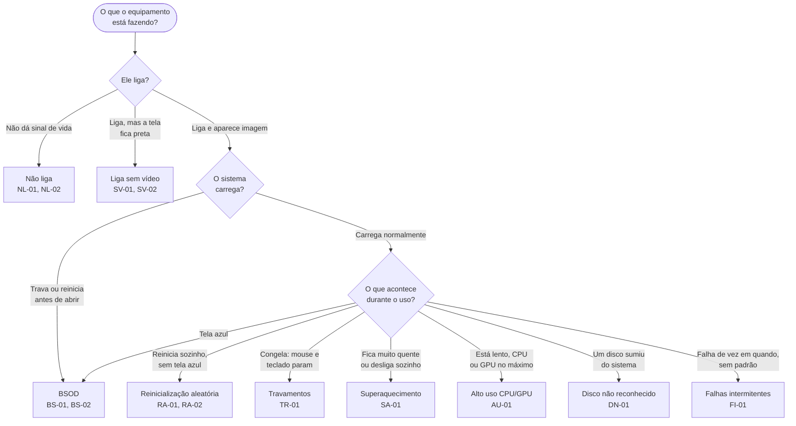

<!-- Gerado a partir de `HW_HARDWARE_FLUXO_DIAGNOSTICO.xlsx` → abas `TABELA_PRINCIPAL` e `INDICE_CENARIOS`. Não editar manualmente sem atualizar a fonte. -->

[Início](../../README.md) › [Resolva](../../README.md#resolva) › **Índice de cenários de falha**

# Índice de cenários de falha

> [!NOTE]
> Ponto de entrada por sintoma. Descreva o que o equipamento faz e vá direto para o procedimento.

**Aplica-se a:** Falhas percebidas depois que o sistema operacional carrega

## Neste artigo

- [Contexto](#contexto)
- [Escopo](#escopo)
- [Relação com outros documentos](#relação-com-outros-documentos)
- [Qual é o seu sintoma?](#qual-é-o-seu-sintoma)
- [Tabela de entrada por sintoma](#tabela-de-entrada-por-sintoma)
- [Ordem de execução declarada na fonte](#ordem-de-execução-declarada-na-fonte)
- [Arquivos por cenário](#arquivos-por-cenário)
- [Próximos passos](#próximos-passos)

## Contexto

Ponto de entrada por sintoma. Quem chega com uma queixa ('não liga', 'tela azul', 'reinicia sozinho') começa aqui e é direcionado à ficha correspondente.

## Escopo

Os 9 cenários e os 13 IDs de diagnóstico registrados na fonte, com camada primária, primeiro teste e ferramentas necessárias.

**Fora do escopo:** Conteúdo detalhado das fichas (ver arquivos por cenário); códigos de POST; fluxos completos.

## Relação com outros documentos

- [Fluxo de diagnóstico sistêmico](../07-fluxo-sistemico.md) — sequência F01→F14
- [Índice de códigos POST](../09-codigos-post/00-indice-codigos.md) — quando o sistema nem chega ao SO
- [Correlações entre camadas](../12-correlacoes.md) — quando o sintoma engana

---

## Qual é o seu sintoma?

> [!IMPORTANT]
> Se o equipamento **não chega a carregar o sistema**, o caminho é outro: comece pelo
> [fluxo de diagnóstico POST](../06-fluxo-post.md) e pelo
> [catálogo de códigos](../09-codigos-post/00-indice-codigos.md).

> [!WARNING]
> Um sintoma pode ter origem em outra camada. Trocar a peça que o sintoma aponta, sem
> verificar a cadeia, é o erro mais comum registrado nesta base — ver
> [Correlações entre camadas](../12-correlacoes.md).

## Tabela de entrada por sintoma

| Cenário | IDs relacionados | Camada primária | Primeiro teste | Ferramentas necessárias | Fichas |
| :--- | :--- | :--- | :--- | :--- | :--- |
| Não liga | NL-01, NL-02 | 1 - Energia | Teste paperclip da PSU → Multímetro nas tensões | Multímetro, Testador PSU, Chave de fenda | [NL-01](nao-liga.md#nl-01), [NL-02](nao-liga.md#nl-02) |
| Liga sem vídeo | SV-01, SV-02 | 4 - Memória / 6-GPU | Reencaixar RAM (1 módulo, slot primário) → Testar iGPU | Manual placa-mãe, GPU known-good | [SV-01](liga-sem-video.md#sv-01), [SV-02](liga-sem-video.md#sv-02) |
| Reinicialização aleatória | RA-01, RA-02 | 1 - Energia / 4-Memória | AIDA64 Voltage monitoring → MemTest86 | AIDA64, MemTest86, Multímetro | [RA-01](reinicializacao-aleatoria.md#ra-01), [RA-02](reinicializacao-aleatoria.md#ra-02) |
| BSOD (Tela Azul) | BS-01, BS-02 | 4 - Memória / 5-Armazenamento | WinDbg !analyze -v no minidump → mdsched.exe → Victoria SMART | WinDbg, BlueScreenView, MemTest86, Victoria | [BS-01](bsod.md#bs-01), [BS-02](bsod.md#bs-02) |
| Travamentos (Freeze) | TR-01 | 3 - CPU | AIDA64 Stability Test + OSD (temperatura + throttling) | AIDA64, Pasta térmica, Álcool isopropílico | [TR-01](travamentos-freeze.md#tr-01) |
| Disco não reconhecido | DN-01 | 5 - Armazenamento | Verificar cabos → Outra porta SATA → BIOS (AHCI) → Outro sistema | Cabos SATA known-good, Victoria | [DN-01](disco-nao-reconhecido.md#dn-01) |
| Alto uso CPU/GPU | AU-01 | 9 - SO | Gerenciador de Tarefas → Process Explorer → Verificar malware | Process Explorer, Windows Defender Offline | [AU-01](alto-uso-cpu-gpu.md#au-01) |
| Superaquecimento | SA-01 | 3 - CPU | AIDA64 Sensores (idle) → Stability Test FPU (2min) | AIDA64, Pasta térmica, Termômetro IR | [SA-01](superaquecimento.md#sa-01) |
| Falhas intermitentes | FI-01 | 1 - Energia (mais comum) | AIDA64 Log CSV contínuo (24h) → Analisar última linha antes da falha | AIDA64 (Log), UPS, Multímetro | [FI-01](falhas-intermitentes.md#fi-01) |

## Ordem de execução declarada na fonte

| ID | Sintoma observado | Camada afetada | Componente suspeito | Ordem de execução | Dependências | Risco |
| :--- | :--- | :--- | :--- | :--- | :--- | :--- |
| [NL-01](nao-liga.md#nl-01) | Equipamento não liga: sem LEDs, sem ventoinhas, sem sinal de vida. | 1 - Energia | PSU (Fonte de Alimentação) | 1 | Nenhuma (primeiro teste da cadeia) | Crítico |
| [NL-02](nao-liga.md#nl-02) | PSU funcional (teste paperclip OK), mas sistema não liga ao conectar na placa-mãe. | 7 - Placa-mãe | Placa-mãe / VRM / Front Panel Header | 2 | NL-01 (PSU validada) | Alto |
| [SV-01](liga-sem-video.md#sv-01) | Sistema liga (ventoinhas giram, LEDs acendem) mas sem saída de vídeo. Monitor em standby. | 4 - Memória | Módulos DRAM / Slots DIMM | 3 | NL-01, NL-02 (energia e placa-mãe validadas) | Alto |
| [SV-02](liga-sem-video.md#sv-02) | Sistema liga sem vídeo. RAM validada. Debug LED estaciona em VGA. | 6 - GPU | GPU Dedicada / iGPU / Slot PCIe x16 | 4 | SV-01 (RAM validada) | Médio |
| [RA-01](reinicializacao-aleatoria.md#ra-01) | Sistema reinicia sem aviso durante uso normal ou sob carga. Sem BSOD prévio. | 1 - Energia | PSU / VRM / Cabos de alimentação | 5 | Nenhuma (pode ser primeiro sintoma) | Crítico |
| [RA-02](reinicializacao-aleatoria.md#ra-02) | Reinicialização aleatória. PSU validada. Ocorre principalmente com carga em RAM. | 4 - Memória | Módulos DRAM / XMP Profile / IMC da CPU | 6 | RA-01 (PSU validada como estável) | Alto |
| [BS-01](bsod.md#bs-01) | BSOD com código MEMORY_MANAGEMENT (0x0000001A) ou IRQL_NOT_LESS_OR_EQUAL (0x0000000A). | 4 - Memória | Módulos DRAM / Driver com vazamento de memória | 7 | RA-01 (PSU), RA-02 (RAM) | Alto |
| [BS-02](bsod.md#bs-02) | BSOD com código KERNEL_DATA_INPAGE_ERROR (0x0000007A) ou NTFS_FILE_SYSTEM (0x00000024). | 5 - Armazenamento | HDD/SSD / Controladora SATA/NVMe | 8 | NL-01 (energia estável para não corromper durante clone) | Crítico |
| [TR-01](travamentos-freeze.md#tr-01) | Sistema congela completamente (freeze). Mouse e teclado não respondem. Sem BSOD. | 3 - CPU | CPU / Thermal Throttling / VRM | 9 | RA-01 (PSU estável), SV-01/02 (vídeo funcional para monitorar) | Crítico |
| [DN-01](disco-nao-reconhecido.md#dn-01) | Disco não aparece na BIOS/UEFI nem no Gerenciador de Dispositivos. | 5 - Armazenamento | Disco HDD/SSD / Cabo SATA-Dados / Cabo SATA-Energia / Porta SATA/M.2 | 10 | NL-01 (energia presente e estável) | Alto |
| [SA-01](superaquecimento.md#sa-01) | CPU operando acima de 90°C em idle ou atingindo TjMax (100-105°C) rapidamente sob carga. | 3 - CPU | Cooler / Pasta Térmica / Ventilação do Gabinete | 11 | NL-01 (energia), SV-01/02 (vídeo para monitorar) | Crítico |
| [AU-01](alto-uso-cpu-gpu.md#au-01) | CPU em 100% de uso constante sem carga aparente do usuário. Sistema lento. | 9 - SO | Processos do SO / Malware / Windows Update | 12 | TR-01 (descartar superaquecimento como causa de lentidão) | Médio |
| [FI-01](falhas-intermitentes.md#fi-01) | Falhas esporádicas sem padrão claro: freezes, BSODs variados, reinícios. Não reproduzível sob demanda. | 1 - Energia | PSU / Contatos elétricos / Cabos internos | 13 | Todas as camadas anteriores como diagnóstico diferencial | Alto |

## Arquivos por cenário

- [Não liga](nao-liga.md) — NL-01, NL-02
- [Liga sem vídeo](liga-sem-video.md) — SV-01, SV-02
- [Reinicialização aleatória](reinicializacao-aleatoria.md) — RA-01, RA-02
- [BSOD (Tela Azul)](bsod.md) — BS-01, BS-02
- [Travamentos (Freeze)](travamentos-freeze.md) — TR-01
- [Disco não reconhecido](disco-nao-reconhecido.md) — DN-01
- [Alto uso CPU/GPU](alto-uso-cpu-gpu.md) — AU-01
- [Superaquecimento](superaquecimento.md) — SA-01
- [Falhas intermitentes](falhas-intermitentes.md) — FI-01

## Próximos passos

| Se você… | Vá para |
| :--- | :--- |
| o equipamento não chega a carregar o sistema | [Fluxo de diagnóstico POST](../06-fluxo-post.md) |
| quer percorrer o diagnóstico do início ao fim | [Fluxo de diagnóstico sistêmico](../07-fluxo-sistemico.md) |
| precisa do comando exato de um cenário | [Referência de comandos](../19-comandos.md) |
| quer buscar por componente, risco ou ferramenta | [Índices cruzados](../18-indices-cruzados.md) |

---

| Atributo | Valor |
| :--- | :--- |
| **Fonte primária deste documento** | `HW_HARDWARE_FLUXO_DIAGNOSTICO.xlsx` → abas `TABELA_PRINCIPAL` e `INDICE_CENARIOS` |
| **Status de confiança** | Confirmado — transcrito das células de origem |
| **Última verificação contra a fonte** | 2026-08-08 |
| **Autoria** | Edsilas |
| **Versão da documentação** | `doc-2.0.0` |
