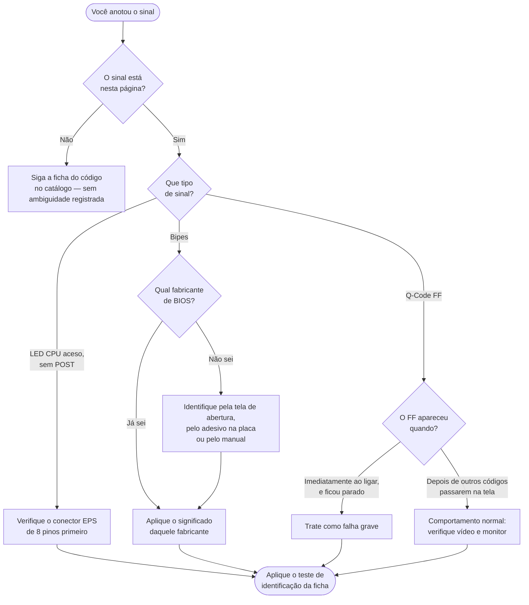

[Início](../README.md) › [Resolva](../README.md#resolva) › **Ambiguidade de códigos**

# Ambiguidade de códigos

> Sinais que significam coisas diferentes conforme o fabricante ou o momento em que aparecem, e o critério para diferenciá-los.

**Aplica-se a:** Beeps, Q-Codes e LEDs cujo significado depende do contexto

## Neste documento

- [Como desempatar](#como-desempatar)
- [Título declarado na fonte](#título-declarado-na-fonte)
- [1 Longo + 2 Curtos](#1-longo--2-curtos)
- [1 Longo + 3 Curtos](#1-longo--3-curtos)
- [Beep Contínuo](#beep-contínuo)
- [Q-Code FF](#q-code-ff)
- [LED CPU + sem POST](#led-cpu--sem-post)
- [Próximos passos](#próximos-passos)

## Contexto

Alguns sinais de POST têm significados diferentes conforme o fabricante do BIOS ou o momento em que aparecem. Este documento reúne os casos registrados na fonte e o critério para diferenciá-los.

## Escopo

Os 5 códigos ambíguos registrados, com os significados concorrentes por fabricante, o critério de diferenciação e o teste para identificar a causa.

## Fora do escopo

Fichas completas dos códigos (ver catálogo); fluxos; cenários pós-boot.

## Relação com outros documentos

- [Índice de códigos POST](09-codigos-post/00-indice-codigos.md)
- [Fluxo de diagnóstico POST](06-fluxo-post.md) — Etapa 4 remete a este tratamento
- [Camadas de diagnóstico](08-diagnostico-por-camada.md)

---

## Como desempatar

> [!TIP]
> Todo caso desta página traz um campo **Teste para identificar a causa**: é uma sequência curta
> que resolve o empate na prática, sem depender de saber o fabricante de antemão.

## Título declarado na fonte

**TRATAMENTO DE AMBIGUIDADE — CÓDIGOS COM MÚLTIPLOS SIGNIFICADOS**

---

## 1 Longo + 2 Curtos

### Significados concorrentes

| Fabricante | Significado |
| --- | --- |
| AMI (UEFI) | Video System Failure (GPU não detectada) |
| Award | Video Adapter Error |
| Acer (Insyde) | Video Interface Error (cabo flat) |

### Critério de diferenciação

1. Identificar fabricante do BIOS (tela de splash antes do erro, adesivo na placa, manual).  
2. AMI/Award: focam em GPU/slot.  
3. Acer: foco em cabo flat/LCD (notebook).  
4. Verificar plataforma: desktop vs notebook.

### Teste para identificar a causa

1. Se DESKTOP: reseat GPU → teste cruzado GPU → se falha: slot PCIe.  
2. Se NOTEBOOK Acer: conectar monitor externo → se externo funciona: cabo flat rompido.  
3. Se NOTEBOOK outros: GPU BGA ou cabo eDP.  
4. Identificar BIOS: acessar sticker na placa-mãe ou documentação online.

---

## 1 Longo + 3 Curtos

### Significados concorrentes

| Fabricante | Significado |
| --- | --- |
| AMI (UEFI) | Conventional/Extended Memory Failure (RAM) |
| Award | Video Adapter Error / VRAM |

### Critério de diferenciação

1. AMI: código aponta para RAM, não vídeo.  
2. Award: código aponta para GPU/VRAM.  
3. Verificar fabricante do BIOS.  
4. Se incerto: testar RAM primeiro (mais simples), depois GPU.

### Teste para identificar a causa

1. Reseat RAM → se POST OK: era RAM (AMI).  
2. Se RAM OK mas falha persiste: reseat GPU → se POST OK: era GPU (Award).  
3. Se ambos falham: teste cruzado com componentes known-good.

---

## Beep Contínuo

> [!IMPORTANT]
> **Esta é a entrada canônica para beep contínuo.** O
> [catálogo de códigos](09-codigos-post/00-indice-codigos.md) registra beep contínuo apenas na
> família Award, com o significado de memória não instalada ou não detectada. A hipótese de
> **teclado com tecla presa**, que ocorre em parte das versões AMI, existe só aqui. Se você chegou
> ao catálogo por um beep contínuo e o procedimento de memória não resolveu, volte a esta seção
> antes de condenar a placa: o teste de desconectar o teclado leva segundos e desempata.

### Significados concorrentes

| Fabricante | Significado |
| --- | --- |
| Award | Memory not installed / not detected |
| AMI (alguns) | Stuck key / keyboard error |
| GERAL | Pode ser qualquer falha crítica pré-POST |

### Critério de diferenciação

1. Award: beep contínuo LONGO ininterrupto = RAM.  
2. AMI: beep contínuo de tom DIFERENTE pode ser teclado.  
3. Distinguir pelo tom e ritmo.  
4. Se beep para ao remover teclado: era teclado.

### Teste para identificar a causa

1. Desconectar teclado → se beep para: teclado com tecla presa.  
2. Se beep continua sem teclado: reseat RAM.  
3. Se continua sem RAM: placa/CPU com falha grave.

---

## Q-Code FF

### Significados concorrentes

| Fabricante | Significado |
| --- | --- |
| AMI (Q-Code) | Se FIXO ao ligar: Falha grave (CPU/VRM/BIOS morta) |
| AMI (Q-Code) | Se APÓS sequência: Boot OK (controle passou ao OS) |

### Critério de diferenciação

1. QUANDO o FF aparece é determinante.  
2. FF imediato (0.5s após ligar, sem outros códigos) = FALHA GRAVE.  
3. FF após progressão (00→55→A0→FF) = NORMAL.  
4. Observar se há outros códigos antes do FF.

### Teste para identificar a causa

1. Observar Q-Code nos primeiros 5 segundos:  

   — Se FF aparece instantaneamente e fica fixo: tratar como FE (falha grave).  
   — Se códigos progridem e terminam em FF: sistema está OK, verificar vídeo/monitor.  
2. Filmar o Q-Code na inicialização (celular em slow-motion) para capturar sequência.

---

## LED CPU + sem POST

### Significados concorrentes

| Fabricante | Significado |
| --- | --- |
| Genérico | CPU não detectada / falha de inicialização |
| Genérico | BIOS não suporta CPU (requer update) |
| Genérico | EPS 8-pin desconectado (sem energia para CPU) |

### Critério de diferenciação

1. Verificar conector EPS PRIMEIRO (causa mais comum e simples).  
2. Se EPS OK: verificar compatibilidade CPU-BIOS.  
3. Se compatível: inspecionar socket.  
4. Se socket OK: CPU com defeito.

### Teste para identificar a causa

1. Verificar EPS 8-pin conectado → medir 12V.  
2. Se 12V OK: consultar lista de CPUs suportadas pela versão do BIOS instalada.  
3. Se CPU não listada: BIOS Flashback com versão compatível.  
4. Se CPU listada: inspecionar socket com lupa.  
5. Se socket OK: teste cruzado CPU.

---

## Próximos passos

| Se você… | Vá para |
| --- | --- |
| desempatou e quer o procedimento completo | [Índice de códigos POST](09-codigos-post/00-indice-codigos.md) |
| ainda não identificou o tipo de sinal | [Fluxo de diagnóstico POST](06-fluxo-post.md) |
| quer saber o que testar naquele subsistema | [Diagnóstico por camada](08-diagnostico-por-camada.md) |

---

| Atributo | Valor |
| --- | --- |
| **Autoria** | Edsilas |
| **Versão da documentação** | `doc-3.0.0` |
