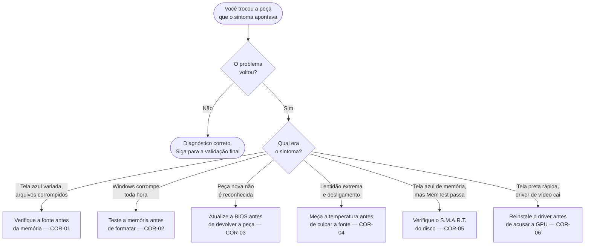

<!-- Gerado a partir de `HW_HARDWARE_FLUXO_DIAGNOSTICO.xlsx` → aba `CORRELACOES`. Não editar manualmente sem atualizar a fonte. -->

[Início](../README.md) › [Resolva](../README.md#resolva) › **Correlações entre camadas (efeitos em cascata)**

# Correlações entre camadas (efeitos em cascata)

> Falhas que se manifestam em outro subsistema e levam à troca do componente errado, com o critério para separar causa de sintoma.

**Aplica-se a:** Casos em que o problema retorna depois da troca de peça

## Neste documento

- [Quando desconfiar de uma cascata](#quando-desconfiar-de-uma-cascata)
- [Resumo](#resumo)
- [COR-01](#cor-01)
- [COR-02](#cor-02)
- [COR-03](#cor-03)
- [COR-04](#cor-04)
- [COR-05](#cor-05)
- [COR-06](#cor-06)
- [Próximos passos](#próximos-passos)

## Contexto

Casos em que a falha de uma camada produz sintoma em outra, levando o técnico a trocar o componente errado. Cada registro traz o mecanismo de propagação, a armadilha comum e como distinguir causa de sintoma.

## Escopo

As 6 correlações registradas na fonte (COR-01 a COR-06).

## Fora do escopo

Procedimentos de correção (ver cenários); códigos de POST; validação pós-reparo.

## Relação com outros documentos

- [Índice de cenários](10-cenarios/00-indice-cenarios.md)
- [Fluxo de diagnóstico sistêmico](07-fluxo-sistemico.md)
- [Validação final por componente](13-validacao-final.md)
- [Taxonomia de camadas](03-taxonomia-camadas.md) — as camadas citadas aqui seguem o modelo sistêmico

---

## Quando desconfiar de uma cascata

> [!WARNING]
> Todo caso desta página começa com um técnico trocando uma peça boa. O prejuízo não é só a peça:
> o problema real segue no equipamento e volta para a bancada.

## Resumo

| ID | Falha primária | Efeito cascata | Sintoma resultante |
| --- | --- | --- | --- |
| [COR-01](#cor-01) | 1-Energia (PSU instável) | 4-Memória / 5-Armazenamento / 9-SO | BSODs variados (MEMORY_MANAGEMENT, NTFS_FILE_SYSTEM), corrupção de arquivos, reinícios aleatórios. |
| [COR-02](#cor-02) | 4-Memória (RAM defeituosa) | 9-SO / 5-Armazenamento | BSOD MEMORY_MANAGEMENT, corrupção do registro do Windows, arquivos corrompidos, sfc /scannow encontra erros repetidamente. |
| [COR-03](#cor-03) | 2-Firmware (BIOS/UEFI desatualizado) | 3-CPU / 4-Memória / 8-Periféricos | Incompatibilidade com CPUs novas (não inicializa), RAM nova não detectada, BSOD DRIVER_POWER_STATE_FAILURE ao suspender/hibernar. |
| [COR-04](#cor-04) | 3-CPU (Superaquecimento) | 1-Energia / 9-SO | Lentidão extrema, desligamentos abruptos, ventoinhas em rotação máxima. |
| [COR-05](#cor-05) | 5-Armazenamento (Bad Sectors) | 9-SO / 4-Memória (falsa pista) | BSOD KERNEL_DATA_INPAGE_ERROR, lentidão ao acessar arquivos específicos, boot extremamente lento. |
| [COR-06](#cor-06) | 10-Drivers (Driver incompatível/corrompido) | 6-GPU / 3-CPU / 9-SO | Tela preta momentânea com notificação 'O driver de vídeo parou de responder', BSOD VIDEO_TDR_FAILURE, dispositivos desconhecidos no Device Manager. |

---

## COR-01

**Falha primária (camada):** 1-Energia (PSU instável)  
**Efeito cascata (camada):** 4-Memória / 5-Armazenamento / 9-SO

### Mecanismo de propagação

Ripple excessivo ou Vdrop na linha +12V causa voltage droop no VRM da CPU, que afeta o IMC (Integrated Memory Controller). O IMC instável causa bit-flips na RAM, que corrompem páginas do kernel na memória, resultando em BSOD ou corrupção de NTFS no disco.

### Sintoma resultante

BSODs variados (MEMORY_MANAGEMENT, NTFS_FILE_SYSTEM), corrupção de arquivos, reinícios aleatórios.

### Diagnóstico diferencial

Testar PSU PRIMEIRO (AIDA64 Voltages, multímetro) antes de culpar RAM ou disco.

### Armadilha comum

Trocar RAM ou reinstalar Windows sem verificar PSU. O problema retorna com componentes novos.

### Como distinguir

SE problema persiste após trocar RAM E disco → PSU é o culpado oculto. Log CSV do AIDA64 mostrará queda de +12V precedendo cada falha.

### Fonte

ATX12V PSU Design Guide v2.53 §3.2.1; Intel Voltage Regulator Module Guidelines

---

## COR-02

**Falha primária (camada):** 4-Memória (RAM defeituosa)  
**Efeito cascata (camada):** 9-SO / 5-Armazenamento

### Mecanismo de propagação

Bit-flip em célula de RAM corrompe dados em trânsito entre disco e memória. Páginas de kernel corrompidas causam BSOD. Dados escritos no disco a partir de RAM corrompida geram arquivos inválidos e degradação do sistema de arquivos.

### Sintoma resultante

BSOD MEMORY_MANAGEMENT, corrupção do registro do Windows, arquivos corrompidos, sfc /scannow encontra erros repetidamente.

### Diagnóstico diferencial

Executar MemTest86 antes de reformatar. SE erros de RAM → reformatar não resolve nada.

### Armadilha comum

Formatar o Windows repetidamente sem testar a RAM. O Windows corrompido é SINTOMA, não causa.

### Como distinguir

SE sfc /scannow encontra erros que retornam após correção → RAM corrompendo dados durante a gravação. MemTest86 confirma.

### Fonte

JEDEC JESD79-4/5; Microsoft Docs: sfc /scannow; MemTest86 Documentation

---

## COR-03

**Falha primária (camada):** 2-Firmware (BIOS/UEFI desatualizado)  
**Efeito cascata (camada):** 3-CPU / 4-Memória / 8-Periféricos

### Mecanismo de propagação

BIOS com microcode antigo não implementa correções de errata do processador (ex: Intel Microcode updates). Memory Reference Code (MRC) antigo falha em treinar módulos DDR5 novos. Tabelas ACPI incorretas causam falhas de power management.

### Sintoma resultante

Incompatibilidade com CPUs novas (não inicializa), RAM nova não detectada, BSOD DRIVER_POWER_STATE_FAILURE ao suspender/hibernar.

### Diagnóstico diferencial

Verificar changelog da BIOS no site do fabricante da placa-mãe. Atualizar BIOS antes de trocar componentes.

### Armadilha comum

Comprar CPU/RAM nova e assumir que é defeituosa sem atualizar BIOS. Devolver componente funcional ao fabricante.

### Como distinguir

Verificar CPU/Memory Support List no site da placa-mãe. SE componente listado apenas em BIOS versão X+ → atualizar BIOS primeiro.

### Fonte

Intel Microcode Update Guidance; AMD AGESA Changelog; UEFI Specification 2.10; OEM BIOS Release Notes

---

## COR-04

**Falha primária (camada):** 3-CPU (Superaquecimento)  
**Efeito cascata (camada):** 1-Energia / 9-SO

### Mecanismo de propagação

CPU em throttling contínuo reduz clock e IPC, causando lentidão percebida como problema de SO. Em casos extremos, proteção térmica (PROCHOT) causa shutdown abrupto idêntico a falha de PSU.

### Sintoma resultante

Lentidão extrema, desligamentos abruptos, ventoinhas em rotação máxima.

### Diagnóstico diferencial

Monitorar temperatura ANTES de diagnosticar lentidão de software.

### Armadilha comum

Reinstalar Windows ou trocar PSU sem verificar temperatura. O problema é térmico, não elétrico.

### Como distinguir

AIDA64 OSD durante uso normal: SE CPU > 90°C em idle → problema térmico (não de software). SE desligamento precedido por pico térmico no log → não é PSU.

### Fonte

Intel Thermal Design Guide; AMD Ryzen Thermal Solution Design Guide

---

## COR-05

**Falha primária (camada):** 5-Armazenamento (Bad Sectors)  
**Efeito cascata (camada):** 9-SO / 4-Memória (falsa pista)

### Mecanismo de propagação

Setores defeituosos no disco causam falha de leitura de páginas do kernel (page file, system hive). O SO tenta recarregar da RAM, mas a página é inválida, gerando BSOD idêntico a erro de memória.

### Sintoma resultante

BSOD KERNEL_DATA_INPAGE_ERROR, lentidão ao acessar arquivos específicos, boot extremamente lento.

### Diagnóstico diferencial

Verificar S.M.A.R.T. do disco (Victoria/CrystalDiskInfo) antes de testar RAM.

### Armadilha comum

Executar MemTest86 que retorna limpo (RAM OK), mas BSOD persiste. Técnico troca RAM desnecessariamente.

### Como distinguir

BSOD 0x7A (KERNEL_DATA_INPAGE_ERROR) aponta especificamente para falha de I/O, não de RAM. Victoria S.M.A.R.T. ID C5/C6 > 0 confirma disco.

### Fonte

Microsoft Docs: Bug Check 0x7A; Seagate SMART Attribute Reference; Victoria Documentation

---

## COR-06

**Falha primária (camada):** 10-Drivers (Driver incompatível/corrompido)  
**Efeito cascata (camada):** 6-GPU / 3-CPU / 9-SO

### Mecanismo de propagação

Driver de GPU com bug causa TDR (Timeout Detection and Recovery), gerando reset do driver de vídeo e possível BSOD. Driver de chipset defeituoso causa falhas de comunicação PCIe. Driver de armazenamento corrompido gera I/O errors falsos.

### Sintoma resultante

Tela preta momentânea com notificação 'O driver de vídeo parou de responder', BSOD VIDEO_TDR_FAILURE, dispositivos desconhecidos no Device Manager.

### Diagnóstico diferencial

Verificar Event Viewer para erros de driver (Display, nvlddmkm, atikmdag). Testar com driver anterior (rollback).

### Armadilha comum

Culpar GPU como defeituosa quando o problema é driver de software. Enviar GPU para RMA desnecessário.

### Como distinguir

SE BSOD VIDEO_TDR_FAILURE → DDU (Display Driver Uninstaller) em Safe Mode → instalar driver limpo. SE problema resolve → era driver, não hardware.

### Fonte

Microsoft Docs: TDR Registry Keys; NVIDIA/AMD Driver Release Notes; DDU Documentation

---

## Próximos passos

| Se você… | Vá para |
| --- | --- |
| confirmou a causa real e quer o procedimento | [Índice de cenários](10-cenarios/00-indice-cenarios.md) |
| precisa comprovar antes de trocar a peça | [Validação final por componente](13-validacao-final.md) |
| quer monitorar tensões ou temperatura | [Guias de ferramentas](14-ferramentas/00-indice-ferramentas.md) |

---

| | |
| --- | --- |
| **Fonte primária deste documento** | `HW_HARDWARE_FLUXO_DIAGNOSTICO.xlsx` → aba `CORRELACOES` |
| **Status de confiança** | Confirmado — transcrito das células de origem |
| **Última verificação contra a fonte** | 2026-08-07 |
| **Autoria** | Edsilas |
| **Versão da documentação** | `doc-1.3.0` |
