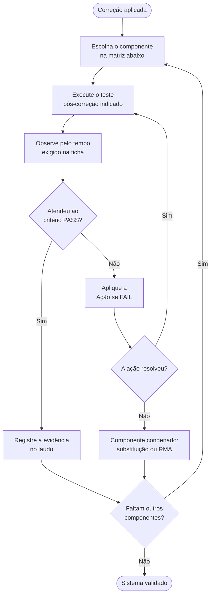

[Início](../README.md) › [Feche o atendimento](../README.md#feche-o-atendimento) › **Validação final por componente**

# Validação final por componente

> Critérios objetivos de aprovação e reprovação por componente, com tempo de observação e encaminhamento em caso de falha.

**Aplica-se a:** Encerramento de atendimento e emissão de laudo

## Neste documento

- [Como fechar o atendimento](#como-fechar-o-atendimento)
- [Matriz de validação](#matriz-de-validação)
- [Como ler os dois limiares de temperatura](#como-ler-os-dois-limiares-de-temperatura)
- [Detalhamento](#detalhamento)
- [PSU](#psu)
- [Placa-mãe](#placa-mãe)
- [CPU](#cpu)
- [RAM](#ram)
- [Disco HDD](#disco-hdd)
- [Disco SSD/NVMe](#disco-ssdnvme)
- [GPU](#gpu)
- [SO Windows](#so-windows)
- [Drivers](#drivers)
- [Térmico](#térmico)
- [Próximos passos](#próximos-passos)

## Contexto

Critérios objetivos de aprovação e reprovação aplicados **depois** da correção, por componente. É o que fecha o atendimento e sustenta o laudo.

## Escopo

Os 10 componentes com teste pós-correção, ferramenta, indicador de sucesso, tempo de observação, critério PASS, critério FAIL e ação em caso de reprovação.

## Fora do escopo

Como chegar ao diagnóstico (ver fluxos e cenários); operação detalhada das ferramentas.

## Relação com outros documentos

- [Fluxo de diagnóstico sistêmico](07-fluxo-sistemico.md) — nó F14 usa estes critérios
- [Guias de ferramentas](14-ferramentas/00-indice-ferramentas.md)
- [Índice de cenários](10-cenarios/00-indice-cenarios.md)
- [Segurança e boas práticas](15-seguranca-e-boas-praticas.md) — escala completa de limiares térmicos

---

## Como fechar o atendimento

> [!IMPORTANT]
> O tempo de observação faz parte do critério. Vários componentes exigem acompanhamento por 48 h
> ou 72 h de uso normal **depois** do teste de bancada: aprovar antes disso devolve ao cliente um
> equipamento não validado.

## Matriz de validação

| Componente | Critério PASS | Critério FAIL | Tempo de observação |
| --- | --- | --- | --- |
| [PSU](#psu) | +12V ±5% estável. 0 reinícios. 0 Kernel-Power 41. | +12V fora de spec OU reinício durante teste. | 30 min stress + 48h uso normal |
| [Placa-mãe](#placa-mãe) | POST sem erros. Debug LEDs limpos. Estabilidade confirmada. | Capacitores estufados. VRM > 110°C. Slots não funcionais. | 30 min stress |
| [CPU](#cpu) | Temp estável. Clock mantido. Score dentro de 5% da referência. | Throttling > 0%. Score > 20% abaixo. Temp > 95°C. | 30 min stress + comparação benchmark |
| [RAM](#ram) | 0 erros. Dual Channel confirmado. Latência dentro de spec. | ≥1 erro em qualquer pass. Single Channel detectado. | 4 passes (~2-4h) + 48h uso normal |
| [Disco HDD](#disco-hdd) | 0 bad blocks. S.M.A.R.T. GOOD. Nenhum setor pendente. | ≥1 bad block. S.M.A.R.T. BAD. C5/C6 > 0. | Scan completo (1-10h) + 72h uso |
| [Disco SSD/NVMe](#disco-ssdnvme) | Velocidade dentro de spec. Wear Level aceitável. 0 erros. | Velocidade < 50% spec. Wear Level > 90%. Erros de mídia. | Benchmark 10min + 72h uso |
| [GPU](#gpu) | 0 artefatos. Score normal. Driver estável (sem TDR). | Artefatos visuais. TDR/crash de driver. Temp Hotspot > 100°C. | 10 min benchmark + 48h uso |
| [SO Windows](#so-windows) | 0 integrity violations. 0 erros críticos em 72h. | sfc encontra erros recorrentes. BSODs persistem. | Scan + 72h uso normal |
| [Drivers](#drivers) | 0 erros no Device Manager. 0 TDRs em 48h. | Dispositivos desconhecidos. TDRs recorrentes. BSODs de driver. | Verificação imediata + 48h estabilidade |
| [Térmico](#térmico) | Temperaturas estáveis. 0% throttling. Delta < 2°C com IR. | Temp > 90°C. Throttling detectado. Diferença > 10°C com IR. | 30 min stress |

## Como ler os dois limiares de temperatura

A matriz traz dois critérios FAIL de temperatura que parecem conflitar — **95 °C** na linha
[CPU](#cpu) e **90 °C** na linha [Térmico](#térmico). Eles não conflitam: **julgam sujeitos
diferentes**.

| Linha | O que ela avalia | Critério FAIL | Pergunta que responde |
| --- | --- | --- | --- |
| [CPU](#cpu) | O processador como peça | Temp > 95 °C | O processador está defeituoso? |
| [Térmico](#térmico) | A solução de refrigeração como sistema — cooler, pasta, fluxo de ar | Temp > 90 °C | A refrigeração está adequada? |

Um equipamento estabilizado em **92 °C** sob carga tem, portanto, **CPU aprovada e subsistema
térmico reprovado**: o processador não está defeituoso, mas a refrigeração não dá conta dele.

> [!IMPORTANT]
> **Para liberar o equipamento prevalece o limiar mais restritivo.** A validação final só fecha
> quando **todos** os componentes avaliados passam. Aprovar a 92 °C porque a linha *CPU* passou
> devolve ao cliente uma máquina que vai voltar para a bancada com queixa de lentidão — o cenário
> [SA-01](10-cenarios/superaquecimento.md#sa-01) e a correlação
> [COR-04](12-correlacoes.md#cor-04) descrevem exatamente esse caminho.

Como referência de teto: segundo a Intel, o **Tjunction max** — ponto em que o processador aciona
o controle térmico interno para reduzir potência — fica entre **100 °C e 110 °C** conforme o
produto. Os dois critérios acima são margens de engenharia abaixo desse limite físico, não o
limite em si. A escala completa, incluindo os limiares de repouso, está em
[Limiares térmicos](15-seguranca-e-boas-praticas.md#limiares-térmicos-e-o-que-cada-um-decide).

---

## Detalhamento

## PSU

### Teste pós-correção

AIDA64 Stability Test (CPU+FPU+Mem) monitorando Voltages por 30min

### Ferramenta de validação

AIDA64 Engineer; Multímetro

### Indicador de sucesso

+12V dentro de 11.4-12.6V durante 100% carga. Sem reinícios.

### Tempo de observação

30 min stress + 48h uso normal

### Critério PASS

+12V ±5% estável. 0 reinícios. 0 Kernel-Power 41.

### Critério FAIL

+12V fora de spec OU reinício durante teste.

### Ação se FAIL

Substituir PSU por unidade de maior potência/qualidade.

---

## Placa-mãe

### Teste pós-correção

Inspeção visual + POST completo + AIDA64 Stability Test

### Ferramenta de validação

AIDA64; Inspeção visual (capacitores, VRM)

### Indicador de sucesso

POST OK. Todos os slots funcionais. VRM < 100°C sob carga.

### Tempo de observação

30 min stress

### Critério PASS

POST sem erros. Debug LEDs limpos. Estabilidade confirmada.

### Critério FAIL

Capacitores estufados. VRM > 110°C. Slots não funcionais.

### Ação se FAIL

Substituir placa-mãe.

---

## CPU

### Teste pós-correção

AIDA64 Stability Test (Stress FPU) 30min + Benchmark CPU Queen

### Ferramenta de validação

AIDA64 Engineer; Intel Processor Diagnostic Tool

### Indicador de sucesso

Temp < 85°C. Throttling = 0%. Score condizente com modelo.

### Tempo de observação

30 min stress + comparação benchmark

### Critério PASS

Temp estável. Clock mantido. Score dentro de 5% da referência.

### Critério FAIL

Throttling > 0%. Score > 20% abaixo. Temp > 95°C.

### Ação se FAIL

Verificar térmico. SE OK → CPU pode ter defeito. Intel PDT.

---

## RAM

### Teste pós-correção

MemTest86 4 passes com XMP ativo + AIDA64 Memory Benchmark

### Ferramenta de validação

MemTest86 v10+; AIDA64 (Cache & Memory Benchmark)

### Indicador de sucesso

0 erros em 4 passes. Latência condizente (DDR4 ~60ns, DDR5 ~70-80ns).

### Tempo de observação

4 passes (~2-4h) + 48h uso normal

### Critério PASS

0 erros. Dual Channel confirmado. Latência dentro de spec.

### Critério FAIL

≥1 erro em qualquer pass. Single Channel detectado.

### Ação se FAIL

Isolar pente defeituoso. RMA. Verificar slots. Desativar XMP se instável.

---

## Disco HDD

### Teste pós-correção

Victoria Scan (Read/Ignore) completo + S.M.A.R.T. final

### Ferramenta de validação

Victoria HDD/SSD; CrystalDiskInfo

### Indicador de sucesso

0 blocos vermelhos/azuis. S.M.A.R.T. GOOD. ID 05/C5/C6 = 0.

### Tempo de observação

Scan completo (1-10h) + 72h uso

### Critério PASS

0 bad blocks. S.M.A.R.T. GOOD. Nenhum setor pendente.

### Critério FAIL

≥1 bad block. S.M.A.R.T. BAD. C5/C6 > 0.

### Ação se FAIL

Backup imediato. Remap se possível. Substituir disco.

---

## Disco SSD/NVMe

### Teste pós-correção

AIDA64 Disk Benchmark (Linear Read) + S.M.A.R.T.

### Ferramenta de validação

AIDA64; CrystalDiskInfo; Utilitário do fabricante

### Indicador de sucesso

Velocidade condizente com spec. S.M.A.R.T.: Wear Level < 80%.

### Tempo de observação

Benchmark 10min + 72h uso

### Critério PASS

Velocidade dentro de spec. Wear Level aceitável. 0 erros.

### Critério FAIL

Velocidade < 50% spec. Wear Level > 90%. Erros de mídia.

### Ação se FAIL

Verificar modo AHCI. Atualizar firmware via utilitário do fabricante. Substituir se wear.

---

## GPU

### Teste pós-correção

AIDA64 GPGPU Benchmark + Stability Test visual

### Ferramenta de validação

AIDA64; FurMark (opcional); Utilitário NVIDIA/AMD

### Indicador de sucesso

Sem artefatos visuais. Score condizente. Temp < 85°C (Hotspot < 95°C).

### Tempo de observação

10 min benchmark + 48h uso

### Critério PASS

0 artefatos. Score normal. Driver estável (sem TDR).

### Critério FAIL

Artefatos visuais. TDR/crash de driver. Temp Hotspot > 100°C.

### Ação se FAIL

DDU + driver limpo. SE persiste → GPU com defeito (VRAM ou chip).

---

## SO Windows

### Teste pós-correção

sfc /scannow + DISM RestoreHealth + Event Viewer limpo

### Ferramenta de validação

sfc; DISM; Event Viewer; Reliability Monitor

### Indicador de sucesso

sfc: 'no integrity violations'. DISM: sucesso. Event Viewer limpo.

### Tempo de observação

Scan + 72h uso normal

### Critério PASS

0 integrity violations. 0 erros críticos em 72h.

### Critério FAIL

sfc encontra erros recorrentes. BSODs persistem.

### Ação se FAIL

SE RAM OK e Disco OK → reinstalação limpa do Windows.

---

## Drivers

### Teste pós-correção

Device Manager sem triângulos amarelos + versões atualizadas

### Ferramenta de validação

Gerenciador de Dispositivos; AIDA64 (Drivers de Sistema)

### Indicador de sucesso

0 dispositivos desconhecidos. Drivers assinados digitalmente.

### Tempo de observação

Verificação imediata + 48h estabilidade

### Critério PASS

0 erros no Device Manager. 0 TDRs em 48h.

### Critério FAIL

Dispositivos desconhecidos. TDRs recorrentes. BSODs de driver.

### Ação se FAIL

Identificar HW ID (AIDA64). Baixar driver oficial do fabricante. DDU para GPU.

---

## Térmico

### Teste pós-correção

AIDA64 Stability Test (FPU) 30min com OSD ativo

### Ferramenta de validação

AIDA64; Termômetro IR (opcional)

### Indicador de sucesso

CPU < 85°C. VRM < 100°C. GPU < 85°C sob carga máxima.

### Tempo de observação

30 min stress

### Critério PASS

Temperaturas estáveis. 0% throttling. Delta < 2°C com IR.

### Critério FAIL

Temp > 90°C. Throttling detectado. Diferença > 10°C com IR.

### Ação se FAIL

Reaplicar pasta. Verificar cooler. Melhorar airflow. Substituir cooler se inadequado.

---

## Próximos passos

| Se você… | Vá para |
| --- | --- |
| reprovou e precisa reabrir o diagnóstico | [Índice de cenários](10-cenarios/00-indice-cenarios.md) |
| desconfia que a causa está em outra camada | [Correlações entre camadas](12-correlacoes.md) |
| precisa operar a ferramenta de validação | [Guias de ferramentas](14-ferramentas/00-indice-ferramentas.md) |
| quer conferir onde a validação entra no fluxo | [Fluxo de diagnóstico sistêmico](07-fluxo-sistemico.md) |

---

| Atributo | Valor |
| --- | --- |
| **Autoria** | Edsilas |
| **Versão da documentação** | `doc-3.0.0` |
