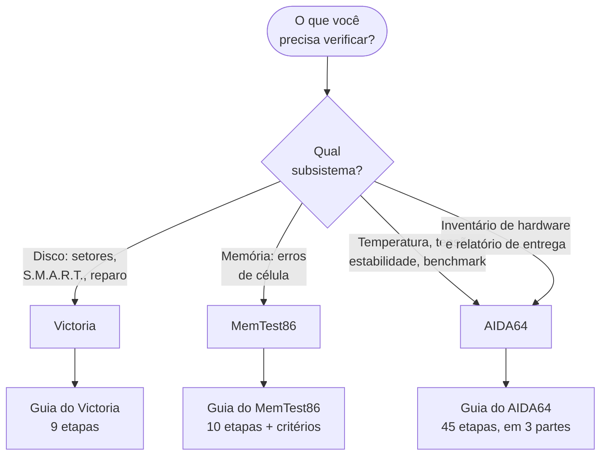

<!-- Gerado a partir de `HW_HARDWARE_FLUXO_DIAGNOSTICO.xlsx` → abas `REF_Victoria`, `REF_AIDA64`, `REF_MemTest86`. Não editar manualmente sem atualizar a fonte. -->

[Início](../../README.md) › [Opere as ferramentas](../../README.md#opere-as-ferramentas) › **Índice de guias de ferramentas**

# Índice de guias de ferramentas

> Qual ferramenta usar para cada tipo de verificação, e onde está o procedimento passo a passo de cada uma.

**Aplica-se a:** Victoria, AIDA64 e MemTest86 — as três com guia próprio na fonte

## Neste documento

- [Qual ferramenta usar](#qual-ferramenta-usar)
- [Guias disponíveis](#guias-disponíveis)
- [Estrutura comum das etapas](#estrutura-comum-das-etapas)
- [Observação sobre completude](#observação-sobre-completude)
- [Próximos passos](#próximos-passos)

## Contexto

Ponto de entrada dos procedimentos operacionais detalhados das três ferramentas que possuem guia próprio na fonte.

## Escopo

Lista dos guias disponíveis e da estrutura de campos comum a todas as etapas.

## Fora do escopo

Ferramentas citadas apenas de passagem em outras abas (ver documento de requisitos); critérios de validação por componente (documento 13).

## Relação com outros documentos

- [Requisitos e ferramentas](../04-requisitos-e-ferramentas.md) — inventário completo de ferramentas citadas
- [Validação final por componente](../13-validacao-final.md)
- [Índice de cenários](../10-cenarios/00-indice-cenarios.md)

---

## Qual ferramenta usar

> [!IMPORTANT]
> MemTest86 roda **fora** do Windows, a partir de mídia bootável. AIDA64 e Victoria rodam **dentro**
> do Windows — e o Victoria exige privilégio de administrador para acessar o disco em baixo nível.

> [!CAUTION]
> As etapas 7 e 8 do guia do Victoria alteram o disco: remapeamento e escrita/zero-fill.
> A etapa 8 **destrói os dados**. Leia o campo *Risco* de cada etapa antes de executá-la.

## Guias disponíveis

| Ferramenta | Guia | Etapas |
| --- | --- | --- |
| Victoria (HDD/SSD) | [victoria.md](victoria.md) | 9 |
| MemTest86 | [memtest86.md](memtest86.md) | 10 (+ critérios de decisão) |
| AIDA64 | [etapas 01–15](aida64-etapas-01-15.md) · [16–30](aida64-etapas-16-30.md) · [31–45](aida64-etapas-31-45.md) | 45 |

## Estrutura comum das etapas

Todas as etapas dos três guias seguem o mesmo conjunto de 20 campos definido na fonte:

- **Nº da etapa** (`Nº da Etapa`)
- **Fase do processo** (`Fase do Processo`)
- **Objetivo da etapa** (`Objetivo da Etapa`)
- **Ação exata a executar** (`Ação Exata a Executar`)
- **Caminho no software** (`Caminho no Software`)
- **Atalho de teclado** (`Atalho de Teclado`)
- **Configurações recomendadas** (`Configurações Recomendadas`)
- **Verificação antes de executar** (`Verificação Antes de Executar`)
- **Possíveis erros** (`Possíveis Erros`)
- **Causa técnica do erro** (`Causa Técnica do Erro`)
- **Como identificar o erro** (`Como Identificar o Erro`)
- **Como corrigir (passo a passo)** (`Como Corrigir (Passo a Passo)`)
- **Validação pós-correção** (`Validação Pós-Correção`)
- **Risco** (`Risco`)
- **Impacto se ignorado** (`Impacto se Ignorado`)
- **Tempo estimado** (`Tempo Estimado`)
- **Observações técnicas** (`Observações Técnicas`)
- **Boas práticas** (`Boas Práticas`)
- **Alternativa segura** (`Alternativa Segura`)
- **Checklist de confirmação** (`Checklist de Confirmação`)

## Observação sobre completude

Nem toda etapa tem atalho de teclado, e nem toda etapa comporta alternativa segura. Onde a fonte
não registra valor, o documento exibe *"Informação não identificada na fonte analisada"* em vez de
omitir a seção ou preencher por analogia. A distribuição é esta:

| Guia | Etapas sem atalho de teclado | Etapas sem alternativa segura |
| --- | --- | --- |
| [Victoria](victoria.md) | 6 de 9 | — |
| [AIDA64](aida64-etapas-01-15.md) | 42 de 45 | 4 de 45 |
| [MemTest86](memtest86.md) | 7 de 10 | 5 de 10 |

> [!NOTE]
> A ausência de atalho é esperada na maior parte dos casos: as três ferramentas são operadas
> majoritariamente por menu e por mouse, e o MemTest86 responde a teclas apenas nas telas de
> configuração e de relatório. Trate o campo vazio como "não há atalho documentado para esta
> etapa", e navegue pelo campo **Caminho no software**, que está preenchido em todas as etapas.

## Próximos passos

| Se você… | Vá para |
| --- | --- |
| quer o inventário completo do instrumental | [Requisitos e ferramentas](../04-requisitos-e-ferramentas.md) |
| precisa dos critérios de aprovação por componente | [Validação final por componente](../13-validacao-final.md) |
| quer saber qual ferramenta cada cenário exige | [Índices cruzados](../18-indices-cruzados.md) |
| vai executar uma etapa destrutiva | [Segurança e boas práticas](../15-seguranca-e-boas-praticas.md#procedimentos-que-destroem-dados) |

---

| | |
| --- | --- |
| **Fonte primária deste documento** | `HW_HARDWARE_FLUXO_DIAGNOSTICO.xlsx` → abas `REF_Victoria`, `REF_AIDA64`, `REF_MemTest86` |
| **Status de confiança** | Confirmado — transcrito das células de origem |
| **Última verificação contra a fonte** | 2026-08-08 |
| **Autoria** | Edsilas |
| **Versão da documentação** | `doc-2.0.0` |
