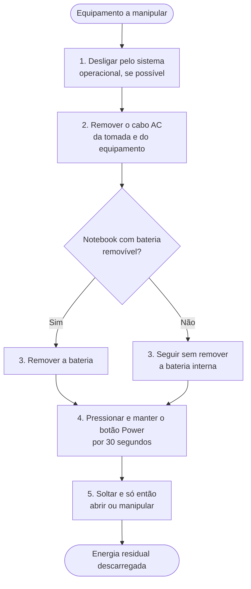

[Início](../README.md) › [Comece aqui](../README.md#comece-aqui) › **Segurança de bancada e boas práticas**

# Segurança de bancada e boas práticas

> O que fazer antes de encostar no equipamento: energia residual, proteção contra descarga eletrostática, proteção dos dados do cliente e registro do atendimento.

**Aplica-se a:** Todo procedimento desta base que envolva abrir o equipamento, medir tensão, manipular componentes ou gravar em disco

## Neste documento

- [Regra de ouro](#regra-de-ouro)
- [Antes de abrir: descarga de energia residual](#antes-de-abrir-descarga-de-energia-residual)
- [Procedimento canônico de *power drain*](#procedimento-canônico-de-power-drain)
- [Proteção contra descarga eletrostática (ESD)](#proteção-contra-descarga-eletrostática-esd)
- [Medição com o equipamento energizado](#medição-com-o-equipamento-energizado)
- [Boot mínimo: as duas composições canônicas](#boot-mínimo-as-duas-composições-canônicas)
- [Procedimentos que destroem dados](#procedimentos-que-destroem-dados)
- [Limiares térmicos e o que cada um decide](#limiares-térmicos-e-o-que-cada-um-decide)
- [Registro do atendimento](#registro-do-atendimento)
- [Quando parar e escalar](#quando-parar-e-escalar)
- [Próximos passos](#próximos-passos)

## Contexto

Os procedimentos desta base envolvem abertura de equipamento, medição elétrica, manipulação de
componentes sensíveis e escrita em disco. Este documento reúne as precauções aplicáveis a todos
eles, para que cada ficha não precise repeti-las, e fixa a forma canônica dos procedimentos
transversais — descarga de energia residual, boot mínimo e leitura de limiares térmicos.

## Escopo

Precauções de segurança elétrica e eletrostática, procedimentos transversais canônicos, proteção
dos dados do cliente e registro do atendimento.

## Fora do escopo

Procedimentos específicos de diagnóstico (ver fichas de código e de cenário); normas de segurança
do trabalho aplicáveis ao estabelecimento, que dependem da legislação local.

## Relação com outros documentos

- [Requisitos e ferramentas](04-requisitos-e-ferramentas.md) — o instrumental citado aqui
- [Fluxo de diagnóstico POST](06-fluxo-post.md) — usa o boot mínimo definido aqui
- [Fluxo de diagnóstico sistêmico](07-fluxo-sistemico.md) — usa os limiares térmicos definidos aqui
- [Validação final por componente](13-validacao-final.md) — critérios de encerramento
- [Guia do Victoria](14-ferramentas/victoria.md) — etapas destrutivas

---

> [!CAUTION]
> Parte dos procedimentos desta base exige **medição de tensão com o equipamento energizado**,
> manipulação de fonte de alimentação e regravação de firmware. Se você não tem o instrumento
> pedido nos pré-requisitos da ficha, ou não está seguro do passo, **pare e encaminhe a um técnico
> experiente**. Esta base descreve o que fazer; ela não substitui prática de bancada.

## Regra de ouro

Antes de qualquer procedimento, confira três coisas na ficha que você vai executar:

| Confira | Onde está na ficha | Por quê |
| --- | --- | --- |
| O **risco declarado** | Campo *Risco associado* ou *Risco / criticidade* | 18 dos 54 códigos e 5 dos 13 cenários são declarados **Crítico** |
| Os **pré-requisitos** | Seção *Pré-requisitos*, antes de *Execução da correção* | Vários procedimentos exigem o equipamento desligado e sem energia residual |
| O **instrumental** | [Requisitos e ferramentas](04-requisitos-e-ferramentas.md) | Medir tensão exige multímetro; não há substituto documentado |

> [!NOTE]
> A escala de risco usada nas fichas — Crítico, Alto, Médio, Baixo, Variável — é a declarada pelas
> escala não define o significado de cada nível. Trate-a como **ordem relativa**
> entre procedimentos, não como medida absoluta. Para ver tudo agrupado por risco, use
> [Índice por risco declarado](18-indices-cruzados.md#índice-por-risco-declarado).

## Antes de abrir: descarga de energia residual

Os capacitores da placa-mãe e da fonte retêm carga depois que o equipamento é desligado. Essa carga
residual — chamada *flea power* pela Dell e *residual electrical charge* pela HP — mantém trilhas
energizadas e pode danificar componentes durante a manipulação, além de impedir que a placa
reinicialize corretamente o estado de POST.

Descarregar é obrigatório **antes de remover ou instalar qualquer componente**, e é também o
primeiro passo de recuperação recomendado pelos fabricantes quando o equipamento não liga.

## Procedimento canônico de *power drain*

Esta base adota **30 segundos** com o botão Power pressionado, com o cabo AC removido.

### Por que 30 segundos

Os fabricantes publicam valores diferentes, todos dentro da mesma ordem de grandeza:

| Fabricante | Valor publicado | Contexto |
| --- | --- | --- |
| Dell | 15 a 20 s | Procedimento geral de *hard reset* (base de conhecimento 000139016) |
| Dell | 20 s | Manuais de serviço de notebook, com a bateria removida |
| Dell | 15 s | *Flea power release* em desktop (manual de serviço Alienware Aurora R7) |
| HP | ≈ 15 s | *Power reset*, com adaptador e bateria removidos |

**30 s satisfaz e supera todos os mínimos publicados.** Não há limite superior publicado por
nenhum dos fabricantes, e manter o botão pressionado por mais tempo que o mínimo não causa dano —
o botão apenas fecha um contato de sinal. Por isso a base adota o valor mais conservador como
padrão único, em vez de manter tempos diferentes por procedimento.

> [!IMPORTANT]
> Valores abaixo de 15 s ficam **abaixo do mínimo publicado por qualquer fabricante consultado** e
> não são adotados por esta base. Se você seguir um procedimento de terceiro que peça menos, use
> 30 s mesmo assim: o custo é meio minuto, e o risco de descarga incompleta é dano a componente.

> [!NOTE]
> **Notebooks com bateria interna não removível.** Alguns modelos substituem a remoção da bateria
> por um botão de reset acessível por orifício na base, ou por uma sequência específica de teclas.
> O procedimento varia por modelo: consulte o manual de serviço do fabricante antes de improvisar.

## Proteção contra descarga eletrostática (ESD)

Um componente pode ser destruído por uma descarga muito abaixo do limiar que uma pessoa consegue
perceber. A norma de referência do setor, **ANSI/ESD S20.20-2021** (EOS/ESD Association), trata
como sensíveis os itens suscetíveis a descargas a partir de **100 V no modelo de corpo humano
(HBM)** e **200 V no modelo de dispositivo carregado (CDM)** — valores que uma pessoa não sente.

Daí a consequência prática que interessa na bancada: **a ausência de choque perceptível não
significa que não houve descarga.** O dano por ESD costuma ser latente — o componente passa no
teste, é entregue, e falha semanas depois.

| Prática | O que fazer |
| --- | --- |
| Aterramento do operador | Pulseira antiestática ligada ao ponto de aterramento da bancada. A norma de pulseiras é a ANSI/ESD S1.1 |
| Superfície de trabalho | Manta dissipativa aterrada; nunca manipular placas sobre carpete, isopor, plástico comum ou saco plástico avulso |
| Transporte e guarda | Embalagem dissipativa ou com blindagem eletrostática, conforme ANSI/ESD S541 |
| Manuseio | Segurar placas pelas bordas; não tocar contatos de conectores, pinos de socket nem trilhas |
| Vestuário | Evitar tecidos sintéticos que acumulem carga com o movimento |

> [!TIP]
> Sem pulseira disponível, o mitigador mínimo é tocar uma parte metálica não pintada do gabinete —
> **com o cabo AC removido** — imediatamente antes de tocar o componente, e repetir o contato a
> cada vez que você se afastar da bancada. É paliativo, não substitui o aterramento adequado.

## Medição com o equipamento energizado

Alguns procedimentos exigem medir tensão com a fonte ligada — por exemplo, 5VSB no conector de
24 pinos e 12 V no conector EPS. Nesses casos:

1. Selecione **tensão contínua (DC)** no multímetro antes de encostar as pontas. Medir tensão com o
   instrumento em escala de corrente ou de resistência danifica o instrumento e pode provocar
   curto.
2. Fixe primeiro a ponta preta no ponto de referência (COM / terra) e só então toque a ponta
   vermelha no pino a medir. Isso evita que a ponta preta escorregue sobre pinos energizados.
3. Meça com **uma mão só**, mantendo a outra fora do equipamento.
4. Não apoie o multímetro nem as pontas sobre a placa.
5. Nunca faça ponte entre pinos com ferramenta metálica que não seja o jumper previsto pelo
   procedimento.

> [!CAUTION]
> A **fonte de alimentação não deve ser aberta**. Mesmo desconectada da rede, os capacitores
> primários de uma PSU retêm tensão suficiente para causar lesão grave, e não há procedimento de
> descarga documentado nesta base. Fonte suspeita é substituída, não reparada.

## Boot mínimo: as duas composições canônicas

*Boot mínimo* é a configuração reduzida usada para isolar a falha. Esta base define **duas
composições nomeadas**, escolhidas conforme o equipamento tenha ou não um canal de diagnóstico
próprio:

| Composição | O que instalar | Quando usar |
| --- | --- | --- |
| **Boot mínimo absoluto** | CPU + cooler + 1 módulo de RAM no slot primário + PSU. Sem GPU dedicada, sem disco, sem periféricos | Quando a placa tem Debug LED, display de Q-Code ou speaker — ou seja, quando há como ler o resultado sem vídeo |
| **Boot mínimo com vídeo** | O anterior, mais uma saída de vídeo (iGPU ou GPU dedicada) e um monitor *known-good* | Quando a placa **não** tem Debug LED, Q-Code nem speaker, e a tela é o único canal de resposta |

### O cooler é obrigatório nas duas

O dissipador nunca é dispensável, mesmo em teste de poucos segundos. Segundo a Intel, o
**Tjunction max** é a temperatura em que o processador aciona os mecanismos internos de controle
térmico para reduzir potência e limitar temperatura, e esse limite fica, conforme o produto, entre
**100 °C e 110 °C**. Um processador sem dissipador atinge essa faixa em segundos: o controle
térmico entra, reduz clock ou desliga o sistema, e o resultado do teste passa a medir a proteção
térmica em vez da falha que você está investigando.

> [!WARNING]
> Um boot mínimo executado sem cooler produz **falso negativo**: o sistema desliga por proteção
> térmica e o técnico conclui que a placa ou a CPU estão condenadas. Monte o cooler mesmo que o
> teste vá durar dez segundos.

### Como ler o resultado

| Resultado | Leitura |
| --- | --- |
| POST conclui | A falha está em algo que você removeu — recoloque um item por vez, testando a cada passo |
| POST não conclui, mas há sinal (beep, Q-Code, Debug LED) | Vá para o [catálogo de códigos](09-codigos-post/00-indice-codigos.md) com o sinal anotado |
| Nenhuma reação, nenhum sinal | Placa ou CPU sob suspeita — confirme por [teste cruzado](17-glossario.md#teste-cruzado) antes de condenar |

## Procedimentos que destroem dados

| Onde | O que acontece |
| --- | --- |
| [Victoria](14-ferramentas/victoria.md), etapa 7 — *Remap* | Altera a tabela de defeitos do disco. Reversível apenas em parte |
| [Victoria](14-ferramentas/victoria.md), etapa 8 — escrita / zero-fill | **Destrói todos os dados do disco.** Irreversível |
| Limpeza de CMOS | Perde configurações de BIOS, inclusive perfil de memória e ordem de boot |
| Reset ou limpeza de TPM | Com BitLocker ativo, **pode tornar o volume inacessível** sem a chave de recuperação |

> [!CAUTION]
> Antes de qualquer etapa de escrita em disco, faça **cópia de segurança dos dados do cliente** e
> registre por escrito a autorização para prosseguir. Antes de limpar um TPM, confirme que a chave
> de recuperação do BitLocker está salva fora do equipamento.

## Limiares térmicos e o que cada um decide

Os limiares citados ao longo da base não são todos a mesma coisa. Cada um responde a uma pergunta
diferente:

| Limiar | O que ele decide | Onde aparece |
| --- | --- | --- |
| **> 60 °C em idle** | *Alerta.* A temperatura em repouso está anômala — investigue o subsistema térmico antes de seguir | [SA-01](10-cenarios/superaquecimento.md#sa-01) |
| **> 90 °C em idle** | *Confirmação.* A falha térmica está caracterizada; não atribua a lentidão a software | [COR-04](12-correlacoes.md#cor-04) |
| **> 90 °C sob carga** | *Reprovação do subsistema térmico* na validação final | [Térmico](13-validacao-final.md#térmico) |
| **> 95 °C sob carga** | *Reprovação da CPU como componente* na validação final | [CPU](13-validacao-final.md#cpu) |
| **Tjunction max (100–110 °C)** | Limite físico do processador, definido pela Intel por produto. É onde o controle térmico interno atua — não é uma meta operacional | Referência de teto |

**Regra de leitura:** os limiares de 60 °C e 90 °C em repouso formam uma escala de dois estágios —
o primeiro abre a investigação, o segundo a encerra. Os limiares de 90 °C e 95 °C sob carga
avaliam sujeitos diferentes: 95 °C julga a **CPU como peça**, 90 °C julga a **solução de
refrigeração como sistema**. Um equipamento estabilizado em 92 °C tem CPU aprovada e subsistema
térmico reprovado — e **não deve ser entregue**, porque a validação final só fecha quando todos os
componentes avaliados passam. Na dúvida, prevalece o limiar mais restritivo.

## Registro do atendimento

O fluxo de POST encerra com a instrução de documentar tudo, e a validação final produz o laudo.
Registre, no mínimo:

| Registro | Por quê |
| --- | --- |
| O sinal original, exatamente como observado | Número de beeps, duração, pausas, código hexadecimal, LED aceso. Sem isso a consulta ao catálogo não converge |
| Cada teste executado e seu resultado | Inclusive os que deram negativo — eles delimitam o que já foi descartado |
| O componente identificado como causa raiz | Separa causa de sintoma no histórico do equipamento |
| As evidências de validação | Relatórios de MemTest86, Victoria e AIDA64, e o tempo de observação cumprido |
| Autorizações do cliente | Em especial para procedimentos destrutivos |

> [!TIP]
> Fotografe ou filme o Q-Code na inicialização. O
> [tratamento de ambiguidade do FF](11-ambiguidades.md#q-code-ff) depende de saber se o código
> apareceu isolado ou ao fim de uma progressão — e isso passa rápido demais para anotar a olho.

## Quando parar e escalar

| Situação | Encaminhamento |
| --- | --- |
| O procedimento pede instrumento que você não tem | Não improvise substituto: encaminhe |
| A ficha declara risco **Crítico** e você não domina o passo | Encaminhe a técnico experiente |
| O reparo exigiria intervenção em nível de componente (BGA, capacitor, VRM) | Fora do escopo desta base — ver [Visão geral](01-visao-geral.md#fronteiras-de-cobertura) |
| O equipamento está em garantia | Abrir pode anular a garantia; consulte o fabricante antes |
| Há risco de perda de dados sem backup possível | Pare e trate a recuperação de dados como atendimento separado |

## Próximos passos

| Se você… | Vá para |
| --- | --- |
| vai montar a bancada | [Requisitos e ferramentas](04-requisitos-e-ferramentas.md) |
| já está seguro e quer começar o diagnóstico | [Fluxo de diagnóstico POST](06-fluxo-post.md) · [Fluxo sistêmico](07-fluxo-sistemico.md) |
| vai executar uma etapa destrutiva | [Guia do Victoria](14-ferramentas/victoria.md) |
| terminou o reparo e vai emitir o laudo | [Validação final por componente](13-validacao-final.md) |

---

| Atributo | Valor |
| --- | --- |
| **Autoria** | Edsilas |
| **Versão da documentação** | `doc-3.0.0` |
