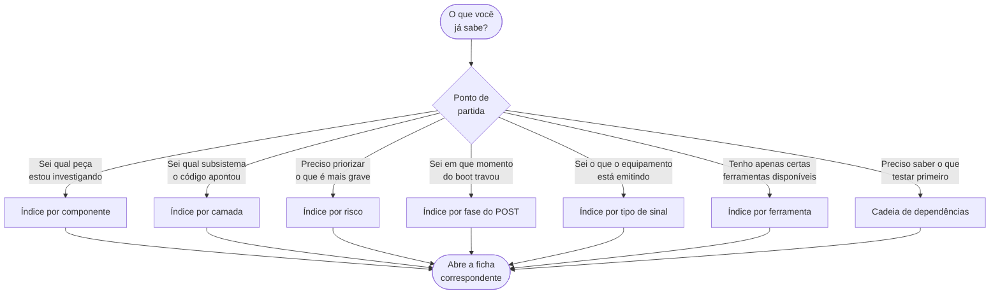

<!-- Gerado a partir de Derivado das colunas de `Tabela Diagnóstico POST` e `TABELA_PRINCIPAL`. Não editar manualmente sem atualizar a fonte. -->

[Início](../README.md) › [Consulte a referência](../README.md#consulte-a-referência) › **Índices cruzados**

# Índices cruzados

> Os mesmos registros reagrupados por componente, camada, risco, fase do POST, tipo de sinal e ferramenta — para quem não chega pelo sintoma.

**Aplica-se a:** Busca por outro eixo que não o sintoma

## Neste documento

- [Por qual eixo buscar](#por-qual-eixo-buscar)
- [Índice por componente afetado — códigos de POST](#índice-por-componente-afetado--códigos-de-post)
- [Índice por componente suspeito — cenários](#índice-por-componente-suspeito--cenários)
- [Índice por camada de diagnóstico](#índice-por-camada-de-diagnóstico)
- [Índice por risco declarado](#índice-por-risco-declarado)
- [Índice por fase do POST](#índice-por-fase-do-post)
- [Índice por tipo de sinal](#índice-por-tipo-de-sinal)
- [Índice por ferramenta](#índice-por-ferramenta)
- [Cadeia de dependências entre cenários](#cadeia-de-dependências-entre-cenários)
- [Próximos passos](#próximos-passos)

## Contexto

Reagrupamentos do mesmo conteúdo por outros eixos de busca. Nenhuma informação nova: são recortes das colunas de classificação já presentes nas fichas, montados para quem chega por um caminho diferente do sintoma.

## Escopo

Índices por componente afetado, por camada, por risco, por fase do POST, por tipo de sinal e por ferramenta exigida.

## Fora do escopo

Conteúdo das fichas; entrada por sintoma (ver índices de códigos e de cenários).

## Relação com outros documentos

- [Índice de códigos POST](09-codigos-post/00-indice-codigos.md) — entrada por código
- [Índice de cenários](10-cenarios/00-indice-cenarios.md) — entrada por sintoma
- [Requisitos e ferramentas](04-requisitos-e-ferramentas.md) — inventário do instrumental
- [Taxonomia de camadas](03-taxonomia-camadas.md) — os dois modelos de numeração

---

## Por qual eixo buscar

> [!TIP]
> Se o seu ponto de partida é o **sintoma**, não use esta página: vá pelo
> [README](../README.md#por-onde-começar) ou pelo
> [índice de cenários](10-cenarios/00-indice-cenarios.md).

> [!NOTE]
> Cada tabela agrupa registros pelo valor literal de uma coluna de origem. Nenhum registro foi
> reclassificado, e nenhuma categoria foi criada. Quando um registro declara mais de uma categoria
> (por exemplo `Camada 1: Energia / Camada 2: CPU`), ele aparece sob o valor completo, exatamente
> como está na fonte.

## Índice por componente afetado — códigos de POST

- **BIOS / EEPROM** (2) — [POST-08](09-codigos-post/ami-legacy.md#post-08--9-beeps-curtos), [POST-27](09-codigos-post/phoenix.md#post-27--1-2-2-3)
- **BIOS / Firmware** (1) — [POST-36](09-codigos-post/dell.md#post-36--3-âmbar--3-branco)
- **BIOS / SPI Flash** (1) — [POST-38](09-codigos-post/hp.md#post-38--2-longos--2-curtos-22)
- **Bateria CR2032** (1) — [POST-35](09-codigos-post/dell.md#post-35--3-âmbar--1-branco)
- **CMOS / RTC / Cristal 32kHz** (1) — [POST-30](09-codigos-post/phoenix.md#post-30--1-4-2-1)
- **CMOS / Super I/O** (1) — [POST-09](09-codigos-post/ami-legacy.md#post-09--10-beeps-curtos)
- **CPU** (2) — [POST-13](09-codigos-post/ami-q-code.md#post-13--00--d0), [POST-31](09-codigos-post/dell.md#post-31--2-âmbar--1-branco)
- **CPU (Cache)** (1) — [POST-10](09-codigos-post/ami-legacy.md#post-10--11-beeps-curtos)
- **CPU (Processador)** (2) — [POST-04](09-codigos-post/ami-legacy.md#post-04--5-beeps-curtos), [POST-06](09-codigos-post/ami-legacy.md#post-06--7-beeps-curtos)
- **CPU / Fan / Sistema térmico** (1) — [POST-42](09-codigos-post/hp.md#post-42--4-longos--2-curtos-42)
- **CPU / PSU / Cooler** (1) — [POST-24](09-codigos-post/award.md#post-24--repetitivo-sirene-contínua)
- **CPU / Placa-mãe** (1) — [POST-26](09-codigos-post/phoenix.md#post-26--1-1-1-3)
- **CPU / VRM** (1) — [POST-15](09-codigos-post/ami-q-code.md#post-15--63--67)
- **CPU / VRM / EPS** (1) — [POST-51](09-codigos-post/generico-debug-led.md#post-51--led-cpu-vermelho)
- **EFI / Firmware** (1) — [POST-48](09-codigos-post/apple.md#post-48--3-longos--3-curtos--3-longos-sos)
- **GPU / Adaptador Gráfico** (1) — [POST-22](09-codigos-post/award.md#post-22--1-longo--2-curtos)
- **GPU / Cabo Flat (LVDS/eDP)** (1) — [POST-49](09-codigos-post/acer-insyde.md#post-49--1-longo--2-curtos)
- **GPU / PCIe** (1) — [POST-11](09-codigos-post/ami-uefi-aptio.md#post-11--1-longo--2-curtos)
- **GPU / Saída de Vídeo** (1) — [POST-19](09-codigos-post/ami-q-code.md#post-19--d6--d7)
- **GPU / Slot PCIe** (1) — [POST-53](09-codigos-post/generico-debug-led.md#post-53--led-vga-branco)
- **GPU / VRAM** (2) — [POST-07](09-codigos-post/ami-legacy.md#post-07--8-beeps-curtos), [POST-23](09-codigos-post/award.md#post-23--1-longo--3-curtos)
- **GPU / iGPU** (1) — [POST-40](09-codigos-post/hp.md#post-40--3-longos--3-curtos-33)
- **KBC / Super I/O** (1) — [POST-05](09-codigos-post/ami-legacy.md#post-05--6-beeps-curtos)
- **LCD / GPU / Cabo eDP** (1) — [POST-34](09-codigos-post/dell.md#post-34--2-âmbar--7-branco)
- **PSU / DC-DC Converters** (1) — [POST-41](09-codigos-post/hp.md#post-41--3-longos--4-curtos-34)
- **Placa-mãe (Estrutural)** (1) — [POST-20](09-codigos-post/ami-q-code.md#post-20--fe)
- **Placa-mãe / KBC / SIO** (1) — [POST-43](09-codigos-post/hp.md#post-43--5-longos-50)
- **Placa-mãe / PSU** (1) — [POST-32](09-codigos-post/dell.md#post-32--2-âmbar--2-branco)
- **RAM** (5) — [POST-25](09-codigos-post/award.md#post-25--contínuo-longo-ininterrupto), [POST-33](09-codigos-post/dell.md#post-33--2-âmbar--3-branco), [POST-39](09-codigos-post/hp.md#post-39--3-longos--2-curtos-32), [POST-46](09-codigos-post/apple.md#post-46--1-tom-repetido-a-cada-5-segundos), [POST-47](09-codigos-post/apple.md#post-47--3-tons-repetidos-a-cada-5-segundos)
- **RAM (Base Memory)** (1) — [POST-02](09-codigos-post/ami-legacy.md#post-02--2-ou-3-beeps-curtos)
- **RAM (Módulos DIMM)** (2) — [POST-01](09-codigos-post/ami-legacy.md#post-01--1-beep-curto), [POST-12](09-codigos-post/ami-uefi-aptio.md#post-12--1-longo--3-curtos)
- **RAM / Controladora** (1) — [POST-52](09-codigos-post/generico-debug-led.md#post-52--led-dram-amarelo)
- **RAM / Controladora de Memória** (1) — [POST-14](09-codigos-post/ami-q-code.md#post-14--50--55)
- **RAM / Slots DIMM** (1) — [POST-28](09-codigos-post/phoenix.md#post-28--1-3-1-1)
- **RAM / Trilhas da Placa-mãe** (1) — [POST-29](09-codigos-post/phoenix.md#post-29--1-3-4-1)
- **SATA / M.2 / NVMe** (1) — [POST-17](09-codigos-post/ami-q-code.md#post-17--a0--a2)
- **SSD / HDD / NVMe / Config BIOS** (1) — [POST-54](09-codigos-post/generico-debug-led.md#post-54--led-boot-verde)
- **Super I/O / USB / PCIe** (1) — [POST-16](09-codigos-post/ami-q-code.md#post-16--99--9a--9c)
- **TPM (Trusted Platform Module)** (1) — [POST-45](09-codigos-post/lenovo.md#post-45--0110-binário)
- **Teclado / BIOS Setup** (1) — [POST-50](09-codigos-post/ami-q-code.md#post-50--7f)
- **Timer / Chipset (PCH/SIO)** (1) — [POST-03](09-codigos-post/ami-legacy.md#post-03--4-beeps-curtos)
- **USB** (1) — [POST-18](09-codigos-post/ami-q-code.md#post-18--b4)
- **VRM / Power Rails / EC** (1) — [POST-37](09-codigos-post/dell.md#post-37--3-âmbar--5-branco)
- **Variável** (2) — [POST-21](09-codigos-post/ami-q-code.md#post-21--ff), [POST-44](09-codigos-post/lenovo.md#post-44--melodia-variável)

## Índice por componente suspeito — cenários

- **CPU / Thermal Throttling / VRM** — [TR-01](10-cenarios/travamentos-freeze.md#tr-01)
- **Cooler / Pasta Térmica / Ventilação do Gabinete** — [SA-01](10-cenarios/superaquecimento.md#sa-01)
- **Disco HDD/SSD / Cabo SATA-Dados / Cabo SATA-Energia / Porta SATA/M.2** — [DN-01](10-cenarios/disco-nao-reconhecido.md#dn-01)
- **GPU Dedicada / iGPU / Slot PCIe x16** — [SV-02](10-cenarios/liga-sem-video.md#sv-02)
- **HDD/SSD / Controladora SATA/NVMe** — [BS-02](10-cenarios/bsod.md#bs-02)
- **Módulos DRAM / Driver com vazamento de memória** — [BS-01](10-cenarios/bsod.md#bs-01)
- **Módulos DRAM / Slots DIMM** — [SV-01](10-cenarios/liga-sem-video.md#sv-01)
- **Módulos DRAM / XMP Profile / IMC da CPU** — [RA-02](10-cenarios/reinicializacao-aleatoria.md#ra-02)
- **PSU (Fonte de Alimentação)** — [NL-01](10-cenarios/nao-liga.md#nl-01)
- **PSU / Contatos elétricos / Cabos internos** — [FI-01](10-cenarios/falhas-intermitentes.md#fi-01)
- **PSU / VRM / Cabos de alimentação** — [RA-01](10-cenarios/reinicializacao-aleatoria.md#ra-01)
- **Placa-mãe / VRM / Front Panel Header** — [NL-02](10-cenarios/nao-liga.md#nl-02)
- **Processos do SO / Malware / Windows Update** — [AU-01](10-cenarios/alto-uso-cpu-gpu.md#au-01)

## Índice por camada de diagnóstico

### Códigos de POST (modelo POST — `Camada N: NOME`)

| Camada declarada | Códigos | Ficha da camada |
| --- | --- | --- |
| Camada 1: Energia | [POST-37](09-codigos-post/dell.md#post-37--3-âmbar--5-branco), [POST-41](09-codigos-post/hp.md#post-41--3-longos--4-curtos-34) | [ver ficha](08-diagnostico-por-camada.md#camada-1--energia-psuvrm) |
| Camada 1: Energia / Camada 2: CPU | [POST-24](09-codigos-post/award.md#post-24--repetitivo-sirene-contínua) | — (valor composto ou variável) |
| Camada 1: Energia / Camada 5: Chipset | [POST-32](09-codigos-post/dell.md#post-32--2-âmbar--2-branco) | — (valor composto ou variável) |
| Camada 2: CPU | [POST-04](09-codigos-post/ami-legacy.md#post-04--5-beeps-curtos), [POST-06](09-codigos-post/ami-legacy.md#post-06--7-beeps-curtos), [POST-10](09-codigos-post/ami-legacy.md#post-10--11-beeps-curtos), [POST-13](09-codigos-post/ami-q-code.md#post-13--00--d0), [POST-15](09-codigos-post/ami-q-code.md#post-15--63--67), [POST-26](09-codigos-post/phoenix.md#post-26--1-1-1-3), [POST-31](09-codigos-post/dell.md#post-31--2-âmbar--1-branco), [POST-51](09-codigos-post/generico-debug-led.md#post-51--led-cpu-vermelho) | [ver ficha](08-diagnostico-por-camada.md#camada-2--cpu-processador) |
| Camada 2: CPU / Camada 1: Energia | [POST-42](09-codigos-post/hp.md#post-42--4-longos--2-curtos-42) | — (valor composto ou variável) |
| Camada 3: Memória | [POST-01](09-codigos-post/ami-legacy.md#post-01--1-beep-curto), [POST-02](09-codigos-post/ami-legacy.md#post-02--2-ou-3-beeps-curtos), [POST-12](09-codigos-post/ami-uefi-aptio.md#post-12--1-longo--3-curtos), [POST-14](09-codigos-post/ami-q-code.md#post-14--50--55), [POST-25](09-codigos-post/award.md#post-25--contínuo-longo-ininterrupto), [POST-28](09-codigos-post/phoenix.md#post-28--1-3-1-1), [POST-29](09-codigos-post/phoenix.md#post-29--1-3-4-1), [POST-33](09-codigos-post/dell.md#post-33--2-âmbar--3-branco), [POST-39](09-codigos-post/hp.md#post-39--3-longos--2-curtos-32), [POST-46](09-codigos-post/apple.md#post-46--1-tom-repetido-a-cada-5-segundos), [POST-47](09-codigos-post/apple.md#post-47--3-tons-repetidos-a-cada-5-segundos), [POST-52](09-codigos-post/generico-debug-led.md#post-52--led-dram-amarelo) | [ver ficha](08-diagnostico-por-camada.md#camada-3--memória-ram) |
| Camada 4: Vídeo | [POST-07](09-codigos-post/ami-legacy.md#post-07--8-beeps-curtos), [POST-11](09-codigos-post/ami-uefi-aptio.md#post-11--1-longo--2-curtos), [POST-19](09-codigos-post/ami-q-code.md#post-19--d6--d7), [POST-22](09-codigos-post/award.md#post-22--1-longo--2-curtos), [POST-23](09-codigos-post/award.md#post-23--1-longo--3-curtos), [POST-34](09-codigos-post/dell.md#post-34--2-âmbar--7-branco), [POST-40](09-codigos-post/hp.md#post-40--3-longos--3-curtos-33), [POST-49](09-codigos-post/acer-insyde.md#post-49--1-longo--2-curtos), [POST-53](09-codigos-post/generico-debug-led.md#post-53--led-vga-branco) | [ver ficha](08-diagnostico-por-camada.md#camada-4--vídeo-gpuigpu) |
| Camada 5: Chipset / Motherboard | [POST-03](09-codigos-post/ami-legacy.md#post-03--4-beeps-curtos), [POST-05](09-codigos-post/ami-legacy.md#post-05--6-beeps-curtos), [POST-09](09-codigos-post/ami-legacy.md#post-09--10-beeps-curtos), [POST-20](09-codigos-post/ami-q-code.md#post-20--fe), [POST-30](09-codigos-post/phoenix.md#post-30--1-4-2-1), [POST-35](09-codigos-post/dell.md#post-35--3-âmbar--1-branco), [POST-43](09-codigos-post/hp.md#post-43--5-longos-50), [POST-45](09-codigos-post/lenovo.md#post-45--0110-binário) | [ver ficha](08-diagnostico-por-camada.md#camada-5--chipset--motherboard) |
| Camada 6: Firmware | [POST-08](09-codigos-post/ami-legacy.md#post-08--9-beeps-curtos), [POST-27](09-codigos-post/phoenix.md#post-27--1-2-2-3), [POST-36](09-codigos-post/dell.md#post-36--3-âmbar--3-branco), [POST-38](09-codigos-post/hp.md#post-38--2-longos--2-curtos-22), [POST-48](09-codigos-post/apple.md#post-48--3-longos--3-curtos--3-longos-sos) | [ver ficha](08-diagnostico-por-camada.md#camada-6--firmware-biosuefi) |
| Camada 6: Firmware / Camada 2: CPU | [POST-21](09-codigos-post/ami-q-code.md#post-21--ff) | — (valor composto ou variável) |
| Camada 7: Periféricos Críticos | [POST-16](09-codigos-post/ami-q-code.md#post-16--99--9a--9c), [POST-17](09-codigos-post/ami-q-code.md#post-17--a0--a2), [POST-18](09-codigos-post/ami-q-code.md#post-18--b4), [POST-50](09-codigos-post/ami-q-code.md#post-50--7f), [POST-54](09-codigos-post/generico-debug-led.md#post-54--led-boot-verde) | [ver ficha](08-diagnostico-por-camada.md#camada-7--periféricos-críticos) |
| Variável | [POST-44](09-codigos-post/lenovo.md#post-44--melodia-variável) | — (valor composto ou variável) |

### Cenários (modelo sistêmico — `N - Nome`)

| Camada declarada | Cenários |
| --- | --- |
| 1 - Energia | [NL-01](10-cenarios/nao-liga.md#nl-01), [RA-01](10-cenarios/reinicializacao-aleatoria.md#ra-01), [FI-01](10-cenarios/falhas-intermitentes.md#fi-01) |
| 3 - CPU | [TR-01](10-cenarios/travamentos-freeze.md#tr-01), [SA-01](10-cenarios/superaquecimento.md#sa-01) |
| 4 - Memória | [SV-01](10-cenarios/liga-sem-video.md#sv-01), [RA-02](10-cenarios/reinicializacao-aleatoria.md#ra-02), [BS-01](10-cenarios/bsod.md#bs-01) |
| 5 - Armazenamento | [BS-02](10-cenarios/bsod.md#bs-02), [DN-01](10-cenarios/disco-nao-reconhecido.md#dn-01) |
| 6 - GPU | [SV-02](10-cenarios/liga-sem-video.md#sv-02) |
| 7 - Placa-mãe | [NL-02](10-cenarios/nao-liga.md#nl-02) |
| 9 - SO | [AU-01](10-cenarios/alto-uso-cpu-gpu.md#au-01) |

> Os dois blocos acima usam numerações **diferentes e incompatíveis**. Ver
> [03-taxonomia-camadas.md](03-taxonomia-camadas.md).

## Índice por risco declarado

### Códigos de POST

| Risco | Quantidade | Códigos |
| --- | --- | --- |
| **Crítico** | 18 | [POST-03](09-codigos-post/ami-legacy.md#post-03--4-beeps-curtos), [POST-04](09-codigos-post/ami-legacy.md#post-04--5-beeps-curtos), [POST-06](09-codigos-post/ami-legacy.md#post-06--7-beeps-curtos), [POST-08](09-codigos-post/ami-legacy.md#post-08--9-beeps-curtos), [POST-10](09-codigos-post/ami-legacy.md#post-10--11-beeps-curtos), [POST-13](09-codigos-post/ami-q-code.md#post-13--00--d0), [POST-20](09-codigos-post/ami-q-code.md#post-20--fe), [POST-24](09-codigos-post/award.md#post-24--repetitivo-sirene-contínua), [POST-26](09-codigos-post/phoenix.md#post-26--1-1-1-3), [POST-27](09-codigos-post/phoenix.md#post-27--1-2-2-3), [POST-31](09-codigos-post/dell.md#post-31--2-âmbar--1-branco), [POST-32](09-codigos-post/dell.md#post-32--2-âmbar--2-branco), [POST-37](09-codigos-post/dell.md#post-37--3-âmbar--5-branco), [POST-38](09-codigos-post/hp.md#post-38--2-longos--2-curtos-22), [POST-41](09-codigos-post/hp.md#post-41--3-longos--4-curtos-34), [POST-43](09-codigos-post/hp.md#post-43--5-longos-50), [POST-48](09-codigos-post/apple.md#post-48--3-longos--3-curtos--3-longos-sos), [POST-51](09-codigos-post/generico-debug-led.md#post-51--led-cpu-vermelho) |
| **Alto** | 23 | [POST-01](09-codigos-post/ami-legacy.md#post-01--1-beep-curto), [POST-02](09-codigos-post/ami-legacy.md#post-02--2-ou-3-beeps-curtos), [POST-07](09-codigos-post/ami-legacy.md#post-07--8-beeps-curtos), [POST-11](09-codigos-post/ami-uefi-aptio.md#post-11--1-longo--2-curtos), [POST-12](09-codigos-post/ami-uefi-aptio.md#post-12--1-longo--3-curtos), [POST-14](09-codigos-post/ami-q-code.md#post-14--50--55), [POST-15](09-codigos-post/ami-q-code.md#post-15--63--67), [POST-19](09-codigos-post/ami-q-code.md#post-19--d6--d7), [POST-22](09-codigos-post/award.md#post-22--1-longo--2-curtos), [POST-23](09-codigos-post/award.md#post-23--1-longo--3-curtos), [POST-25](09-codigos-post/award.md#post-25--contínuo-longo-ininterrupto), [POST-28](09-codigos-post/phoenix.md#post-28--1-3-1-1), [POST-29](09-codigos-post/phoenix.md#post-29--1-3-4-1), [POST-33](09-codigos-post/dell.md#post-33--2-âmbar--3-branco), [POST-36](09-codigos-post/dell.md#post-36--3-âmbar--3-branco), [POST-39](09-codigos-post/hp.md#post-39--3-longos--2-curtos-32), [POST-40](09-codigos-post/hp.md#post-40--3-longos--3-curtos-33), [POST-45](09-codigos-post/lenovo.md#post-45--0110-binário), [POST-46](09-codigos-post/apple.md#post-46--1-tom-repetido-a-cada-5-segundos), [POST-47](09-codigos-post/apple.md#post-47--3-tons-repetidos-a-cada-5-segundos), [POST-49](09-codigos-post/acer-insyde.md#post-49--1-longo--2-curtos), [POST-52](09-codigos-post/generico-debug-led.md#post-52--led-dram-amarelo), [POST-53](09-codigos-post/generico-debug-led.md#post-53--led-vga-branco) |
| **Médio** | 9 | [POST-05](09-codigos-post/ami-legacy.md#post-05--6-beeps-curtos), [POST-09](09-codigos-post/ami-legacy.md#post-09--10-beeps-curtos), [POST-16](09-codigos-post/ami-q-code.md#post-16--99--9a--9c), [POST-17](09-codigos-post/ami-q-code.md#post-17--a0--a2), [POST-18](09-codigos-post/ami-q-code.md#post-18--b4), [POST-30](09-codigos-post/phoenix.md#post-30--1-4-2-1), [POST-34](09-codigos-post/dell.md#post-34--2-âmbar--7-branco), [POST-42](09-codigos-post/hp.md#post-42--4-longos--2-curtos-42), [POST-54](09-codigos-post/generico-debug-led.md#post-54--led-boot-verde) |
| **Baixo** | 2 | [POST-35](09-codigos-post/dell.md#post-35--3-âmbar--1-branco), [POST-50](09-codigos-post/ami-q-code.md#post-50--7f) |
| **Variável** | 2 | [POST-21](09-codigos-post/ami-q-code.md#post-21--ff), [POST-44](09-codigos-post/lenovo.md#post-44--melodia-variável) |

### Cenários

| Risco | Quantidade | Cenários |
| --- | --- | --- |
| **Crítico** | 5 | [NL-01](10-cenarios/nao-liga.md#nl-01), [RA-01](10-cenarios/reinicializacao-aleatoria.md#ra-01), [BS-02](10-cenarios/bsod.md#bs-02), [TR-01](10-cenarios/travamentos-freeze.md#tr-01), [SA-01](10-cenarios/superaquecimento.md#sa-01) |
| **Alto** | 6 | [NL-02](10-cenarios/nao-liga.md#nl-02), [SV-01](10-cenarios/liga-sem-video.md#sv-01), [RA-02](10-cenarios/reinicializacao-aleatoria.md#ra-02), [BS-01](10-cenarios/bsod.md#bs-01), [DN-01](10-cenarios/disco-nao-reconhecido.md#dn-01), [FI-01](10-cenarios/falhas-intermitentes.md#fi-01) |
| **Médio** | 2 | [SV-02](10-cenarios/liga-sem-video.md#sv-02), [AU-01](10-cenarios/alto-uso-cpu-gpu.md#au-01) |

> A escala de risco é a declarada pela fonte em `RISCO / CRITICIDADE` e `Risco Associado`. A fonte
> não define o significado de cada nível.

## Índice por fase do POST

Ordem de execução do firmware, conforme declarada na coluna `FASE POST`.

| Fase declarada | Códigos |
| --- | --- |
| BDS (Boot Device Selection) | [POST-50](09-codigos-post/ami-q-code.md#post-50--7f), [POST-54](09-codigos-post/generico-debug-led.md#post-54--led-boot-verde) |
| BIOS Recovery | [POST-36](09-codigos-post/dell.md#post-36--3-âmbar--3-branco) |
| BIOS Verify | [POST-08](09-codigos-post/ami-legacy.md#post-08--9-beeps-curtos), [POST-27](09-codigos-post/phoenix.md#post-27--1-2-2-3), [POST-38](09-codigos-post/hp.md#post-38--2-longos--2-curtos-22) |
| Board Init | [POST-43](09-codigos-post/hp.md#post-43--5-longos-50) |
| CMOS Init | [POST-09](09-codigos-post/ami-legacy.md#post-09--10-beeps-curtos), [POST-35](09-codigos-post/dell.md#post-35--3-âmbar--1-branco) |
| CPU Cache Init | [POST-10](09-codigos-post/ami-legacy.md#post-10--11-beeps-curtos) |
| CPU Init | [POST-06](09-codigos-post/ami-legacy.md#post-06--7-beeps-curtos), [POST-31](09-codigos-post/dell.md#post-31--2-âmbar--1-branco) |
| CPU Init (SEC/PEI) | [POST-04](09-codigos-post/ami-legacy.md#post-04--5-beeps-curtos) |
| Chipset Init | [POST-03](09-codigos-post/ami-legacy.md#post-03--4-beeps-curtos) |
| DXE (Video Init) | [POST-53](09-codigos-post/generico-debug-led.md#post-53--led-vga-branco) |
| DXE Console Init | [POST-19](09-codigos-post/ami-q-code.md#post-19--d6--d7) |
| DXE I/O Init | [POST-16](09-codigos-post/ami-q-code.md#post-16--99--9a--9c) |
| DXE Phase | [POST-15](09-codigos-post/ami-q-code.md#post-15--63--67) |
| DXE Storage Init | [POST-17](09-codigos-post/ami-q-code.md#post-17--a0--a2) |
| DXE USB Init | [POST-18](09-codigos-post/ami-q-code.md#post-18--b4) |
| DXE Video Init | [POST-11](09-codigos-post/ami-uefi-aptio.md#post-11--1-longo--2-curtos) |
| EFI Verify | [POST-48](09-codigos-post/apple.md#post-48--3-longos--3-curtos--3-longos-sos) |
| KBC Init | [POST-05](09-codigos-post/ami-legacy.md#post-05--6-beeps-curtos) |
| Memory Address Test | [POST-29](09-codigos-post/phoenix.md#post-29--1-3-4-1) |
| Memory Detect | [POST-25](09-codigos-post/award.md#post-25--contínuo-longo-ininterrupto), [POST-46](09-codigos-post/apple.md#post-46--1-tom-repetido-a-cada-5-segundos) |
| Memory Detect/Init | [POST-33](09-codigos-post/dell.md#post-33--2-âmbar--3-branco) |
| Memory Init | [POST-28](09-codigos-post/phoenix.md#post-28--1-3-1-1), [POST-39](09-codigos-post/hp.md#post-39--3-longos--2-curtos-32) |
| Memory Init (PEI) | [POST-01](09-codigos-post/ami-legacy.md#post-01--1-beep-curto), [POST-02](09-codigos-post/ami-legacy.md#post-02--2-ou-3-beeps-curtos) |
| Memory Test | [POST-47](09-codigos-post/apple.md#post-47--3-tons-repetidos-a-cada-5-segundos) |
| Memory Training (PEI) | [POST-12](09-codigos-post/ami-uefi-aptio.md#post-12--1-longo--3-curtos) |
| PEI (Memory Training) | [POST-14](09-codigos-post/ami-q-code.md#post-14--50--55), [POST-52](09-codigos-post/generico-debug-led.md#post-52--led-dram-amarelo) |
| Power Sequencing | [POST-37](09-codigos-post/dell.md#post-37--3-âmbar--5-branco), [POST-41](09-codigos-post/hp.md#post-41--3-longos--4-curtos-34) |
| Power/Board Init | [POST-32](09-codigos-post/dell.md#post-32--2-âmbar--2-branco) |
| Pre-SEC | [POST-20](09-codigos-post/ami-q-code.md#post-20--fe) |
| RTC Init | [POST-30](09-codigos-post/phoenix.md#post-30--1-4-2-1) |
| SEC Phase (CPU Init) | [POST-13](09-codigos-post/ami-q-code.md#post-13--00--d0) |
| SEC Phase (Real Mode Init) | [POST-26](09-codigos-post/phoenix.md#post-26--1-1-1-3) |
| SEC/PEI (CPU Init) | [POST-51](09-codigos-post/generico-debug-led.md#post-51--led-cpu-vermelho) |
| Security Init | [POST-45](09-codigos-post/lenovo.md#post-45--0110-binário) |
| Thermal Monitor | [POST-42](09-codigos-post/hp.md#post-42--4-longos--2-curtos-42) |
| Thermal/Voltage Monitor | [POST-24](09-codigos-post/award.md#post-24--repetitivo-sirene-contínua) |
| Variável | [POST-21](09-codigos-post/ami-q-code.md#post-21--ff), [POST-44](09-codigos-post/lenovo.md#post-44--melodia-variável) |
| Video Init | [POST-07](09-codigos-post/ami-legacy.md#post-07--8-beeps-curtos), [POST-22](09-codigos-post/award.md#post-22--1-longo--2-curtos), [POST-40](09-codigos-post/hp.md#post-40--3-longos--3-curtos-33), [POST-49](09-codigos-post/acer-insyde.md#post-49--1-longo--2-curtos) |
| Video VRAM Test | [POST-23](09-codigos-post/award.md#post-23--1-longo--3-curtos) |
| Video/LCD Init | [POST-34](09-codigos-post/dell.md#post-34--2-âmbar--7-branco) |

## Índice por tipo de sinal

Use este índice quando a pergunta for "o equipamento está emitindo *isto*; o que consulto?".

| Tipo de sinal | Códigos | Onde observar |
| --- | --- | --- |
| Beep Sonoro | [POST-01](09-codigos-post/ami-legacy.md#post-01--1-beep-curto), [POST-02](09-codigos-post/ami-legacy.md#post-02--2-ou-3-beeps-curtos), [POST-03](09-codigos-post/ami-legacy.md#post-03--4-beeps-curtos), [POST-04](09-codigos-post/ami-legacy.md#post-04--5-beeps-curtos), [POST-05](09-codigos-post/ami-legacy.md#post-05--6-beeps-curtos), [POST-06](09-codigos-post/ami-legacy.md#post-06--7-beeps-curtos), [POST-07](09-codigos-post/ami-legacy.md#post-07--8-beeps-curtos), [POST-08](09-codigos-post/ami-legacy.md#post-08--9-beeps-curtos), [POST-09](09-codigos-post/ami-legacy.md#post-09--10-beeps-curtos), [POST-10](09-codigos-post/ami-legacy.md#post-10--11-beeps-curtos), [POST-11](09-codigos-post/ami-uefi-aptio.md#post-11--1-longo--2-curtos), [POST-12](09-codigos-post/ami-uefi-aptio.md#post-12--1-longo--3-curtos), [POST-22](09-codigos-post/award.md#post-22--1-longo--2-curtos), [POST-23](09-codigos-post/award.md#post-23--1-longo--3-curtos), [POST-24](09-codigos-post/award.md#post-24--repetitivo-sirene-contínua), [POST-25](09-codigos-post/award.md#post-25--contínuo-longo-ininterrupto), [POST-49](09-codigos-post/acer-insyde.md#post-49--1-longo--2-curtos) | Speaker interno da placa-mãe |
| Beep Sonoro (Binário) | [POST-45](09-codigos-post/lenovo.md#post-45--0110-binário) | Speaker interno |
| Beep Sonoro (Sequência) | [POST-26](09-codigos-post/phoenix.md#post-26--1-1-1-3), [POST-27](09-codigos-post/phoenix.md#post-27--1-2-2-3), [POST-28](09-codigos-post/phoenix.md#post-28--1-3-1-1), [POST-29](09-codigos-post/phoenix.md#post-29--1-3-4-1), [POST-30](09-codigos-post/phoenix.md#post-30--1-4-2-1) | Speaker interno, contando pausas entre grupos |
| Hex Q-Code (Display) | [POST-13](09-codigos-post/ami-q-code.md#post-13--00--d0), [POST-14](09-codigos-post/ami-q-code.md#post-14--50--55), [POST-15](09-codigos-post/ami-q-code.md#post-15--63--67), [POST-16](09-codigos-post/ami-q-code.md#post-16--99--9a--9c), [POST-17](09-codigos-post/ami-q-code.md#post-17--a0--a2), [POST-18](09-codigos-post/ami-q-code.md#post-18--b4), [POST-19](09-codigos-post/ami-q-code.md#post-19--d6--d7), [POST-20](09-codigos-post/ami-q-code.md#post-20--fe), [POST-21](09-codigos-post/ami-q-code.md#post-21--ff), [POST-50](09-codigos-post/ami-q-code.md#post-50--7f) | Display de 2 dígitos na placa-mãe |
| LED Diagnóstico (Âmbar/Branco) | [POST-31](09-codigos-post/dell.md#post-31--2-âmbar--1-branco), [POST-32](09-codigos-post/dell.md#post-32--2-âmbar--2-branco), [POST-33](09-codigos-post/dell.md#post-33--2-âmbar--3-branco), [POST-34](09-codigos-post/dell.md#post-34--2-âmbar--7-branco), [POST-35](09-codigos-post/dell.md#post-35--3-âmbar--1-branco), [POST-36](09-codigos-post/dell.md#post-36--3-âmbar--3-branco), [POST-37](09-codigos-post/dell.md#post-37--3-âmbar--5-branco) | LED de status do gabinete/placa |
| LED Piscante (Caps/Num Lock) | [POST-38](09-codigos-post/hp.md#post-38--2-longos--2-curtos-22), [POST-39](09-codigos-post/hp.md#post-39--3-longos--2-curtos-32), [POST-40](09-codigos-post/hp.md#post-40--3-longos--3-curtos-33), [POST-41](09-codigos-post/hp.md#post-41--3-longos--4-curtos-34), [POST-42](09-codigos-post/hp.md#post-42--4-longos--2-curtos-42), [POST-43](09-codigos-post/hp.md#post-43--5-longos-50) | LEDs do teclado |
| LED de Diagnóstico (cor fixa) | [POST-51](09-codigos-post/generico-debug-led.md#post-51--led-cpu-vermelho), [POST-52](09-codigos-post/generico-debug-led.md#post-52--led-dram-amarelo), [POST-53](09-codigos-post/generico-debug-led.md#post-53--led-vga-branco), [POST-54](09-codigos-post/generico-debug-led.md#post-54--led-boot-verde) | LEDs CPU/DRAM/VGA/BOOT da placa-mãe |
| SmartBeep (Melodia) | [POST-44](09-codigos-post/lenovo.md#post-44--melodia-variável) | Speaker interno, interpretado por aplicativo |
| Tom Sonoro | [POST-46](09-codigos-post/apple.md#post-46--1-tom-repetido-a-cada-5-segundos), [POST-47](09-codigos-post/apple.md#post-47--3-tons-repetidos-a-cada-5-segundos), [POST-48](09-codigos-post/apple.md#post-48--3-longos--3-curtos--3-longos-sos) | Speaker interno |

> A coluna *Onde observar* resume o local físico do sinal a partir do próprio nome do tipo
> declarado na fonte e das descrições das fichas. Nível de confiança: **Inferido**.

## Índice por ferramenta

Onde cada ferramenta é exigida. Os nomes seguem a grafia das colunas `FERRAMENTAS OFICIAIS` e
`Ferramentas Oficiais`; a busca é por ocorrência do nome dentro do texto da célula.

| Ferramenta | Códigos de POST | Cenários |
| --- | --- | --- |
| **Multímetro** | [POST-01](09-codigos-post/ami-legacy.md#post-01--1-beep-curto), [POST-03](09-codigos-post/ami-legacy.md#post-03--4-beeps-curtos), [POST-04](09-codigos-post/ami-legacy.md#post-04--5-beeps-curtos), [POST-06](09-codigos-post/ami-legacy.md#post-06--7-beeps-curtos), [POST-09](09-codigos-post/ami-legacy.md#post-09--10-beeps-curtos), [POST-11](09-codigos-post/ami-uefi-aptio.md#post-11--1-longo--2-curtos), [POST-13](09-codigos-post/ami-q-code.md#post-13--00--d0), [POST-15](09-codigos-post/ami-q-code.md#post-15--63--67), [POST-18](09-codigos-post/ami-q-code.md#post-18--b4), [POST-20](09-codigos-post/ami-q-code.md#post-20--fe), [POST-24](09-codigos-post/award.md#post-24--repetitivo-sirene-contínua), [POST-25](09-codigos-post/award.md#post-25--contínuo-longo-ininterrupto), [POST-26](09-codigos-post/phoenix.md#post-26--1-1-1-3), [POST-29](09-codigos-post/phoenix.md#post-29--1-3-4-1), [POST-30](09-codigos-post/phoenix.md#post-30--1-4-2-1), [POST-32](09-codigos-post/dell.md#post-32--2-âmbar--2-branco), [POST-35](09-codigos-post/dell.md#post-35--3-âmbar--1-branco), [POST-37](09-codigos-post/dell.md#post-37--3-âmbar--5-branco), [POST-41](09-codigos-post/hp.md#post-41--3-longos--4-curtos-34), [POST-49](09-codigos-post/acer-insyde.md#post-49--1-longo--2-curtos), [POST-51](09-codigos-post/generico-debug-led.md#post-51--led-cpu-vermelho) | [NL-01](10-cenarios/nao-liga.md#nl-01), [NL-02](10-cenarios/nao-liga.md#nl-02), [RA-01](10-cenarios/reinicializacao-aleatoria.md#ra-01), [FI-01](10-cenarios/falhas-intermitentes.md#fi-01) |
| **Osciloscópio** | [POST-03](09-codigos-post/ami-legacy.md#post-03--4-beeps-curtos), [POST-30](09-codigos-post/phoenix.md#post-30--1-4-2-1) | — |
| **MemTest86** | [POST-01](09-codigos-post/ami-legacy.md#post-01--1-beep-curto) | [SV-01](10-cenarios/liga-sem-video.md#sv-01), [RA-02](10-cenarios/reinicializacao-aleatoria.md#ra-02), [BS-01](10-cenarios/bsod.md#bs-01) |
| **AIDA64** | — | [RA-01](10-cenarios/reinicializacao-aleatoria.md#ra-01), [RA-02](10-cenarios/reinicializacao-aleatoria.md#ra-02), [TR-01](10-cenarios/travamentos-freeze.md#tr-01), [SA-01](10-cenarios/superaquecimento.md#sa-01), [FI-01](10-cenarios/falhas-intermitentes.md#fi-01) |
| **Victoria** | — | [BS-02](10-cenarios/bsod.md#bs-02), [DN-01](10-cenarios/disco-nao-reconhecido.md#dn-01) |
| **CrystalDiskInfo** | [POST-17](09-codigos-post/ami-q-code.md#post-17--a0--a2) | [BS-02](10-cenarios/bsod.md#bs-02) |
| **WinDbg** | — | [BS-01](10-cenarios/bsod.md#bs-01) |
| **BlueScreenView** | — | [BS-01](10-cenarios/bsod.md#bs-01) |
| **Programadora CH341A** | [POST-08](09-codigos-post/ami-legacy.md#post-08--9-beeps-curtos), [POST-27](09-codigos-post/phoenix.md#post-27--1-2-2-3) | — |
| **Lupa** | [POST-01](09-codigos-post/ami-legacy.md#post-01--1-beep-curto), [POST-04](09-codigos-post/ami-legacy.md#post-04--5-beeps-curtos), [POST-13](09-codigos-post/ami-q-code.md#post-13--00--d0), [POST-14](09-codigos-post/ami-q-code.md#post-14--50--55), [POST-15](09-codigos-post/ami-q-code.md#post-15--63--67), [POST-20](09-codigos-post/ami-q-code.md#post-20--fe), [POST-28](09-codigos-post/phoenix.md#post-28--1-3-1-1), [POST-31](09-codigos-post/dell.md#post-31--2-âmbar--1-branco), [POST-51](09-codigos-post/generico-debug-led.md#post-51--led-cpu-vermelho) | [NL-02](10-cenarios/nao-liga.md#nl-02) |
| **POST Card** | [POST-02](09-codigos-post/ami-legacy.md#post-02--2-ou-3-beeps-curtos) | — |
| **Testador de PSU** | — | [NL-01](10-cenarios/nao-liga.md#nl-01), [RA-01](10-cenarios/reinicializacao-aleatoria.md#ra-01) |
| **Process Explorer** | — | [AU-01](10-cenarios/alto-uso-cpu-gpu.md#au-01) |
| **Pendrive / mídia bootável** | [POST-01](09-codigos-post/ami-legacy.md#post-01--1-beep-curto), [POST-08](09-codigos-post/ami-legacy.md#post-08--9-beeps-curtos), [POST-27](09-codigos-post/phoenix.md#post-27--1-2-2-3), [POST-36](09-codigos-post/dell.md#post-36--3-âmbar--3-branco), [POST-38](09-codigos-post/hp.md#post-38--2-longos--2-curtos-22), [POST-54](09-codigos-post/generico-debug-led.md#post-54--led-boot-verde) | [RA-02](10-cenarios/reinicializacao-aleatoria.md#ra-02) |
| **Componente known-good** | [POST-05](09-codigos-post/ami-legacy.md#post-05--6-beeps-curtos), [POST-07](09-codigos-post/ami-legacy.md#post-07--8-beeps-curtos), [POST-12](09-codigos-post/ami-uefi-aptio.md#post-12--1-longo--3-curtos), [POST-19](09-codigos-post/ami-q-code.md#post-19--d6--d7), [POST-22](09-codigos-post/award.md#post-22--1-longo--2-curtos), [POST-23](09-codigos-post/award.md#post-23--1-longo--3-curtos), [POST-25](09-codigos-post/award.md#post-25--contínuo-longo-ininterrupto), [POST-26](09-codigos-post/phoenix.md#post-26--1-1-1-3), [POST-28](09-codigos-post/phoenix.md#post-28--1-3-1-1), [POST-41](09-codigos-post/hp.md#post-41--3-longos--4-curtos-34), [POST-52](09-codigos-post/generico-debug-led.md#post-52--led-dram-amarelo), [POST-53](09-codigos-post/generico-debug-led.md#post-53--led-vga-branco) | [SV-02](10-cenarios/liga-sem-video.md#sv-02), [BS-02](10-cenarios/bsod.md#bs-02), [DN-01](10-cenarios/disco-nao-reconhecido.md#dn-01) |

> Este índice cobre apenas as colunas de ferramentas das duas tabelas principais. Ferramentas
> citadas dentro de procedimentos, das fichas de camada ou dos guias operacionais não entram aqui —
> para o inventário completo, ver
> [04-requisitos-e-ferramentas.md](04-requisitos-e-ferramentas.md).

## Cadeia de dependências entre cenários

Ordem declarada na coluna `Ordem de Execução`, com os pré-requisitos da coluna `Dependências`.

| Ordem | Cenário | Depende de |
| --- | --- | --- |
| 1 | [NL-01](10-cenarios/nao-liga.md#nl-01) — Equipamento não liga: sem LEDs, sem ventoinhas, sem sinal de vida. | Nenhuma (primeiro teste da cadeia) |
| 2 | [NL-02](10-cenarios/nao-liga.md#nl-02) — PSU funcional (teste paperclip OK), mas sistema não liga ao conectar na placa-mãe. | NL-01 (PSU validada) |
| 3 | [SV-01](10-cenarios/liga-sem-video.md#sv-01) — Sistema liga (ventoinhas giram, LEDs acendem) mas sem saída de vídeo. Monitor em standby. | NL-01, NL-02 (energia e placa-mãe validadas) |
| 4 | [SV-02](10-cenarios/liga-sem-video.md#sv-02) — Sistema liga sem vídeo. RAM validada. Debug LED estaciona em VGA. | SV-01 (RAM validada) |
| 5 | [RA-01](10-cenarios/reinicializacao-aleatoria.md#ra-01) — Sistema reinicia sem aviso durante uso normal ou sob carga. Sem BSOD prévio. | Nenhuma (pode ser primeiro sintoma) |
| 6 | [RA-02](10-cenarios/reinicializacao-aleatoria.md#ra-02) — Reinicialização aleatória. PSU validada. Ocorre principalmente com carga em RAM. | RA-01 (PSU validada como estável) |
| 7 | [BS-01](10-cenarios/bsod.md#bs-01) — BSOD com código MEMORY_MANAGEMENT (0x0000001A) ou IRQL_NOT_LESS_OR_EQUAL (0x0000000A). | RA-01 (PSU), RA-02 (RAM) |
| 8 | [BS-02](10-cenarios/bsod.md#bs-02) — BSOD com código KERNEL_DATA_INPAGE_ERROR (0x0000007A) ou NTFS_FILE_SYSTEM (0x00000024). | NL-01 (energia estável para não corromper durante clone) |
| 9 | [TR-01](10-cenarios/travamentos-freeze.md#tr-01) — Sistema congela completamente (freeze). Mouse e teclado não respondem. Sem BSOD. | RA-01 (PSU estável), SV-01/02 (vídeo funcional para monitorar) |
| 10 | [DN-01](10-cenarios/disco-nao-reconhecido.md#dn-01) — Disco não aparece na BIOS/UEFI nem no Gerenciador de Dispositivos. | NL-01 (energia presente e estável) |
| 11 | [SA-01](10-cenarios/superaquecimento.md#sa-01) — CPU operando acima de 90°C em idle ou atingindo TjMax (100-105°C) rapidamente sob carga. | NL-01 (energia), SV-01/02 (vídeo para monitorar) |
| 12 | [AU-01](10-cenarios/alto-uso-cpu-gpu.md#au-01) — CPU em 100% de uso constante sem carga aparente do usuário. Sistema lento. | TR-01 (descartar superaquecimento como causa de lentidão) |
| 13 | [FI-01](10-cenarios/falhas-intermitentes.md#fi-01) — Falhas esporádicas sem padrão claro: freezes, BSODs variados, reinícios. Não reproduzível sob demanda. | Todas as camadas anteriores como diagnóstico diferencial |

## Próximos passos

| Se você… | Vá para |
| --- | --- |
| localizou o código e quer a ficha | [Índice de códigos POST](09-codigos-post/00-indice-codigos.md) |
| localizou o cenário e quer o procedimento | [Índice de cenários](10-cenarios/00-indice-cenarios.md) |
| quer o comando exato | [Referência de comandos](19-comandos.md) |
| está montando a bancada | [Requisitos e ferramentas](04-requisitos-e-ferramentas.md) |

---

| | |
| --- | --- |
| **Fonte primária deste documento** | Derivado das colunas de `Tabela Diagnóstico POST` e `TABELA_PRINCIPAL` |
| **Status de confiança** | Confirmado (agrupamentos) / Inferido (coluna *Onde observar*) |
| **Última verificação contra a fonte** | 2026-08-08 |
| **Autoria** | Edsilas |
| **Versão da documentação** | `doc-2.0.0` |
